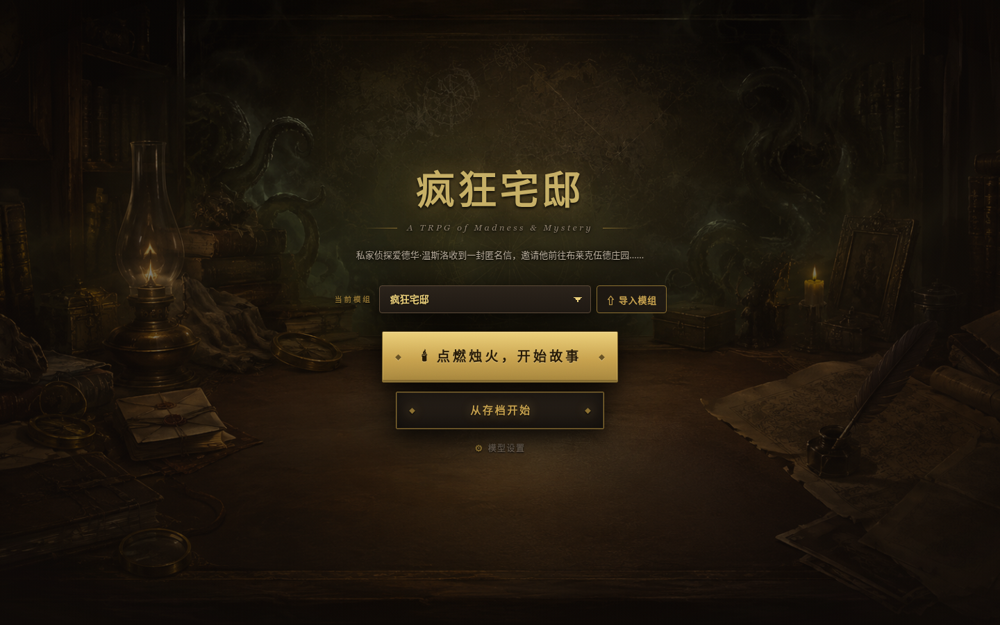
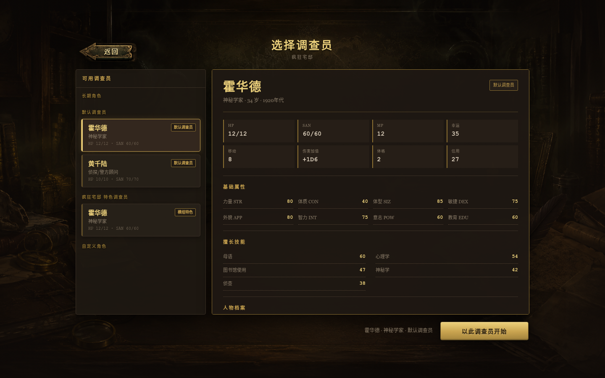
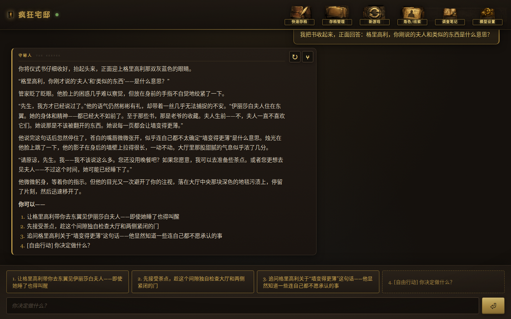
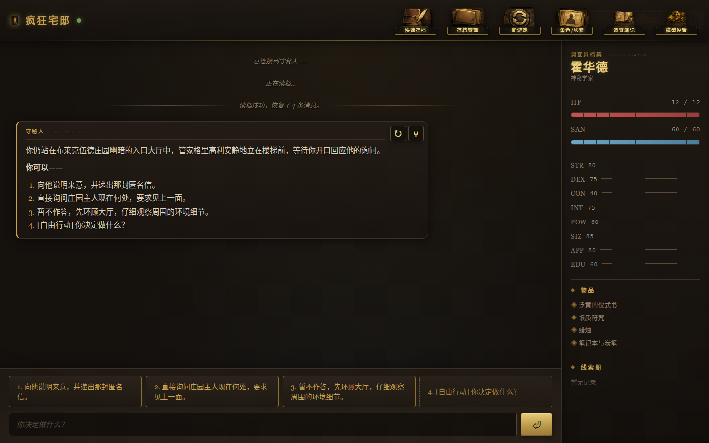

# TRPG Game

**[中文版 README](README.zh-CN.md)**

An AI Keeper (game master) for Call-of-Cthulhu-style tabletop role-playing. TRPG Game pairs an LLM narrator with deterministic d100 rules tooling: the model writes the story and interprets your intent, while Python code rolls the dice, tracks the world, and enforces the rules. It runs as a local desktop app (Electron) or as an account-based server.

Two playable modules are bundled: **Mansion of Madness** (疯狂宅邸) and **猩红文档** (The Scarlet Documents). The game UI and narrative are in Chinese.

<p align="center">
  
  
  
  
</p>

## Features

- **LLM narrates, Python decides.** The model handles prose and intent; skill checks, dice, damage, SAN loss, world state, saves and asset reveals are all resolved by deterministic tools — no hallucinated rules.
- **Server-authoritative combat.** A dedicated state machine handles initiative, opposed d100 rolls, damage, firearm ammo and player defense choices. First lethal aggression against non-hostile NPCs is confirmed with you before the story commits.
- **Modules you can write and share.** Modules are safe, sandboxed `.trpgmod` ZIP packages (JSON + Markdown + assets) with JSON Schema validation, one-click import, side-by-side versions and a v2 format that guarantees the main investigation can never dead-end on a failed roll. A ready-to-copy [template](examples/module-template/manifest.json) is included.
- **Lorebook-powered context.** Character Card V3 lorebooks retrieve module lore per turn with budgets, groups and cooldowns; tiered information boundaries keep the model from spoiling secrets it shouldn't know yet.
- **Saves, journals and timeline branches.** Per-world save slots, a persistent turn journal that survives disconnects, and branching timelines: rewind to any decision point and play out a different choice without rerolling the past.
- **Desktop or official cloud.** Linux runs the Electron desktop from source; Windows supports NSIS and portable packages. The official service adds shared 2–4 player rooms, Argon2id accounts, revocable sessions, turn ownership, private-event isolation and PostgreSQL persistence.

## Quick Start

### Requirements

- Python 3.12+
- Node.js 20 LTS or newer
- For local play or server operation: an API key for any OpenAI-compatible endpoint (DeepSeek by default)
- Optional: a Zhipu GLM API key for fast summaries and context compression

### Install

```bash
python3 -m venv venv
source venv/bin/activate
pip install -r requirements.txt

cd frontend
npm install
npm run build
cd ..
```

### Configure the model

Skip this section if you only join a multiplayer server; its operator owns the model configuration.

Interactive setup (writes `.env.json` in the project root; the file is git-ignored):

```bash
python3 start.py --config
```

Or create `.env.json` manually — only the first two fields are strictly required:

```json
{
  "api_key": "your-api-key",
  "base_url": "https://api.deepseek.com",
  "flash_model": "deepseek-v4-flash",
  "pro_model": "deepseek-v4-pro",
  "narrative_model": "deepseek-v4-pro",
  "judgement_model": "deepseek-v4-pro",
  "glm_api_key": "optional-glm-key"
}
```

Environment variables take precedence over the file. The full list — model-role presets, lorebook/prompt toggles, database URL, auth and origins for server deployments — is in the fold-out below.

<details>
<summary><strong>Full environment variable reference</strong></summary>

| Variable | Purpose | Default |
|---|---|---|
| `OPENAI_API_KEY` | Main model API key | empty |
| `OPENAI_BASE_URL` | OpenAI-compatible endpoint | `https://api.deepseek.com` |
| `TRPG_FLASH_MODEL` | Model ID for the "Flash" preset in settings | `deepseek-v4-flash` |
| `TRPG_PRO_MODEL` | Model ID for the "Pro" preset in settings | `deepseek-v4-pro` |
| `TRPG_NARRATIVE_MODEL` | Exploration, social and opening narration | `deepseek-v4-pro` |
| `TRPG_JUDGEMENT_MODEL` | Combat, complex tool follow-ups, audits and summary fallback | `deepseek-v4-pro` |
| `TRPG_FORCE_PRO` | Legacy switch; explicitly `0/false/no/off` with no role models set makes both roles use Flash | unset |
| `TRPG_ENABLE_TURN_AUDIT` | Per-turn model audit for diagnostics, `1/true/yes` | off |
| `TRPG_ENABLE_LOREBOOK` | Module lorebook retrieval, `0/false/no/off` to disable | on |
| `TRPG_PROMPT_PROFILE` | `hybrid` uses the module's story spine, falls back to `full` when absent | `hybrid` |
| `TRPG_DYNAMIC_TOOLS` | Send only relevant tool schemas per turn | on |
| `TRPG_STORY_THINKING` | Narration thinking mode: `auto/disabled/enabled/provider` | `auto` |
| `GLM_API_KEY` | Optional summary model API key | empty |
| `GLM_BASE_URL` | GLM endpoint | `https://open.bigmodel.cn/api/paas/v4/` |
| `GLM_MODEL` | GLM model name | `glm-4-flash-250414` |
| `TRPG_MODULE` | Module directory used at startup | `mansion_of_madness` |
| `TRPG_PROJECT_ROOT` | Read-only root for modules, rules and skills | auto-detected |
| `TRPG_RUNTIME_ROOT` | Writable root for the database, compatibility data, custom characters and profiles | project root in source mode; Electron injects its per-user `userData/runtime` directory when packaged |
| `TRPG_DATABASE_URL` | SQLAlchemy database URL; PostgreSQL required for cloud deployments | desktop defaults to SQLite at `TRPG_RUNTIME_ROOT/trpg-master.db` |
| `TRPG_REQUIRE_AUTH` | Enable account, HTTP and WebSocket permission gates | `0`; the production service sets `1` |
| `TRPG_ALLOW_REGISTRATION` | Open the registration endpoint; when off, accounts are provisioned manually (`tools/manage_users.py`) | `1`; the production service sets `0` |
| `TRPG_LLM_MAX_CONCURRENCY` | Process-wide cap on concurrent model calls; excess calls queue and time out after 60s with a "server busy" error | `2` |
| `TRPG_ACTION_RATE_PER_MINUTE` | Per-account per-minute action rate limit (start/continue/action); excess is rejected with `rate_limited` | `10` |
| `TRPG_DAILY_TURN_QUOTA` | Per-account daily generated-turn quota; excess is rejected with `daily_quota_exceeded`; in-memory counter, resets on restart | `200` |
| `TRPG_ALLOWED_ORIGINS` | Origins allowed to carry the login cookie over HTTP/WebSocket | must be set explicitly in production |
| `TRPG_WORLD_ID` | World instance opened by tool subprocesses; usually injected by the engine | the current module's default local world |

</details>

### Run the Linux desktop app from source

```bash
bash start_desktop.sh
```

The launcher builds the UI and opens Electron without touching the local database. Choosing **local play** then
activates the venv, installs missing backend dependencies, applies migrations, imports legacy saves once and starts
the local backend; choosing **multiplayer** never starts it. Closing the last Electron window stops a backend owned
by that window. In an attended terminal, failure to start Electron falls back to a local browser session that runs
until you press Ctrl+C.

The project does not currently produce a Linux AppImage. The Windows package is built separately as described
under **Windows packaging** below.

### Multiplayer

In a browser, open [https://trpggame.xyz](https://trpggame.xyz). In Electron, choose **多人游戏**
(Multiplayer); the official server is selected automatically. A custom bare HTTPS origin remains available only
for development and acceptance testing. After logging in, create a room or join one with an invitation code. See the Chinese
[multiplayer user guide](docs/MULTIPLAYER_USER_GUIDE.md) for the complete room, character, turn, save,
reconnection and ownership-transfer flow.

Online players do not need a local model API key and Electron does not start its embedded backend in multiplayer
mode. Model credentials and inference configuration stay on the server. Multiplayer currently offers only
default and module-provided investigators; local profile and custom-character files are not uploaded.

The official endpoint uses a publicly trusted certificate. Do not bypass certificate warnings; report them to the
server operator instead.

### Run in the terminal

```bash
python3 start.py
```

### Frontend development mode

```bash
# Terminal 1 — backend on http://127.0.0.1:8765 (WebSocket: ws://127.0.0.1:8765/ws)
source venv/bin/activate
python3 server.py

# Terminal 2 — Vite dev server on http://127.0.0.1:5173
cd frontend && npm run dev

# Terminal 3 — Electron shell
cd frontend && npm run electron:dev
```

## Playing the Game

- **Quick save** overwrites the auto slot `slot_000` of the current world; every completed keeper turn also updates it.
- **Save manager** handles manual slots: load, create, rename, delete.
- **Character / clues** shows your investigator's stats, items, clues and revealed handouts.
- **Model settings** picks narration and judgement models independently (all-Pro, balanced, all-Flash, or custom model IDs).
- **New game** returns to the module and investigator selection flow.

## Documentation

The project documentation is written in Chinese:

- [架构文档](docs/ARCHITECTURE.md) — processes, modules, turn lifecycle, data ownership, extension points
- [接口文档](docs/API.md) — HTTP routes, WebSocket protocol, event ordering, payload schemas
- [部署与恢复](docs/DEPLOYMENT.md) — official server, PostgreSQL, migrations, backup, monitoring and recovery
- [多人游戏使用说明](docs/MULTIPLAYER_USER_GUIDE.md) — browser/Electron login, rooms, turns, saves and reconnection
- [模组格式](docs/MODULE_FORMAT.md) — the `.trpgmod` v1/v2 package specification for module authors
- [开发路线图](docs/ROADMAP.md) — current local/multiplayer baseline and remaining release work

## Development

Run these checks before submitting changes:

```bash
venv/bin/python -m pytest -q
venv/bin/python -m ruff check src server.py tools tests
venv/bin/python -m compileall -q src tools server.py tests
cd frontend
npm test
npm run format:check
npm run build
bash -n ../start_desktop.sh
```

Protocol changes must be reflected in [docs/API.md](docs/API.md); changes to save, character or module state structures belong in the data-ownership chapter of [docs/ARCHITECTURE.md](docs/ARCHITECTURE.md).

### Project structure (top level)

```text
trpg-master/
├── server.py        # FastAPI HTTP + WebSocket adapter
├── src/             # engine, LangGraph turn workflow, combat, persistence, module tooling
├── tools/           # deterministic CLI tools (dice, combat, damage, SAN, module packager)
├── skills/          # keeper constraint prompts, loaded on demand
├── rules/           # structured rules data
├── mod/             # bundled modules
├── schemas/trpgmod/ # shared JSON Schemas for the module format
├── examples/        # module project template
├── frontend/        # React + Vite + TypeScript UI and Electron shell
└── docs/            # project documentation (Chinese)
```

The full module map lives in [docs/ARCHITECTURE.md](docs/ARCHITECTURE.md).

### Windows packaging

```powershell
powershell -ExecutionPolicy Bypass -File packaging/build_windows.ps1
```

Run this on Windows. It builds `trpg-server.exe` with PyInstaller, then the NSIS installer and portable builds
with electron-builder. Output lands in `frontend/release/`. `.env.json` is never bundled. The Electron setup
window asks for a model endpoint and key only when the player selects local mode; multiplayer mode selects the
official HTTPS service automatically, with a custom origin available only for development and acceptance testing.

## Current Limitations

- Multiplayer now uses one shared `GameEngine` per active room, authoritative turn ownership and
  member-filtered recovery. The current target is 2–4 players per room and one Uvicorn worker; cross-process
  room coordination is not implemented.
- Local desktop mode ships with auth disabled and must not be exposed to the public internet. Server
  deployments require `TRPG_REQUIRE_AUTH=1`, trusted TLS and explicit allowed origins (see
  the [deployment guide](docs/DEPLOYMENT.md) and [multiplayer user guide](docs/MULTIPLAYER_USER_GUIDE.md)).

## Contributing

Contributions are welcome. Please keep protocol, architecture and module-format documentation in sync with code changes, and make sure the checks above pass before opening a PR. Note that the codebase, in-game content and most documentation are in Chinese.

## License

Code is released under the [MIT License](LICENSE). Bundled module content (narrative text and assets under `mod/`) is included for play and study; check each module's own `license` field before redistributing it.
