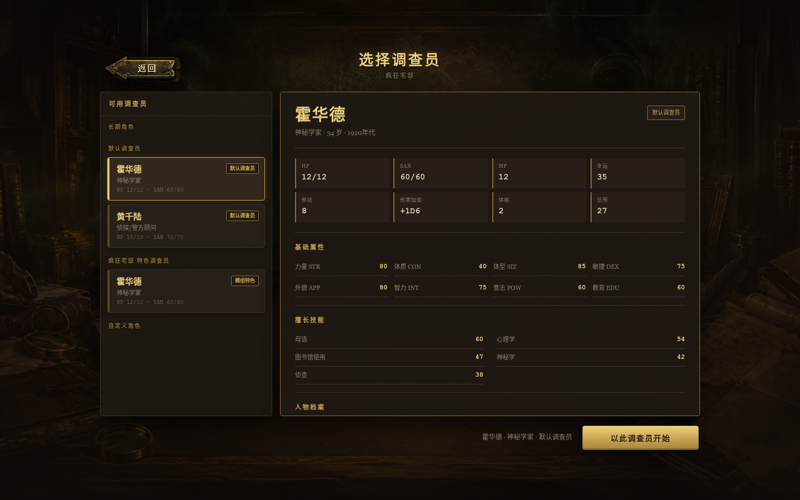
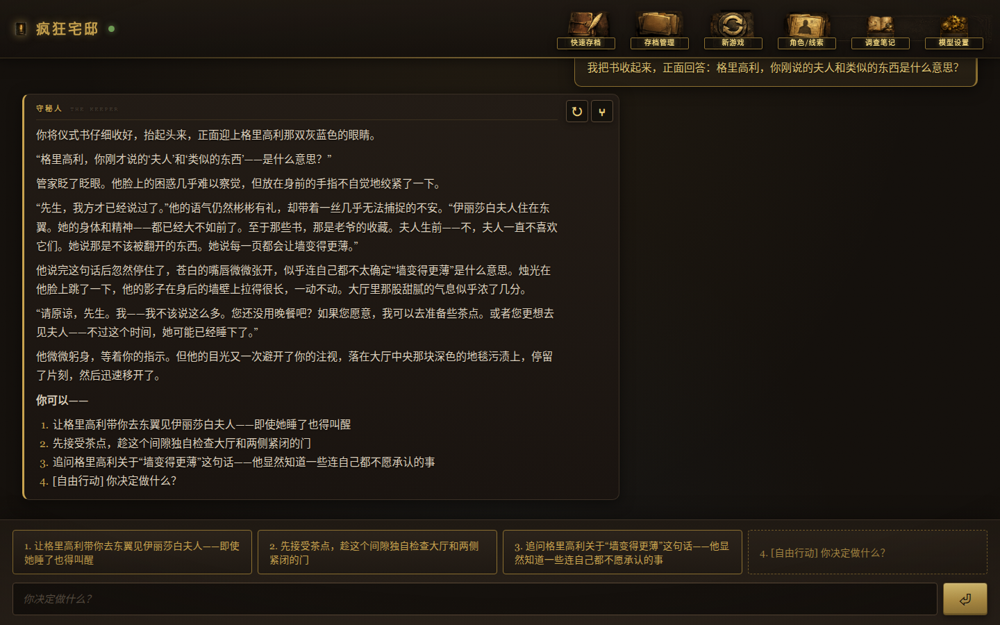
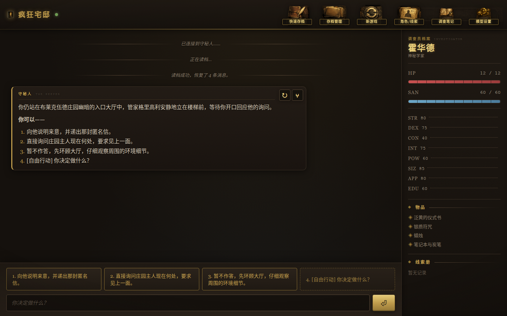

# TRPG Master

**[English README](README.md)**

一个 AI 守秘人应用：模型负责叙事和理解意图，d100 检定、战斗、伤害、SAN、世界状态和存档全部由确定性的 Python 工具结算。支持本地桌面（Electron）和账号化云端部署两种形态。

仓库内置两个可游玩模组：`mansion_of_madness`（疯狂宅邸）与 `猩红文档`。

<p align="center">
  
  
  
  
</p>

## 主要能力

- **模型叙事，代码裁决。** 探索、社交和开场由叙述模型生成；检定、骰子、先攻、伤害、SAN、世界状态、存档和素材发放均由 Python 确定性执行，不存在"模型编规则"。
- **服务端权威战斗。** 独立状态机负责先攻、回合推进、d100 对抗、伤害、枪械弹药与玩家防御确认；对非敌对 NPC 的首次不可逆攻击和武力威胁会在叙事前向玩家确认，取消时场景完全不变。
- **可创作的模组生态。** 模组是安全沙箱化的 `.trpgmod` ZIP 包（JSON + Markdown + 素材），带 JSON Schema 校验、一键导入和版本并存；v2 格式的主线安全契约保证随机失败不会让调查永久卡死。自带可直接复制的[工程模板](examples/module-template/manifest.json)。
- **Lorebook 上下文与防剧透。** Character Card V3 Lorebook 按回合本地检索叙事素材，带预算、分组与冷却；分层信息边界、NPC 揭示记录和私有工作记忆降低模型提前剧透的概率；每 50 个玩家回合静默压缩旧上下文。
- **存档、回合日志与时间线分支。** 按世界实例隔离的多槽位存档；持久回合日志把叙事、选项、事件和快照绑定到同一回合，断线后可恢复；可在任意决策点创建时间线分支，回到当时的世界快照走出另一条路，且不重新掷骰；无副作用重新叙述只替换最后一轮的文字表达。
- **桌面与云端双形态。** Linux/Windows 桌面开箱即用；云端部署提供 Argon2id 账号、可撤销会话、世界成员权限、审计事件、WebSocket Origin 校验和 PostgreSQL 持久化。

## 快速开始

### 环境要求

- Python 3.10+
- Node.js 20 LTS 或更新版本
- 一个 OpenAI 兼容 API Key（默认面向 DeepSeek）
- 可选：智谱 GLM API Key，用于快速摘要与上下文压缩

### 安装依赖

```bash
python3 -m venv venv
source venv/bin/activate
pip install -r requirements.txt

cd frontend
npm install
npm run build
cd ..
```

### 配置模型

交互式写入项目根目录的 `.env.json`（已被 Git 忽略）：

```bash
python3 start.py --config
```

也可以手动创建，只有前两项必填：

```json
{
  "api_key": "your-api-key",
  "base_url": "https://api.deepseek.com",
  "flash_model": "deepseek-v4-flash",
  "pro_model": "deepseek-v4-pro",
  "narrative_model": "deepseek-v4-pro",
  "judgement_model": "deepseek-v4-pro",
  "glm_api_key": "optional-glm-key"
}
```

系统环境变量优先于文件配置。完整列表（模型角色预设、Lorebook/提示词开关、数据库、云端鉴权与 Origin）见下方折叠块。

<details>
<summary><strong>完整环境变量列表</strong></summary>

| 环境变量 | 用途 | 默认值 |
|---|---|---|
| `OPENAI_API_KEY` | 主模型 API Key | 空 |
| `OPENAI_BASE_URL` | OpenAI 兼容请求地址 | `https://api.deepseek.com` |
| `TRPG_FLASH_MODEL` | 设置页"Flash"预设对应的模型 ID | `deepseek-v4-flash` |
| `TRPG_PRO_MODEL` | 设置页"Pro"预设对应的模型 ID | `deepseek-v4-pro` |
| `TRPG_NARRATIVE_MODEL` | 探索、社交和开场叙述模型 | `deepseek-v4-pro` |
| `TRPG_JUDGEMENT_MODEL` | 战斗、复杂工具后续、模型审计和摘要兜底模型 | `deepseek-v4-pro` |
| `TRPG_FORCE_PRO` | 旧版兼容开关；显式设为 `0/false/no/off` 且未指定角色模型时，两者改用 Flash | 未设置 |
| `TRPG_ENABLE_TURN_AUDIT` | 诊断用回合模型审计，支持 `1/true/yes` | 关闭 |
| `TRPG_ENABLE_LOREBOOK` | 启用模组 Lorebook 本地检索，支持 `0/false/no/off` 关闭 | 开启 |
| `TRPG_PROMPT_PROFILE` | `hybrid` 使用模组剧情脊柱，缺失时自动回退 `full` | `hybrid` |
| `TRPG_DYNAMIC_TOOLS` | 按回合只发送相关工具 Schema | 开启 |
| `TRPG_STORY_THINKING` | 叙述请求思考模式：`auto/disabled/enabled/provider` | `auto` |
| `GLM_API_KEY` | 可选摘要模型 API Key | 空 |
| `GLM_BASE_URL` | GLM 请求地址 | `https://open.bigmodel.cn/api/paas/v4/` |
| `GLM_MODEL` | GLM 模型名 | `glm-4-flash-250414` |
| `TRPG_MODULE` | 启动时使用的模组目录名 | `mansion_of_madness` |
| `TRPG_PROJECT_ROOT` | 模组、规则与 Skill 的只读定义根目录 | 自动识别 |
| `TRPG_RUNTIME_ROOT` | `worlds/`、自定义角色和长期档案的可写根目录 | 源码模式同项目根目录；打包模式为后端目录 |
| `TRPG_DATABASE_URL` | SQLAlchemy 数据库 URL；云端必须使用 PostgreSQL | 桌面模式默认使用 `TRPG_RUNTIME_ROOT/trpg-master.db` |
| `TRPG_REQUIRE_AUTH` | 启用账号、HTTP 与 WebSocket 权限门禁 | `0`；生产 service 设置为 `1` |
| `TRPG_ALLOWED_ORIGINS` | 允许携带登录 Cookie 的 HTTP/WebSocket Origin | 生产环境必须显式配置 |
| `TRPG_WORLD_ID` | 工具子进程打开的世界实例；通常由引擎自动注入 | 当前模组的默认本地世界 |

</details>

### 启动桌面版

```bash
./start_desktop.sh
```

启动脚本会在打开后端前依次执行：

1. 优先激活项目的 `venv`，不存在时回退 `.venv`；
2. 检查 SQLAlchemy、Alembic、psycopg 和 Argon2 等后端依赖，缺失时自动执行 `pip install -r requirements.txt`；
3. 对桌面 SQLite 数据库执行 `alembic upgrade head`；
4. 第一次数据库化启动时，把旧 `worlds/` 中的世界、回合、存档和笔记导入数据库。

一次性导入成功后会在数据库的 `audit_events` 中写入 `legacy_import_completed`，后续启动只返回
`already_imported`，不会再用旧 JSON 覆盖数据库状态。确认数据库中的世界和存档均可正常打开并完成备份前，不要删除旧 `worlds/`。

无终端桌面入口应使用 `Terminal=false` 的 `.desktop` 文件调用：

```text
Exec=/absolute/path/to/trpg-master/start_desktop.sh --desktop
Terminal=false
```

桌面模式日志写入 `/tmp/trpg-desktop.log`，后端日志写入 `/tmp/trpg-server.log`。Electron 最后一个窗口关闭后，启动脚本会自动停止后端并释放 `8765` 端口。

若出现 `ModuleNotFoundError: argon2`、`sqlalchemy` 或 `psycopg`，通常表示绕过了启动脚本，或虚拟环境尚未同步。可执行：

```bash
source venv/bin/activate
python -m pip install -r requirements.txt
bash start_desktop.sh
```

### 启动终端版

```bash
python3 start.py
```

### 前端开发模式

```bash
# 终端 1：后端，http://127.0.0.1:8765（WebSocket：ws://127.0.0.1:8765/ws）
source venv/bin/activate
python3 server.py

# 终端 2：Vite 开发服务器，http://127.0.0.1:5173
cd frontend && npm run dev

# 终端 3：Electron 壳
cd frontend && npm run electron:dev
```

## 游戏内操作

- **快速存档**：直接覆盖当前世界的自动槽 `slot_000`；每个守秘人回合完成时也会更新自动槽。
- **存档管理**：读取、新建手动存档、重命名和删除手动槽。
- **角色/线索**：查看当前调查员状态、物品、线索和已发放图片。
- **模型设置**：分别选择叙述模型和判定模型，支持全 Pro、均衡、全 Flash 与自定义模型 ID。
- **新游戏**：返回开始流程，重新选择模组与调查员。

退出确认窗口仍建议先快速存档，以免在正在生成的回合中途关闭。

## 存档与角色数据

存档按世界实例隔离并事务化保存（自动槽 `slot_000` + 手动槽，世界快照不可变）。

调查员数据分为三层：

| 层 | 路径 | 作用 |
|---|---|---|
| 角色模板 | `characters/default`、`characters/custom`、`mod/*/characters` | 新游戏的候选调查员 |
| 当前案件 | 世界状态中的 `pc` | 当前 HP、SAN、物品、心理状态与案件内成长 |
| 长期履历 | `profiles/player_profile.json` | 已完成模组、结局、声望、人脉与最后状态 |

运行时数据和 API Key 均已加入 `.gitignore`。旧版 `mod/<module>/world_state.json` 只作为首次迁移来源保留；新游戏与工具调用不会再写入模组目录。

## 模组开发与导入

新模组使用 `.trpgmod` 包（v1/v2），最少包含 `manifest.json` 和 `module.json`。编译预览、打包、检查和迁移：

```bash
venv/bin/python tools/module_packager.py compile examples/module-template
venv/bin/python tools/module_packager.py pack examples/module-template /tmp/example.trpgmod
venv/bin/python tools/module_packager.py validate /tmp/example.trpgmod
venv/bin/python tools/module_packager.py migrate-v2 <v1工程目录> <新的v2目录>
```

游戏开始页的"导入"按钮会先做格式、安全和引用预检，确认后安装到
`<runtime>/modules/<id>/<version>/` 并自动切换。完整字段、安全限制、v2 主线安全契约和
失败保底（fallback）规则见[模组格式文档](docs/MODULE_FORMAT.md)。

## Windows 打包

在 Windows PowerShell 中执行：

```powershell
powershell -ExecutionPolicy Bypass -File packaging/build_windows.ps1
```

脚本安装/检查 Python 与 Node.js 依赖，用 PyInstaller 构建 `trpg-server.exe`，再用
electron-builder 构建 NSIS 安装版和便携版。输出位于 `frontend/release/`。`.env.json`
不会被打进安装包；首次运行时由 Electron 配置窗口收集 API 地址和 Key。

## 文档

- [架构文档](docs/ARCHITECTURE.md)：进程、模块、回合时序、数据所有权、扩展点与多人化边界。
- [接口文档](docs/API.md)：HTTP 路由、WebSocket 双向消息、事件顺序与数据结构。
- [数据库与账号](docs/DATABASE.md)：迁移、旧世界导入、PostgreSQL、备份与恢复。
- [模组格式](docs/MODULE_FORMAT.md)：`.trpgmod` 目录、字段、校验、安全和版本规范。
- [前端架构](docs/FRONTEND_ARCHITECTURE.md)：React 组件、Zustand 状态、协议边界与扩展约束。
- [回合性能](docs/PERFORMANCE.md)：阶段指标、进程内工具、回合缓存与本地基准。
- [开发路线图](docs/ROADMAP.md)：当前基线、多人房间和未来可选 Agent 的进入条件。
- [模组编辑器规划](docs/MODULE_EDITOR_PLAN.md)：编辑器需求与技术规划（内部文档，非使用手册）。
- [设计依据](docs/DESIGN_RATIONALE.md)：关键设计决策参考的外部资料。
- [模组工程模板](examples/module-template/manifest.json)：可直接打包的示例。
- 历史交接与试玩报告归档在 [docs/archive/](docs/archive/)。

## 开发校验

提交前运行：

```bash
venv/bin/python -m unittest discover -s tests -v
venv/bin/python -m ruff check src server.py tools tests
venv/bin/python -m compileall -q src tools server.py tests
cd frontend
npm test
npm run format:check
npm run build
bash -n ../start_desktop.sh
```

接口变化应同步更新[接口文档](docs/API.md)；修改存档、角色或模组状态结构时，应同时更新[架构文档](docs/ARCHITECTURE.md)的数据所有权章节。

## 项目结构（顶层）

```text
trpg-master/
├── server.py        # FastAPI HTTP + WebSocket 适配层
├── src/             # 引擎、LangGraph 回合工作流、战斗、持久化、模组工具链
├── tools/           # 确定性 CLI 工具（骰子、战斗、伤害、SAN、模组打包）
├── skills/          # 常驻与按需加载的守秘人约束
├── rules/           # 结构化规则数据
├── mod/             # 内置模组
├── schemas/trpgmod/ # 模组格式共享 JSON Schema
├── examples/        # 模组工程模板
├── frontend/        # React + Vite + TypeScript UI 与 Electron 壳
└── docs/            # 项目文档
```

完整的模块分层表见[架构文档](docs/ARCHITECTURE.md)。

## 当前边界

- 单机单玩家：世界已按 `world_id` 隔离，但每条 WebSocket 连接仍拥有独立的守秘人历史；共享 GM 房间是下一个里程碑，见[路线图](docs/ROADMAP.md)。
- 桌面模式默认关闭账号门禁，不应直接暴露到公网；云端必须设置 `TRPG_REQUIRE_AUTH=1`、TLS 和允许的 Origin，见[数据库与账号](docs/DATABASE.md)。

## 参与贡献

欢迎贡献。请保持接口、架构和模组格式文档与代码同步，并确保上方"开发校验"全部通过后再提交 PR。

## 许可证

代码以 [MIT 许可证](LICENSE)发布。内置模组内容（`mod/` 下的剧本文本与素材）仅供游玩与研究，再分发前请查看各模组 `manifest.json` 中的 `license` 字段。
