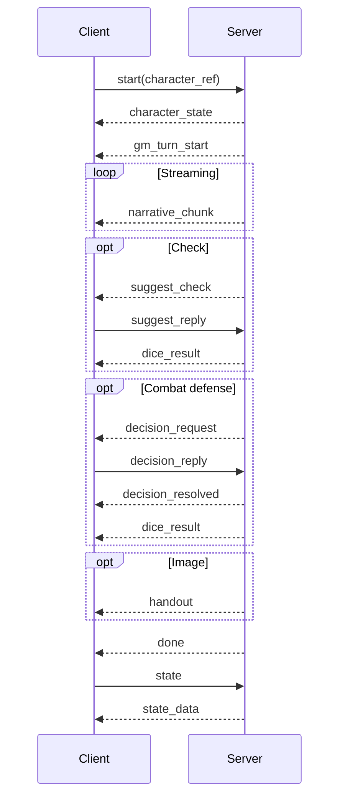
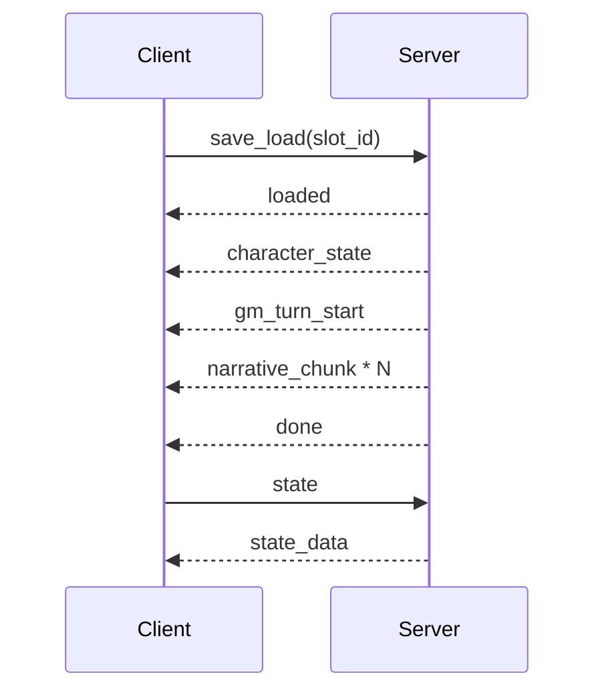
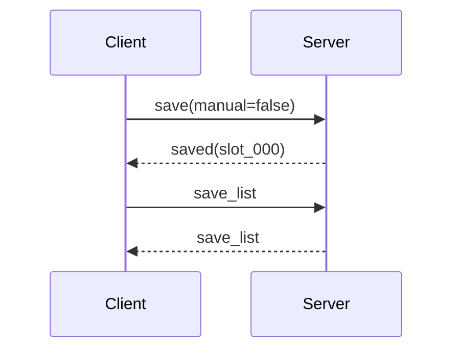

# 接口文档

本文记录 `server.py` 当前公开的 HTTP 与 WebSocket 协议。协议尚未版本化；修改消息字段时应同步更新本文和 `frontend/src/ws.ts`。

## 1. 基本约定

| 项目 | 值 |
|---|---|
| HTTP Base URL | `http://127.0.0.1:8765` |
| WebSocket URL | `ws://127.0.0.1:8765/ws`；可选 `?module=<name>&world_id=<id>` |
| 编码 | UTF-8 |
| WebSocket 数据 | JSON text frame |
| 鉴权 | 无 |
| OpenAPI | `/docs`、`/openapi.json` |

服务端进程实际监听 `0.0.0.0:8765`，但接口按本地桌面应用设计。不同 `world_id` 的文件状态已经隔离，但尚无房间身份、共享 GM 会话、鉴权、限流或 TLS，不应直接暴露到公网。

WebSocket 消息都有一个字符串字段 `type`：

```json
{
  "type": "ping"
}
```

未识别的 `type` 当前会被静默忽略；非法 JSON text frame 也会被忽略。

## 2. HTTP API

### 2.1 路由总览

| 方法 | 路径 | 用途 |
|---|---|---|
| `GET` | `/api/health` | 后端就绪检查 |
| `GET` | `/api/theme` | 当前活动模组主题 |
| `GET` | `/api/modules` | 模组列表与活动模组 |
| `GET` | `/api/modules/schema/manifest-v1` | manifest JSON Schema |
| `GET` | `/api/modules/schema/module-v1` | 模组定义 JSON Schema |
| `POST` | `/api/modules/compile` | 无副作用编译作者态数据并返回诊断/trace |
| `POST` | `/api/modules/inspect` | 预检 `.trpgmod`，不安装 |
| `POST` | `/api/modules/import` | 校验并版本化安装 `.trpgmod` |
| `GET` | `/api/characters` | 当前模组可选调查员 |
| `POST` | `/api/modules/switch` | 切换 REST/新连接使用的默认本地世界 |
| `GET` | `/api/assets/{module_name}/{filename:path}` | 读取模组素材 |
| `GET` | `/` | 已构建前端或构建提示 |

### 2.2 `GET /api/health`

用于启动脚本和 Electron 等待后端就绪。

响应：

```json
{
  "ok": true,
  "module": "mansion_of_madness",
  "world_id": "local-mansion_of_madness"
}
```

### 2.3 `GET /api/theme`

返回当前活动模组的 `theme.json`。文件不存在时返回最小主题。

示例：

```json
{
  "title": "疯狂宅邸",
  "subtitle": "A TRPG of Madness & Mystery",
  "description": "...",
  "colors": {
    "bg": "#14100c",
    "text": "#ddd0bc",
    "gold": "#c8a24e"
  },
  "fonts": {
    "body": "Georgia, serif",
    "mono": "Courier New, monospace"
  },
  "startButtonText": "点燃烛火，开始故事"
}
```

前端实际使用的颜色 key 映射见 `frontend/src/main.ts`。未知 key 会被忽略。

### 2.4 `GET /api/modules`

通过 `ModuleRegistry` 合并内置 `mod/*` 和用户安装的 `modules/<id>/<version>`。

响应：

```json
{
  "modules": [
    {
      "id": "mansion_of_madness",
      "package_id": "mansion_of_madness",
      "version": "legacy",
      "title": "疯狂宅邸",
      "description": "...",
      "author": "",
      "system": "",
      "source": "builtin",
      "format_version": "legacy",
      "capabilities": []
    },
    {
      "id": "example.whispering-archive@1.0.0",
      "package_id": "example.whispering-archive",
      "version": "1.0.0",
      "title": "低语档案馆",
      "description": "...",
      "author": "模组作者",
      "system": "COC 第七版",
      "source": "user",
      "format_version": "1.0",
      "capabilities": []
    }
  ],
  "active": "mansion_of_madness"
}
```

用户模组的 `id` 是运行时 key `<package_id>@<version>`，切换模组和 WebSocket 查询参数均使用它。

### 2.5 模组 JSON Schema

```text
GET /api/modules/schema/manifest-v1
GET /api/modules/schema/module-v1
```

返回 Draft 2020-12 JSON Schema。未来编辑器和第三方工具应消费这些 Schema，但后端
Pydantic/语义校验仍是导入权威。

### 2.6 `POST /api/modules/compile`

供模组编辑器实时校验和预览。请求体直接携带作者态对象，不接收 ZIP：

```json
{
  "manifest": { "format_version": "1.0", "id": "example.demo", "version": "1.0.0", "title": "示例" },
  "module": {
    "format_version": "1.0",
    "entry_scene_id": "start",
    "scenes": { "start": { "name": "起点", "description": "故事从这里开始。" } }
  },
  "keeper_document": "# 守秘人正文"
}
```

成功编译和作者态校验失败都返回 HTTP 200，调用方根据 `ok` 判断；字段错误不会变成难以关联表单的
HTTP 异常。响应结构：

```json
{
  "ok": true,
  "compiler_version": "1.0.0",
  "diagnostics": [
    {
      "phase": "content_advice",
      "level": "warning",
      "code": "license_missing",
      "path": "manifest.license",
      "message": "模组尚未声明许可证或授权信息"
    }
  ],
  "trace": [
    {
      "output_path": "world_state.current_scene",
      "source_path": "module.scenes.start",
      "operation": "select entry scene"
    }
  ],
  "outputs": {
    "world_state_initial": {},
    "module_md": "..."
  }
}
```

存在 `error` 级诊断时 `ok:false`、`outputs:null`；`warning` 和 `advice` 不阻止编译。该接口不读写
工程、不安装包、不创建世界，也不检查 ZIP/checksum 或素材文件是否真实存在；发布前仍必须调用
`/inspect` 或 `/import` 完成包级安全校验。

### 2.7 `POST /api/modules/inspect`

请求体是 `.trpgmod` 原始字节，不使用 multipart：

```http
Content-Type: application/vnd.trpg-master.module+zip
X-Module-Filename: example.trpgmod
```

成功响应：

```json
{
  "ok": true,
  "module": {
    "module_key": "example.whispering-archive@1.0.0",
    "package_id": "example.whispering-archive",
    "version": "1.0.0",
    "title": "低语档案馆",
    "author": "模组作者",
    "description": "...",
    "system": "COC 第七版",
    "capabilities": [],
    "file_count": 4,
    "package_sha256": "...",
    "warnings": []
  }
}
```

该接口执行 ZIP 安全、Schema、最低引擎版本、交叉引用、capability、UTF-8 和 checksum 校验，
不写入用户模组目录。

### 2.8 `POST /api/modules/import`

请求格式与 inspect 相同。服务端重复执行全部校验，在 staging 目录编译运行时文件，然后原子安装到
`modules/<package-id>/<version>/`。

首次安装返回 HTTP 201：

```json
{
  "ok": true,
  "already_installed": false,
  "module": {
    "id": "example.whispering-archive@1.0.0",
    "package_id": "example.whispering-archive",
    "version": "1.0.0",
    "title": "低语档案馆",
    "source": "user",
    "format_version": "1.0",
    "capabilities": []
  },
  "inspection": {}
}
```

相同 SHA-256 重复导入返回 HTTP 200 且 `already_installed:true`。相同版本、不同内容返回 HTTP 409。
失败结构：

```json
{
  "ok": false,
  "error_code": "missing_reference",
  "error": "模组定义引用了包内不存在的文件",
  "details": ["assets/missing.png"]
}
```

包上限为 64 MiB；其余大小和安全限制见 `docs/MODULE_FORMAT.md`。

### 2.9 `GET /api/characters`

列出当前活动模组的新游戏候选调查员。

响应结构：

```json
{
  "module": "mansion_of_madness",
  "groups": [
    {
      "id": "default",
      "title": "默认调查员",
      "characters": [
        {
          "ref": {
            "source": "default",
            "file": "黄千陆.json",
            "path": "characters/default/黄千陆.json"
          },
          "id": "default:黄千陆",
          "name": "黄千陆",
          "occupation": "侦探/警方顾问",
          "age": 32,
          "era": "1920年代",
          "source": "default",
          "source_label": "默认调查员",
          "hp": 10,
          "max_hp": 10,
          "san": 70,
          "max_san": 70,
          "reputation": 0,
          "completed_modules": 0,
          "credit_rating": 25,
          "attributes": {"STR": 45, "DEX": 55, "INT": 65},
          "derived": {"MP": 14, "MOV": 8, "LUCK": 55, "DB": "-1"},
          "inventory": ["笔记本与钢笔", "手电筒"],
          "backstory": {
            "description": "衣着整洁朴素，永远一丝不苟。",
            "beliefs": "行动是最好的回击。"
          },
          "top_skills": [
            {"id": "spot_hidden", "value": 70}
          ],
          "description": "..."
        }
      ]
    }
  ]
}
```

开始界面先使用姓名、职业和 HP/SAN 渲染调查员名单；选中后使用 `attributes`、`derived`、
`inventory`、`backstory` 和 `top_skills` 在本地渲染完整角色档案，不需要额外读取角色文件。

固定分组及来源：

| group/source | 数据来源 |
|---|---|
| `profile` | `profiles/player_profile.json` 中的长期角色 |
| `default` | `characters/default/*.json` |
| `module` | 当前 `ModuleRecord.path/characters/*.json` |
| `custom` | `characters/custom/*.json` |

### 2.10 `POST /api/modules/switch`

请求：

```json
{
  "module": "猩红文档"
}
```

成功响应：

```json
{
  "ok": true,
  "module": "猩红文档",
  "world_id": "local-猩红文档"
}
```

模组不存在时仍返回 HTTP 200：

```json
{
  "ok": false,
  "error": "模组'unknown'不存在"
}
```

此接口打开该模组稳定的 `local-<module>` 世界，并把它设为 REST 与后续无参数 WebSocket 连接的默认 context；不会修改已经连接的 `GameEngine`。桌面前端使用 WebSocket `switch_module`，因为它会切换当前连接并同时刷新主题、角色与存档列表。

### 2.11 `GET /api/assets/{module_name}/{filename:path}`

从内置或用户模组返回 `assets/<filename>`，支持子目录、中文与 URL 编码文件名。

- 成功：文件内容，`Content-Type` 由扩展名推断。
- 文件不存在：HTTP 404，`{"error":"not found"}`。
- 路径越界：HTTP 403，`{"error":"forbidden"}`。

### 2.12 静态前端

当 `frontend/dist` 存在时，它被挂载到 `/`。否则根路由返回构建提示：

```html
<h2>前端未构建。运行: cd frontend && npm run build</h2>
```

## 3. WebSocket 生命周期

连接成功后，服务端先打开 `RuntimeContext`，再用它创建新的 `GameEngine` 并准备 system prompt。默认打开当前模组的本地世界；测试或未来房间层可连接
`/ws?module=mansion_of_madness&world_id=room-a`。随后按以下顺序主动发送：

1. `module_list`
2. `character_list`
3. `theme`
4. `save_list`

如果引擎初始化失败，服务端发送 `error` 并关闭连接。

前端建立连接后通常发送：

1. `ping`
2. `state`

没有协议级 request ID。请求与响应通过事件类型和客户端状态关联；一个连接内的 GM 回合由服务端串行执行。

## 4. 客户端发送消息

### 4.1 总览

| `type` | 关键字段 | 作用 |
|---|---|---|
| `ping` | 无 | 心跳 |
| `module_list` | 无 | 导入后重新请求内置/用户模组列表 |
| `switch_module` | `module` | 切换活动模组并刷新开局数据 |
| `start` | `character_ref` | 新游戏 |
| `action` | `content` | 提交玩家动作 |
| `suggest_reply` | `confirmed` | 回复检定确认 |
| `decision_reply` | `decision_id`, `option_id` | 回复战斗等多选决定 |
| `state` | 无 | 请求角色与线索状态 |
| `character_list` | 无 | 请求角色列表 |
| `save` | `manual` | 快速保存；正式客户端使用 `manual:false` |
| `save_create` | 无 | 新建手动槽 |
| `save_list` | 无 | 请求存档列表 |
| `save_load` | `slot_id` | 加载指定槽并继续 GM 回合 |
| `save_delete` | `slot_id` | 删除手动槽 |
| `save_rename` | `slot_id`, `label` | 修改存档显示名 |
| `settle_case` | `ending_type`, `title`, `summary` | 确认结局并写入长期履历 |
| `quit` | 无 | 保存自动槽并结束当前 WS 会话 |
| `continue` | `slot_id?` | 兼容接口：加载存档并继续 |
| `load` | 无 | 兼容接口：加载最新存档，不自动触发续写 |

### 4.2 心跳

请求：

```json
{"type":"ping"}
```

响应：

```json
{"type":"pong"}
```

### 4.3 刷新与切换模组

导入成功后可重新请求列表：

```json
{"type":"module_list"}
```

服务端返回 `module_list`，但不改变当前模组。

切换请求：

```json
{
  "type": "switch_module",
  "module": "猩红文档"
}
```

成功后当前连接切换到该模组的默认本地世界，并依次返回新的 `theme`、`module_list`、`character_list` 和 `save_list`。切换不重置世界状态；新游戏的 `start` 才会从初始模板重建当前 world。

### 4.4 开始新游戏

```json
{
  "type": "start",
  "character_ref": {
    "source": "default",
    "file": "黄千陆.json",
    "path": "characters/default/黄千陆.json"
  }
}
```

`character_ref` 可为 `null`，此时按 `profile -> default -> module -> custom` 的顺序选择第一个可用角色。

角色引用支持四种形态：

```json
{"source":"profile","id":"default:黄千陆"}
```

```json
{"source":"default","file":"黄千陆.json"}
```

```json
{"source":"custom","file":"my-investigator.json"}
```

```json
{"source":"module","module":"猩红文档","file":"黄千陆.json"}
```

`path` 是服务端返回给 UI 的说明字段，解析角色时以 `source/id/file/module` 为准。

开始新游戏会：

1. 用当前 `ModuleRecord.path/world_state_initial.json` 重建 `worlds/<world_id>/world_state.json`，并递增 revision。
2. 把选中的调查员复制到当前 world 的 `pc`。
3. 重建 system prompt 与会话消息。
4. 返回 `character_state`，让客户端在揭开开始界面前同步权威调查员资料。
5. 返回 `gm_turn_start` 并异步运行开场 GM 回合。

### 4.5 玩家动作

```json
{
  "type": "action",
  "content": "检查书桌抽屉里是否藏着文件"
}
```

服务端不发送单独 ACK。一个典型回合为：

```text
gm_turn_start
narrative_chunk * N
tension? / suggest_check? / decision_request? / dice_result? / handout? / glm_summary?
narrative_chunk * N
done
```

新游戏和读档先发送 `character_state`，随后与普通 `action` 一样发送 `gm_turn_start`；客户端以 `gm_turn_start` 和 `done` 作为一轮 GM 回合的边界。工具执行期间到达的 `handout` 或 `state_data` 可能早于最终叙述；正式前端会暂存这些展示更新，在 `done` 后显示材料并重新请求最终状态。

### 4.6 回复检定确认

服务端发送 `suggest_check` 后，客户端回复：

```json
{
  "type": "suggest_reply",
  "confirmed": true
}
```

`confirmed:false` 表示放弃。服务端工作线程最多等待 120 秒；超时按未确认处理。

### 4.7 回复多选决定

服务端发送 `decision_request` 后，客户端必须回传原决定 ID 和选项 ID：

```json
{
  "type": "decision_reply",
  "decision_id": "a9bc13d42e11",
  "option_id": "dodge"
}
```

服务端只接受当前活动决定中列出的选项。工作线程最多等待 120 秒；超时会采用服务端提供的 `default_option`，并发送 `decision_resolved`。

### 4.8 请求当前状态

```json
{"type":"state"}
```

响应为 `state_data`。注意：`data` 和 `clues` 当前是 JSON 编码后的字符串，不是直接嵌套对象，客户端需要再次 `JSON.parse`。

### 4.9 快速存档

```json
{
  "type": "save",
  "manual": false
}
```

写入当前模组的 `slot_000`，响应 `saved`。

`manual:true` 是早期兼容字段；当前持久化层会把空 `slot_id` 同样解析成自动槽。新客户端必须使用 `save_create` 创建手动槽，不应依赖 `manual:true`。

### 4.10 新建手动存档

```json
{"type":"save_create"}
```

服务端查找最小可用编号，创建 `slot_001`、`slot_002` 等，响应 `saved`。

### 4.11 加载存档

```json
{
  "type": "save_load",
  "slot_id": "slot_001"
}
```

成功顺序：

1. `loaded`
2. `character_state`
3. `gm_turn_start`
4. GM 回合事件
5. `done`

读档会通过 `WorldStore.restore()` 把 `snapshot.json` 恢复到当前 world，执行 schema 迁移并生成新的 revision；待确认的战斗动作也随完整快照恢复。若读取槽位期间当前 world 已被其他动作更新，服务端发送 revision 过期的 `error`，不会覆盖新状态。随后模型消息加入“基于存档续写、不要重新开场”的指令。

### 4.12 删除存档

```json
{
  "type": "save_delete",
  "slot_id": "slot_001"
}
```

成功返回 `save_deleted`。`slot_000` 不允许删除，会返回 `error`。

### 4.13 重命名存档

```json
{
  "type": "save_rename",
  "slot_id": "slot_001",
  "label": "进入东翼之前"
}
```

重命名只修改 `meta.json.label`，不改槽位目录名。空字符串表示 UI 回退显示 `scene_name`。

### 4.14 结算案件

```json
{
  "type": "settle_case",
  "ending_type": "good",
  "title": "封印重归寂静",
  "summary": "调查员阻止了仪式并带回关键证据。"
}
```

常见 `ending_type`：`good`、`secret`、`neutral`、`bad`。成功后服务端：

1. 更新 `profiles/player_profile.json`。
2. 更新当前 PC 的 career。
3. 保存 `slot_000`。
4. 发送 `case_settled`。
5. 发送新的 `character_list`。
6. 当前实现额外发送一个无 payload 的 `{"type":"state"}` 兼容刷新标记；正式客户端应主动发送客户端 `state` 请求并等待 `state_data`。

### 4.15 退出当前会话

```json
{"type":"quit"}
```

服务端保存 `slot_000`，返回 `quit_ok`，然后结束当前 WebSocket 消息循环。Electron 窗口生命周期由桌面壳单独管理。

## 5. 服务端发送事件

### 5.1 初始化与目录事件

#### `module_list`

```json
{
  "type": "module_list",
  "modules": [
    {"id":"mansion_of_madness","title":"疯狂宅邸","description":"..."}
  ],
  "active": "mansion_of_madness"
}
```

#### `character_list`

```json
{
  "type": "character_list",
  "module": "mansion_of_madness",
  "groups": []
}
```

`groups` 与 HTTP `/api/characters` 相同。

#### `theme`

```json
{
  "type": "theme",
  "theme": {
    "title": "疯狂宅邸",
    "colors": {},
    "fonts": {}
  }
}
```

#### `save_list`

```json
{
  "type": "save_list",
  "saves": [
    {
      "id": "slot_000",
      "label": "入口大厅",
      "created_at": "2026-07-10T09:16:51.718992",
      "scene_id": "entrance_hall",
      "scene_name": "入口大厅",
      "character_id": "default:黄千陆",
      "character_name": "黄千陆",
      "character_source": "default",
      "character_source_path": "characters/default/黄千陆.json",
      "hp": "10/10",
      "san": "70/70",
      "clue_count": 2,
      "message_count": 46
    }
  ]
}
```

`label` 仅在重命名后存在。列表按 `created_at` 倒序。

### 5.2 回合事件

#### `gm_turn_start`

```json
{"type":"gm_turn_start"}
```

表示服务端开始一轮 GM 回合。首次收到时前端隐藏开始界面；每轮收到时均禁用输入并进入等待叙述状态。

#### `narrative_chunk`

```json
{
  "type": "narrative_chunk",
  "text": "雨水沿着宅邸的窗棂缓缓滑落。"
}
```

同一回合可发送任意数量，`text` 是增量而不是完整消息。

#### `tension`

```json
{
  "type": "tension",
  "text": "命运的齿轮开始转动……",
  "category": "dice"
}
```

`category` 常见值：`dice`、`sanity`、`combat`、`pro`。

#### `suggest_check`

```json
{
  "type": "suggest_check",
  "skill": "侦查",
  "attribute": "INT",
  "dc": 15,
  "dc_label": "中等",
  "description": "仔细检查书桌上的异常痕迹"
}
```

客户端必须用 `suggest_reply` 回复。

#### `decision_request`

战斗状态机需要玩家选择防御方式，或确认对非敌对 NPC 的不可逆暴力/武力威胁时发送。对于从玩家最新输入中明确识别出的攻击和武力威胁，`decision_request` 会在首个 `narrative_chunk` 与 `tension` 事件之前发送；取消后本轮直接发送 `done`，世界状态不变。
防御示例：

```json
{
  "type": "decision_request",
  "id": "a9bc13d42e11",
  "kind": "combat_defense",
  "title": "教徒正在攻击你",
  "description": "教徒挥拳扑来。",
  "options": [
    {"id":"dodge","label":"闪避","description":"只求避开这次攻击。"},
    {"id":"fight_back","label":"反击","description":"胜出时可造成伤害。"},
    {"id":"no_defense","label":"不防御","description":"让攻击方正常检定。"}
  ],
  "default_option": "dodge"
}
```

不可逆暴力示例：

```json
{
  "type": "decision_request",
  "id": "c28e71af34d0",
  "kind": "irreversible_violence",
  "target_id": "bryce_fallon",
  "title": "你真的要攻击布莱斯·法伦吗？",
  "description": "法伦目前并未主动敌对。调查员通常只在认为必要时使用暴力，这一次是否必要仍由你决定。攻击可能引来报警、法律、声望、案件或理智后果。",
  "options": [
    {"id":"cancel_violence","label":"暂不攻击","description":"保留行动与当前资源。"},
    {"id":"confirm_violence","label":"仍然攻击","description":"接受后果并进行结算。"}
  ],
  "default_option": "cancel_violence",
  "roleplay_context": {
    "violence_stance": "conditional",
    "violence_stance_label": "仅在必要时使用暴力",
    "beliefs": "以头脑而非暴力追查真相",
    "traits": ["克制而审慎"]
  }
}
```

`backstory.violence_stance` 支持 `avoidant`、`conditional`、`unrestrained`。它只影响确认文案和 Agent 的人物冲突叙事；三个值都会保留确认步骤，且超时一律默认取消。取消标签可能随立场显示为“克制冲动”“暂不攻击”或“改换做法”，客户端应使用服务端返回的 `label`。

武力威胁示例：

```json
{
  "type": "decision_request",
  "id": "f17c3b22aa10",
  "kind": "coercive_threat",
  "target_id": "bryce_fallon",
  "title": "你真的要用武力威胁布莱斯·法伦吗？",
  "description": "法伦目前并未主动敌对。用武器胁迫他人明显违背了调查员避免主动暴力的行为倾向。即使不开枪，这也可能破坏关系、引来报警或改变案件走向。",
  "options": [
    {"id":"cancel_threat","label":"收起武器","description":"收起武器，不消耗行动或弹药。"},
    {"id":"confirm_threat","label":"继续威胁","description":"接受关系、法律与案件后果。"}
  ],
  "default_option": "cancel_threat",
  "roleplay_context": {
    "violence_stance": "avoidant",
    "violence_stance_label": "避免主动暴力",
    "beliefs": "以头脑而非暴力追查真相",
    "traits": ["克制而审慎"]
  }
}
```

客户端用 `decision_reply` 回复。`id` 用于拒绝迟到或不属于当前请求的回复。

#### `decision_resolved`

```json
{
  "type": "decision_resolved",
  "decision_id": "a9bc13d42e11",
  "option_id": "dodge",
  "automatic": false
}
```

每次决定完成后发送。`automatic:true` 表示等待超时后使用了 `default_option`；客户端应关闭仍显示的决定弹窗。不可逆暴力和武力威胁超时分别默认返回 `cancel_violence`、`cancel_threat`，不会产生掷骰、弹药或回合消耗。

#### `dice_result`

技能检定示例：

```json
{
  "type": "dice_result",
  "summary": "侦查 70，d100 = 32，困难成功",
  "roll_data": {
    "skill": "spot_hidden",
    "skill_name": "侦查",
    "skill_value": 70,
    "d100_roll": 32,
    "tens_dice": [30],
    "ones_dice": 2,
    "bonus_dice": 0,
    "penalty_dice": 0,
    "difficulty_regular": 70,
    "difficulty_hard": 35,
    "difficulty_extreme": 14,
    "level": "hard_success",
    "success": true,
    "is_push": false
  }
}
```

通用骰示例：

```json
{
  "type": "dice_result",
  "summary": "2d6 = 9",
  "roll_data": {
    "spec": "2d6",
    "sides": 6,
    "count": 2,
    "modifier": 0,
    "advantage": false,
    "disadvantage": false,
    "rolls": [4, 5],
    "total": 9
  }
}
```

战斗对抗会把攻击与防御 d100 一起发送，`combat:true` 表示它来自战斗状态机：

```json
{
  "type": "dice_result",
  "summary": "教徒攻击调查员：防御成功",
  "roll_data": {
    "spec": "2d100",
    "sides": 100,
    "count": 2,
    "rolls": [62, 31],
    "total": 93,
    "combat": true
  }
}
```

`roll_data` 取决于工具，客户端必须容忍未知字段或空对象。

#### `glm_summary`

```json
{
  "type": "glm_summary",
  "text": "检定成功：你注意到抽屉锁曾被撬动。"
}
```

用于复杂工具的快速摘要。50 回合静默上下文压缩成功时通常不发送该事件。

#### `handout`

```json
{
  "type": "handout",
  "file": "布莱斯·法伦.png",
  "label": "法伦教授",
  "asset_data_uri": "data:image/png;base64,...",
  "asset_url": "/api/assets/猩红文档/布莱斯·法伦.png",
  "entity_type": "npc",
  "entity_id": "professor_fallon"
}
```

`entity_type` 为 `npc`、`scene` 或 `clue`。Electron 使用 `asset_data_uri`，浏览器可使用 `asset_url`。

#### `game_over`

```json
{
  "type": "game_over",
  "ending_type": "good",
  "title": "封印重归寂静",
  "summary": "..."
}
```

它是结局提议，不会立刻写入长期履历。玩家确认后客户端再发送 `settle_case`。

#### `done`

```json
{"type":"done"}
```

表示本轮叙事、工具和自动存档已经完成。前端据此恢复操作并请求最新 `state`。

### 5.3 状态事件

#### `character_state`

```json
{
  "type": "character_state",
  "data": "{\"name\":\"黄千陆\",\"occupation\":\"侦探/警方顾问\",\"hp\":10,\"max_hp\":10,\"san\":70,\"max_san\":70}"
}
```

新游戏完成角色套用、或读档恢复快照后立即发送。`data` 是 JSON 编码后的完整 `pc` 对象；客户端应立即刷新角色面板，不必等待本轮叙述结束。该事件不包含线索，避免开场信息提前揭示。

#### `state_data`

```json
{
  "type": "state_data",
  "data": "{\"name\":\"黄千陆\",\"hp\":10,\"max_hp\":10,\"san\":70,\"max_san\":70}",
  "clues": "{\"investigation\":[],\"event\":[],\"task\":[],\"npc\":[]}"
}
```

解析后 `data` 是当前 `world_state.pc`。`clues` 是按分类组织的对象：

```json
{
  "investigation": [
    {
      "id": "clue_001",
      "text": "抽屉锁曾被撬动",
      "type": "discovered",
      "tier": 1,
      "source": "skill_check",
      "related_npcs": [],
      "related_scenes": ["study"],
      "discovered_at": "...",
      "asset": {
        "id": "damaged_lock",
        "file": "抽屉锁.png",
        "label": "受损的锁",
        "asset_data_uri": "data:image/png;base64,...",
        "asset_url": "/api/assets/module/抽屉锁.png"
      }
    }
  ],
  "event": [],
  "task": [],
  "npc": []
}
```

已发放 NPC 图片会以 `type:"profile"` 的公开人物档案追加到 `npc` 分类；不会包含 secret、技能或其他守秘信息。

### 5.4 存档事件

#### `saved`

```json
{
  "type": "saved",
  "ok": true,
  "slot_id": "slot_000"
}
```

#### `loaded`

```json
{
  "type": "loaded",
  "ok": true,
  "slot_id": "slot_001",
  "count": 42
}
```

兼容 `load` 请求返回的 `loaded` 可能没有 `slot_id`。

#### `save_deleted`

```json
{
  "type": "save_deleted",
  "slot_id": "slot_001"
}
```

#### `save_renamed`

```json
{
  "type": "save_renamed",
  "slot_id": "slot_001",
  "label": "进入东翼之前",
  "ok": true
}
```

### 5.5 案件与退出事件

#### `case_settled`

成功：

```json
{
  "type": "case_settled",
  "ok": true,
  "character_id": "default:黄千陆",
  "case": {
    "module": "mansion_of_madness",
    "ending_type": "good",
    "title": "封印重归寂静",
    "summary": "...",
    "san_delta": -4,
    "hp_delta": 0,
    "reputation_delta": 3,
    "completed_at": "2026-07-10T10:00:00"
  },
  "career": {
    "reputation": 3,
    "titles": [],
    "known_contacts": [],
    "completed_modules": ["mansion_of_madness"],
    "case_history": [
      {
        "module": "mansion_of_madness",
        "ending_type": "good",
        "title": "封印重归寂静",
        "summary": "...",
        "san_delta": -4,
        "hp_delta": 0,
        "reputation_delta": 3,
        "completed_at": "2026-07-10T10:00:00"
      }
    ]
  }
}
```

失败：

```json
{
  "type": "case_settled",
  "ok": false,
  "error": "当前世界状态没有 pc"
}
```

#### `quit_ok`

```json
{"type":"quit_ok"}
```

### 5.6 错误事件

```json
{
  "type": "error",
  "message": "未找到存档。"
}
```

目前错误只有面向用户的 `message`，没有稳定错误码。客户端不应通过中文文案分支业务逻辑。

## 6. 推荐事件时序

### 6.1 新游戏



图中 `handout` 是服务端发送时机。客户端在 GM 回合进行中不会立即渲染它，而是在 `done` 后与最终 `state_data` 一起揭示，避免图片或线索先于对应叙述出现。

### 6.2 读档



### 6.3 快速存档与管理



## 7. 兼容性与已知限制

- WebSocket 协议没有 `version`、request ID 或结构化 error code；模组导入 HTTP API 已使用稳定 `error_code`。
- `state_data.data` 与 `state_data.clues` 是 JSON 字符串，这是历史格式。
- `continue`、`load` 与 `save.manual` 属于兼容接口；桌面前端使用 `save_load`、`save_create` 和 `save(manual:false)`。
- 前端仍包含对 `save_available` 的兼容处理，但当前服务端不会发送该事件。
- `settle_case` 后的服务端 `state` 只是刷新标记，不包含状态数据。
- 不同 `world_id` 的状态和存档互相隔离；但同一 `world_id` 的多条连接仍各自拥有独立 GM 消息历史，尚不能用作共享多人房间。
- HTTP 切换模组不会广播；优先使用 WebSocket `switch_module`。
- API 没有鉴权。开发远程客户端前必须先增加身份、共享房间运行时和权限边界。
