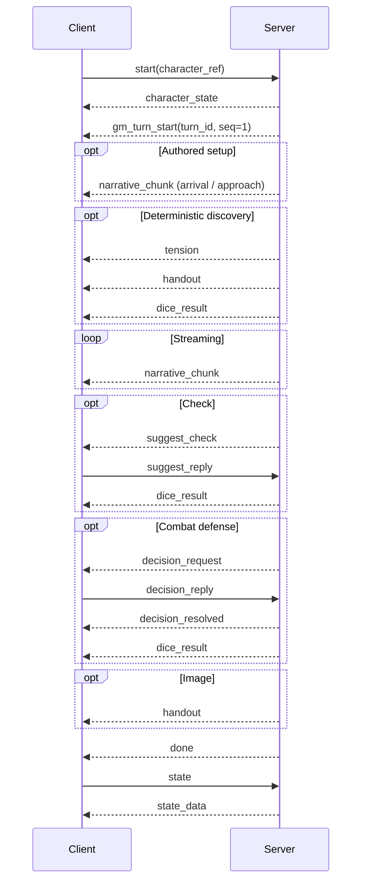
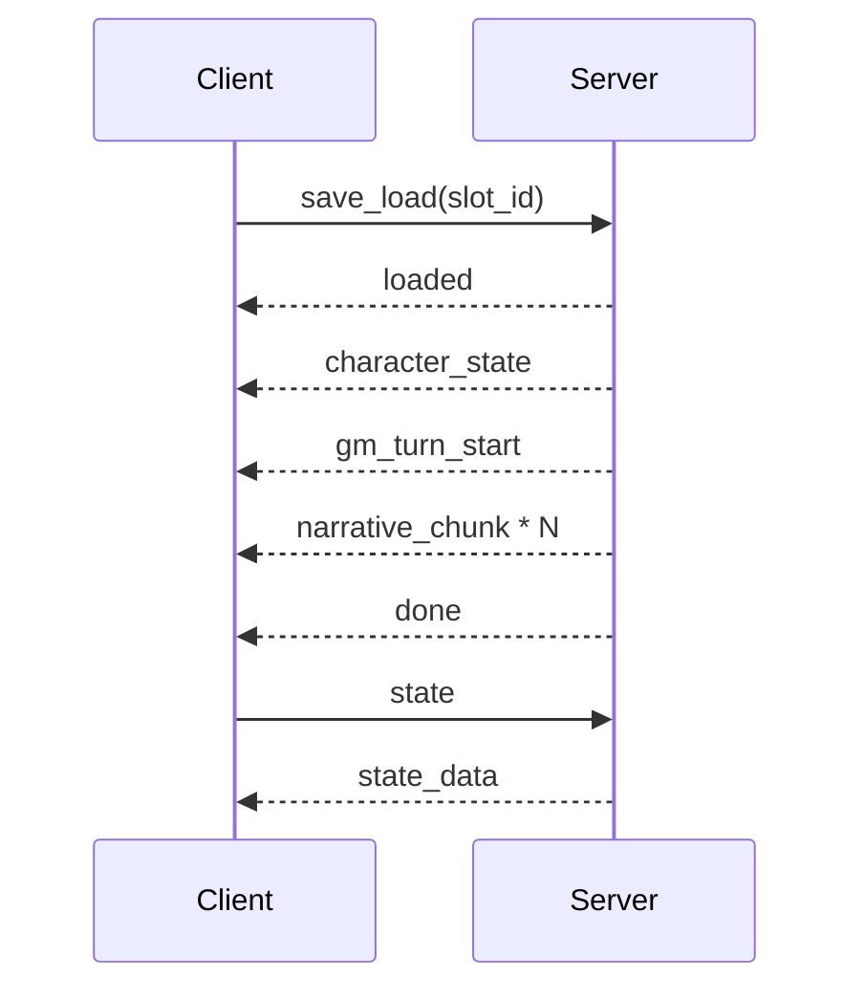
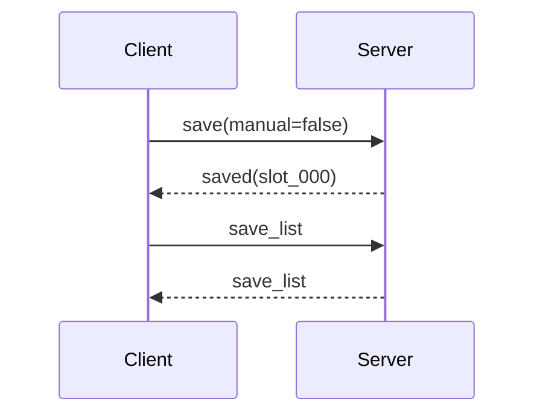

# 接口文档

本文是 TRPG Master 服务端（`server.py`）HTTP 与 WebSocket 协议的规范，面向需要实现或对接
客户端的开发者。文中所有消息与事件的 payload 均按服务端源码核实。协议不携带版本号，
演进规则见 §1.1。

## 1. 基本约定

| 项目 | 值 |
|---|---|
| HTTP Base URL | `http://127.0.0.1:8765` |
| WebSocket URL | 单机 `/ws`；多人 `/ws/room?world_id=<id>` |
| 编码 | UTF-8 |
| WebSocket 数据 | JSON text frame |
| 鉴权 | `trpg_session` 服务端 Session Cookie；桌面模式允许匿名游戏，账号与 `/api/worlds` 接口仍要求登录 |
| OpenAPI | `/docs`、`/openapi.json` |

桌面模式默认关闭账号门禁。云端设置 `TRPG_REQUIRE_AUTH=1` 后使用 Argon2id 账号、可撤销
HttpOnly Session Cookie、登录限流、Origin/CSRF 校验和世界成员权限；TLS 由前置反向代理
（如 Nginx）提供。WebSocket 握手和每次世界切换都会校验成员权限，握手失败时以关闭码
`4401`（未登录）、`4403`（连接被拒绝）、`4404`（世界不存在）结束连接。

WebSocket 消息都有一个字符串字段 `type`：

```json
{
  "type": "ping"
}
```

未识别的 `type` 会收到 `protocol_error`（见 §5.6）；非法 JSON text frame 会被忽略。
客户端必须同样容忍服务端新增的未知 `type` 与未知字段（见 §1.1）。

### 1.1 稳定性承诺

协议不携带总体版本号，也没有客户端 request ID。在此前提下，服务端按以下规则演进：

- **消息集合**：本文列出的客户端消息 `type` 与服务端事件 `type` 是稳定集合。服务端
  可能新增事件 `type`；客户端必须忽略无法识别的消息，不得因此中断会话。
- **字段**：已记录的字段名、类型与含义保持稳定。服务端可能在任何对象中新增可选字段；
  客户端必须容忍未知字段。字段或消息弃用时，先在本文标注"已弃用"并集中列入 §7，
  再考虑移除。
- **回合标识**：GM 回合的 `turn_id + seq` 生命周期规则（§3、§5.2）稳定。
- **错误**：WebSocket `error` 事件只携带面向用户的 `message`，没有稳定错误码，客户端
  不得按文案分支业务逻辑；模组导入与编辑器 HTTP API 使用稳定 `error_code`。
- **枚举**：文中以"当前包含"列出的枚举值（如 `turn_phase.phase`、`tension.category`、
  `turn_rejected.reason`）可能增加，客户端遇到未知值时应能展示通用文案或忽略。

### 1.2 小词汇表

- **守秘人（Keeper）**：由 AI 扮演的游戏主持人，负责叙述场景与裁决玩家行动；聊天事件
  中 `speaker.type` 为 `"keeper"`，显示名为"守秘人"。玩家角色称为"调查员"。
- **turn_id 生命周期**：gameplay 回合的 `turn_id`（形如
  `turn_20260715T120000000000Z_1234abcd`，UTC 时间戳加随机后缀）从 `gm_turn_start`
  到 `done` 有效，并持久保存在回合日志中，此后可用于恢复、诊断、改写与分支。回合内
  事件用 `seq`（从 1 起严格递增，可能跳号）排序。
- **rewrite:\<id\>**：改写操作的流式标识（形如 `rewrite:9f8e7d6c5b4a3210`），只存在于
  改写流从 `gm_turn_start` 到 `turn_rewritten`/`turn_rewrite_failed` 之间，不进入回合
  日志，不能用于查询、恢复或再次改写。
- **glm_summary**：名称沿袭早期接入的模型供应商（GLM）命名，功能是"复杂工具结果的
  快速摘要"——一条简短的玩家可见提示文本，与当前实际接入的供应商无关。

## 2. HTTP API

### 2.1 路由总览

| 方法 | 路径 | 用途 |
|---|---|---|
| `GET` | `/api/health` | 后端就绪检查 |
| `GET` | `/api/theme` | 当前活动模组主题 |
| `POST` | `/api/auth/register` | 注册账号并建立登录 Session |
| `POST` | `/api/auth/login` | 登录并建立 Session |
| `POST` | `/api/auth/logout` | 撤销当前 Session |
| `GET` | `/api/auth/me` | 查询当前登录账号 |
| `GET/POST` | `/api/worlds` | 列出有权访问的世界或创建世界 |
| `GET/POST` | `/api/worlds/{id}/invites` | 房主列出或创建邀请 |
| `DELETE` | `/api/worlds/{id}/invites/{invite_id}` | 房主撤销邀请 |
| `POST` | `/api/invites/{token}/accept` | 接受邀请 |
| `GET` | `/api/worlds/{id}/members` | 房间成员与调查员占用 |
| `PATCH/DELETE` | `/api/worlds/{id}/members/{user_id}` | 修改角色或移除/退出成员 |
| `POST` | `/api/worlds/{id}/owner` | 移交房主 |
| `GET` | `/api/worlds/{id}/investigators/options` | 房间可选调查员 |
| `POST` | `/api/worlds/{id}/investigators/claim` | 当前账号占用调查员 |
| `DELETE` | `/api/worlds/{id}/investigators/{id}/claim` | 释放调查员 |
| `GET` | `/api/modules` | 模组列表与活动模组 |
| `GET` | `/api/modules/schema/manifest-v1` | manifest JSON Schema |
| `GET` | `/api/modules/schema/module-v1` | 模组定义 JSON Schema |
| `GET` | `/api/modules/schema/manifest-v2` | manifest v2 JSON Schema |
| `GET` | `/api/modules/schema/module-v2` | 模组定义 v2 JSON Schema |
| `GET` | `/api/modules/schema/lorebook-v3` | Lorebook v3 JSON Schema |
| `POST` | `/api/modules/compile` | 无副作用编译作者态数据并返回诊断/trace |
| `GET/POST` | `/api/editor/projects` | 列出或创建编辑器工程会话 |
| `GET/PATCH/DELETE` | `/api/editor/projects/{session_id}` | 读取、revision 保存或删除工程会话 |
| `POST` | `/api/modules/inspect` | 预检 `.trpgmod`，不安装 |
| `POST` | `/api/modules/import` | 校验并版本化安装 `.trpgmod` |
| `GET` | `/api/characters` | 当前模组可选调查员 |
| `POST` | `/api/modules/switch` | 切换 REST/新连接使用的默认本地世界 |
| `GET` | `/api/assets/{module_name}/{filename:path}` | 读取模组素材 |
| `GET` | `/` | 已构建前端或构建提示 |

### 2.2 `GET /api/health`

用于启动脚本和桌面壳等待后端就绪。

响应：

```json
{
  "ok": true,
  "module": "mansion_of_madness",
  "world_id": "local-mansion_of_madness"
}
```

### 2.3 账号与 Session

注册和登录分别接收 `{"username":"...","password":"..."}`。成功后返回账号的 `id`、
`username`，并设置名为 `trpg_session` 的 HttpOnly、SameSite=Lax Cookie；开启
`TRPG_REQUIRE_AUTH=1` 时 Cookie 同时带有 Secure，因此生产环境必须通过 HTTPS 访问。

`GET /api/auth/me` 返回 `id`、`username` 和 `status`；未登录返回 401。`POST /api/auth/logout`
撤销服务端 Session、删除 Cookie并返回 204。注册可通过 `TRPG_ALLOW_REGISTRATION=0` 关闭；注册与
登录都有按来源限流。

### 2.4 世界所有权

`GET /api/worlds` 只返回当前账号作为成员且仍为 active 的世界：

```json
{
  "worlds": [
    {
      "world_id": "world-0123456789abcdef01234567",
      "module": "mansion_of_madness",
      "role": "owner",
      "updated_at": "2026-07-22T10:00:00+00:00",
      "metadata": {}
    }
  ]
}
```

`POST /api/worlds` 接收 `{"module":"mansion_of_madness","name":"周五调查团","max_players":4}`，创建世界及 owner 成员关系并返回
`world_id` 和 `module`。这两个接口始终要求登录；云端模式还会在 WebSocket 握手和切换世界时校验
该成员关系。

### 2.4.1 多人房间控制面

邀请明文 token 只在 `POST .../invites` 的创建响应返回一次；数据库只存 SHA-256 哈希，
`GET .../invites` 仅返回用途、使用次数、过期时间与 active/revoked/expired/exhausted 状态。接受
玩家邀请时，服务端在事务内按 `max_players` 校验 owner/player 总数；旁观者不占玩家名额。

`GET .../members` 返回 owner/player/viewer、用户名和当前调查员占用。角色更新、移除成员、撤销
邀请和房主移交都要求服务端 Session 中的当前房主；普通成员只能移除自己，房主必须先移交才能
退出。房主移交请求为 `{"user_id":"目标账号 ID"}`。

调查员占用请求为 `{"character_key":"服务端 options 返回的 id"}`。服务端会重新解析模组角色并
保存可信 `character_ref`，客户端提交的 `user_id`、`investigator_id` 或角色正文均不作为授权事实。

### 2.5 `GET /api/theme`

返回当前活动模组的 `theme.json`。文件不存在时返回最小主题。

示例：

```json
{
  "title": "疯狂宅邸",
  "subtitle": "A TRPG of Madness & Mystery",
  "description": "...",
  "colors": {
    "bg": "#14100c",
    "text": "#ddd0bc",
    "gold": "#c8a24e"
  },
  "fonts": {
    "body": "Georgia, serif",
    "mono": "Courier New, monospace"
  },
  "startButtonText": "点燃烛火，开始故事"
}
```

主题字段由模组作者定义，不限于示例中的 key。客户端应忽略未知 key，并对颜色、字体值做
安全校验后再应用。

### 2.6 `GET /api/modules`

合并内置模组与用户安装的 `modules/<package_id>/<version>`。

响应：

```json
{
  "modules": [
    {
      "id": "mansion_of_madness",
      "package_id": "mansion_of_madness",
      "version": "legacy",
      "title": "疯狂宅邸",
      "description": "...",
      "author": "",
      "system": "",
      "source": "builtin",
      "format_version": "legacy",
      "capabilities": []
    },
    {
      "id": "example.whispering-archive@1.0.0",
      "package_id": "example.whispering-archive",
      "version": "1.0.0",
      "title": "低语档案馆",
      "description": "...",
      "author": "模组作者",
      "system": "COC 第七版",
      "source": "user",
      "format_version": "1.0",
      "capabilities": []
    }
  ],
  "active": "mansion_of_madness"
}
```

用户模组的 `id` 是运行时 key `<package_id>@<version>`，切换模组和 WebSocket 查询参数均使用它。

### 2.7 模组 JSON Schema

```text
GET /api/modules/schema/manifest-v1
GET /api/modules/schema/module-v1
GET /api/modules/schema/manifest-v2
GET /api/modules/schema/module-v2
GET /api/modules/schema/lorebook-v3
```

返回 Draft 2020-12 JSON Schema。编辑器和第三方工具可消费这些 Schema；后端的语义校验仍是
导入权威。

### 2.8 `POST /api/modules/compile`

供模组编辑器实时校验和预览。请求体直接携带作者态对象，不接收 ZIP：

```json
{
  "manifest": { "format_version": "1.0", "id": "example.demo", "version": "1.0.0", "title": "示例" },
  "module": {
    "format_version": "1.0",
    "entry_scene_id": "start",
    "scenes": { "start": { "name": "起点", "description": "故事从这里开始。" } }
  },
  "keeper_document": "# 守秘人正文",
  "lorebook": {
    "spec": "lorebook_v3",
    "data": { "extensions": {}, "entries": [] }
  }
}
```

成功编译和作者态校验失败都返回 HTTP 200，调用方根据 `ok` 判断；字段错误不会变成难以关联表单的
HTTP 异常。响应结构：

```json
{
  "ok": true,
  "compiler_version": "1.0.0",
  "diagnostics": [
    {
      "phase": "content_advice",
      "level": "warning",
      "code": "license_missing",
      "path": "manifest.license",
      "message": "模组尚未声明许可证或授权信息"
    }
  ],
  "trace": [
    {
      "output_path": "world_state.current_scene",
      "source_path": "module.scenes.start",
      "operation": "select entry scene"
    }
  ],
  "outputs": {
    "world_state_initial": {},
    "module_md": "..."
  }
}
```

存在 `error` 级诊断时 `ok:false`、`outputs:null`；`warning` 和 `advice` 不阻止编译。该接口不读写
工程、不安装包、不创建世界，也不检查 ZIP/checksum 或素材文件是否真实存在；发布前仍必须调用
`/inspect` 或 `/import` 完成包级安全校验。

### 2.9 `POST /api/modules/inspect`

请求体是 `.trpgmod` 原始字节，不使用 multipart：

```http
Content-Type: application/vnd.trpg-master.module+zip
X-Module-Filename: example.trpgmod
```

成功响应：

```json
{
  "ok": true,
  "module": {
    "module_key": "example.whispering-archive@1.0.0",
    "package_id": "example.whispering-archive",
    "version": "1.0.0",
    "title": "低语档案馆",
    "author": "模组作者",
    "description": "...",
    "system": "COC 第七版",
    "capabilities": [],
    "file_count": 4,
    "package_sha256": "...",
    "warnings": []
  }
}
```

该接口执行 ZIP 安全、Schema、最低引擎版本、交叉引用、capability、UTF-8 和 checksum 校验，
不写入用户模组目录。

### 2.10 `POST /api/modules/import`

请求格式与 inspect 相同。服务端重复执行全部校验，在 staging 目录编译运行时文件，然后原子安装到
`modules/<package-id>/<version>/`。

首次安装返回 HTTP 201：

```json
{
  "ok": true,
  "already_installed": false,
  "module": {
    "id": "example.whispering-archive@1.0.0",
    "package_id": "example.whispering-archive",
    "version": "1.0.0",
    "title": "低语档案馆",
    "source": "user",
    "format_version": "1.0",
    "capabilities": []
  },
  "inspection": {}
}
```

相同 SHA-256 重复导入返回 HTTP 200 且 `already_installed:true`。相同版本、不同内容返回 HTTP 409。
失败结构：

```json
{
  "ok": false,
  "error_code": "missing_reference",
  "error": "模组定义引用了包内不存在的文件",
  "details": ["assets/missing.png"]
}
```

`error_code` 是稳定标识，可用于业务分支。包上限为 64 MiB；其余大小和安全限制见
`docs/MODULE_FORMAT.md`。

### 2.11 `GET /api/characters`

列出当前活动模组的新游戏候选调查员。

响应结构：

```json
{
  "module": "mansion_of_madness",
  "groups": [
    {
      "id": "default",
      "title": "默认调查员",
      "characters": [
        {
          "ref": {
            "source": "default",
            "file": "黄千陆.json",
            "path": "characters/default/黄千陆.json"
          },
          "id": "default:黄千陆",
          "name": "黄千陆",
          "occupation": "侦探/警方顾问",
          "age": 32,
          "era": "1920年代",
          "source": "default",
          "source_label": "默认调查员",
          "hp": 10,
          "max_hp": 10,
          "san": 70,
          "max_san": 70,
          "reputation": 0,
          "completed_modules": 0,
          "credit_rating": 25,
          "attributes": {"STR": 45, "DEX": 55, "INT": 65},
          "derived": {"MP": 14, "MOV": 8, "LUCK": 55, "DB": "-1"},
          "inventory": ["笔记本与钢笔", "手电筒"],
          "backstory": {
            "description": "衣着整洁朴素，永远一丝不苟。",
            "beliefs": "行动是最好的回击。"
          },
          "top_skills": [
            {"id": "spot_hidden", "value": 70}
          ],
          "description": "..."
        }
      ]
    }
  ]
}
```

开始界面可先使用姓名、职业和 HP/SAN 渲染调查员名单；选中后使用 `attributes`、`derived`、
`inventory`、`backstory` 和 `top_skills` 在本地渲染完整角色档案，不需要额外读取角色文件。

固定分组及来源：

| group/source | 数据来源 |
|---|---|
| `profile` | `profiles/player_profile.json` 中的长期角色 |
| `default` | `characters/default/*.json` |
| `module` | 当前模组运行目录下的 `characters/*.json` |
| `custom` | `characters/custom/*.json` |

### 2.12 `POST /api/modules/switch`

请求：

```json
{
  "module": "猩红文档"
}
```

成功响应：

```json
{
  "ok": true,
  "module": "猩红文档",
  "world_id": "local-猩红文档"
}
```

模组不存在时仍返回 HTTP 200：

```json
{
  "ok": false,
  "error": "模组'unknown'不存在"
}
```

此接口打开该模组稳定的 `local-<module>` 世界，并把它设为 REST 与后续无参数 WebSocket 连接的默认
context；不会修改已经连接的会话。需要切换当前连接的客户端应使用 WebSocket `switch_module`
（§4.3），它会同时刷新主题、角色与存档列表。账号模式下此接口返回 HTTP 409。

### 2.13 `GET /api/assets/{module_name}/{filename:path}`

从内置或用户模组返回 `assets/<filename>`，支持子目录、中文与 URL 编码文件名。

- 成功：文件内容，`Content-Type` 由扩展名推断。
- 模组不存在：HTTP 404，`{"error":"module not found"}`。
- 文件不存在：HTTP 404，`{"error":"not found"}`。
- 路径越界：HTTP 403，`{"error":"forbidden"}`。

### 2.14 编辑器工程会话

工程会话是模组编辑器作者态 `EditorProject` 的持久草稿，不是游戏世界或存档。会话 ID 形如
`editor_<24 位十六进制>`。

| 方法 | 路径 | 用途 |
|---|---|---|
| `GET` | `/api/editor/projects` | 列出工程摘要 |
| `POST` | `/api/editor/projects` | 创建工程会话 |
| `GET` | `/api/editor/projects/{session_id}` | 读取完整工程 |
| `PATCH` | `/api/editor/projects/{session_id}` | 按 revision 乐观保存 |
| `DELETE` | `/api/editor/projects/{session_id}` | 删除工程会话 |

创建会话：

```http
POST /api/editor/projects
Content-Type: application/json

{"project":{"editor_version":2,"manifest":{},"module":{}}}
```

`project` 必须是包含 `manifest`、`module` 对象的 JSON object，单个工程序列化后上限为 8 MiB；
图片等素材必须保存为包内相对路径引用。成功返回 HTTP 201 与完整记录：

```json
{
  "ok": true,
  "session_id": "editor_0123456789abcdef01234567",
  "revision": 0,
  "created_at": "...",
  "updated_at": "...",
  "project": {}
}
```

`GET /api/editor/projects` 返回摘要列表（按 `updated_at` 倒序），不含完整工程：

```json
{
  "ok": true,
  "projects": [
    {
      "session_id": "editor_0123456789abcdef01234567",
      "revision": 12,
      "updated_at": "...",
      "title": "低语档案馆",
      "package_id": "example.whispering-archive",
      "version": "1.0.0"
    }
  ]
}
```

带会话 ID 的 `GET` 返回与创建响应同构的完整记录。保存必须携带上次读取到的 revision：

```http
PATCH /api/editor/projects/editor_0123456789abcdef01234567
Content-Type: application/json

{"expected_revision":12,"project":{}}
```

成功后 `revision` 加一。revision 已过期时返回 HTTP 409：

```json
{
  "ok": false,
  "error_code": "revision_conflict",
  "error": "...",
  "current": { "session_id": "...", "revision": 13, "project": {} }
}
```

`current` 是服务器上的完整版本，由编辑器让作者选择载入服务器版本或显式覆盖。会话不存在返回
HTTP 404、`error_code:"project_not_found"`；请求体非法返回 HTTP 400、
`error_code:"invalid_project"`。`DELETE` 成功返回 `{"ok":true}`。

### 2.15 静态前端

当 `frontend/dist` 存在时，它被挂载到 `/`。否则根路由返回构建提示：

```html
<h2>前端未构建。运行: cd frontend && npm run build</h2>
```

## 3. WebSocket 生命周期

连接握手时可用 `?module=<name>&world_id=<id>` 指定上下文；缺省打开当前活动模组的本地世界
（`local-<module>`）。账号模式在握手时校验成员权限（见 §1）。

初始化成功后，服务端按固定顺序主动发送：

1. `module_list`（仅此次携带 `world_id`、`module_name`）
2. `character_list`
3. `theme`
4. `model_settings`
5. `save_list`

引擎初始化失败时，服务端发送 `error` 并关闭连接。

客户端建立连接后通常发送：

1. `ping`
2. `state`

### 多人 `/ws/room`

多人入口必须携带 `world_id` 并复用登录 Cookie。它不接受 `module` 覆盖，也不接受客户端自报
`user_id`、角色或权限。除上面的游戏初始化事件外，连接会收到：

- `room_full_state`：公开回合父链、公开调查员状态、房主、当前行动者、在线成员和最新事件 ID，
  以及只为当前连接生成的 `private_state`；
- `room_state`：房间状态、房主、当前行动者、ready/online 用户 ID；
- `member_joined`、`member_left`、`member_removed`、`owner_changed`、`actor_changed`；
- `room_action_rejected {code,message}`：稳定错误码包括 `owner_required`、`player_required`、
  `not_current_actor`、`investigator_required`、`room_not_ready`、`duplicate_action` 和
  `room_turn_in_progress`；
- `room_event_gap`：客户端请求的增量已离开缓冲区，紧随其后发送 `room_full_state`。

房间广播事件带单调 `room_event_id`。客户端发送 `room_ack {event_id}` 确认，重连后用
`room_sync {after_event_id}` 请求增量；私人事件不出现在无权连接的实时流或补发结果中。

`room_full_state.private_state` 的结构为：

```json
{
  "investigator_id": "investigator-...",
  "pc": {},
  "clues": {},
  "player_notes": {"text": "...", "revision": 3}
}
```

该字段由服务端根据登录 Session 和调查员绑定逐连接生成。`clues` 只包含公共线索和当前调查员
拥有的私人线索，`player_notes` 只读取当前用户自己的笔记。客户端不得把它写入公共房间 store、
日志或发给其他连接。缓冲缺口、主动 `turn_recovery_get` 与首次连接都遵守相同隔离规则。

多人共享引擎产生的 `character_state` 也不是公共广播。服务端在提交房间驱动前写入权威行动者，
房间事件边界据此只投递给该调查员的控制者，并在出站前删除内部 `target_user_id`。其他玩家只接收
`room_full_state.investigators` 中允许公开的摘要。

房间控制消息：

- `room_ready {ready}`：owner/player 准备或取消准备；
- `actor_assign {user_id}`：仅房主指定/跳过到某个 owner/player；
- `start`、`save_load`、`turn_rewrite`：房主控制操作，必须携带全局唯一的 `action_id` 并经过
  房间串行锁，但房主不需要同时占用当前行动权；`start` 还要求全体 owner/player 已选调查员、
  在线并 ready；
- `continue`、`action`：必须携带全局唯一的 `action_id`，且只能由当前行动者提交；
- `suggest_reply`、`decision_reply`：只接受当前行动者；对应询问只发送给该用户的全部连接；
- `player_notes_get`、`player_notes_update`：在连接边界按 Session 用户直接处理，不进入公共广播。

多人第一版只能运行一个 Uvicorn worker；跨进程房间租约和事件总线尚不属于当前协议。

### 回合生命周期

从 `gm_turn_start` 到终止事件（普通回合为 `done`；改写流为 `turn_rewritten` 或
`turn_rewrite_failed`）构成一个回合生命周期：同一生命周期的所有事件共享一个 `turn_id`，并携带
严格递增的 `seq`。同一连接、同一 `world_id` 同时只允许一个回合；冲突时服务端返回
`turn_rejected`，不会排入另一个生命周期或覆盖活动回合。

### 断线与恢复

客户端应实现有界指数退避重连（例如以 1/2/5/10/30 秒封顶），重连后的世界身份以新的
`module_list` 为准。

若断线发生在活动回合中，客户端应停止回合计时、关闭未决的 `suggest_check`/`decision_request`
交互，重连后以原 `turn_id` 发送 `turn_recovery_get`（§4.17）：

- 目标记录为 `completed`：从记录中的公开事件重放该回合；
- 存在 `active` 记录：回合仍在服务端执行或收尾，稍后再次查询，直到其变为 `completed` 或失败；
- 记录为 `failed`/`interrupted`：不可重放，回退到 `save_load("slot_000")` 加载自动存档后继续。

该机制以完整回合为粒度恢复，不等同于多人客户端按 ack 逐条补发事件（见 §7）。

## 4. 客户端发送消息

### 4.1 总览

| `type` | 关键字段 | 作用 |
|---|---|---|
| `ping` | 无 | 心跳 |
| `model_settings_get` | 无 | 请求当前叙述/判定模型配置 |
| `model_settings_update` | `narrative_model`, `judgement_model` | 校验、保存并热更新模型路由 |
| `module_list` | 无 | 导入后重新请求内置/用户模组列表 |
| `turn_recovery_get` | `turn_id?` | 查询中断回合与最近完成回合 |
| `turn_diagnostics_get` | `turn_id?` | 查询回合耗时、上下文分区和 Lorebook trace |
| `turn_rewrite` | `turn_id` | 仅重新生成最后完成回合的叙事正文 |
| `turn_branch_create` | `turn_id`, `label?` | 从指定完成回合创建并切换独立世界分支 |
| `world_list` | 无 | 列出当前模组的主时间线与分支 |
| `world_switch` | `world_id` | 切换世界并恢复其消息历史 |
| `player_notes_get` | 无 | 读取当前世界的玩家笔记 |
| `player_notes_update` | `text`, `revision?` | 以乐观 revision 原子保存玩家笔记 |
| `switch_module` | `module` | 切换活动模组并刷新开局数据 |
| `start` | `character_ref` | 新游戏 |
| `action` | `content` | 提交玩家动作 |
| `suggest_reply` | `confirmed` | 回复检定确认 |
| `decision_reply` | `decision_id`, `option_id` | 回复战斗等多选决定 |
| `state` | 无 | 请求角色与线索状态 |
| `character_list` | 无 | 请求角色列表 |
| `save` | `manual` | 写入自动槽；固定使用 `manual:false` |
| `save_create` | 无 | 新建手动槽 |
| `save_list` | 无 | 请求存档列表 |
| `save_load` | `slot_id` | 加载指定槽并继续 GM 回合 |
| `save_delete` | `slot_id` | 删除手动槽 |
| `save_rename` | `slot_id`, `label` | 修改存档显示名 |
| `settle_case` | `ending_type`, `title`, `summary` | 确认结局并写入长期履历 |
| `quit` | 无 | 保存自动槽并结束当前 WS 会话 |
| `continue` | `slot_id?` | 已弃用：加载存档并继续（见 §7） |
| `load` | 无 | 已弃用：加载最新存档，不自动续写（见 §7） |

### 4.2 心跳

请求：

```json
{"type":"ping"}
```

响应：

```json
{"type":"pong"}
```

### 4.3 刷新与切换模组

导入成功后可重新请求列表：

```json
{"type":"module_list"}
```

服务端返回 `module_list`（不含 `world_id`），但不改变当前模组。

切换请求：

```json
{
  "type": "switch_module",
  "module": "猩红文档"
}
```

成功后当前连接切换到该模组的默认本地世界，并依次返回 `world_context`、`world_list`、`theme`、
`module_list`、`character_list` 和 `save_list`。切换不重置世界状态；新游戏的 `start` 才会从初始
模板重建当前 world。模组不存在、当前回合未结束时返回 `error`；账号模式下该消息不可用，应通过
HTTP 创建对应模组的世界后使用 `world_switch`。

### 4.4 模型设置

连接初始化时服务端已经主动发送当前配置；客户端也可重新请求：

```json
{"type":"model_settings_get"}
```

更新请求：

```json
{
  "type": "model_settings_update",
  "narrative_model": "deepseek-v4-flash",
  "judgement_model": "deepseek-v4-pro"
}
```

两个值都是 OpenAI 兼容接口使用的模型 ID。服务端只接受 1-120 位字母、数字及 `._:/@+-`，不限制为
预设列表中的模型。更新仅在当前连接没有运行 GM 回合时执行；成功后设置被持久化，当前连接从下一次
模型请求开始使用新路由，后续连接也采用该配置，并返回带 `saved:true` 的 `model_settings`。

回合进行中更新、或校验/写入失败时返回 `model_settings_error`，现有设置保持不变。

### 4.5 开始新游戏

```json
{
  "type": "start",
  "character_ref": {
    "source": "default",
    "file": "黄千陆.json",
    "path": "characters/default/黄千陆.json"
  }
}
```

`character_ref` 可为 `null`，此时按 `profile -> default -> module -> custom` 的顺序选择第一个
可用角色。

角色引用支持四种形态：

```json
{"source":"profile","id":"default:黄千陆"}
```

```json
{"source":"default","file":"黄千陆.json"}
```

```json
{"source":"custom","file":"my-investigator.json"}
```

```json
{"source":"module","module":"猩红文档","file":"黄千陆.json"}
```

`path` 是服务端返回给 UI 的说明字段，解析角色时以 `source/id/file/module` 为准。

开始新游戏会：

1. 以当前模组的初始模板重建世界状态，并递增世界 revision。
2. 把选中的调查员复制到当前 world 的 `pc`。
3. 重建 system prompt 与会话消息。
4. 返回 `character_state`，让客户端在揭开开始界面前同步权威调查员资料。
5. 返回 `gm_turn_start` 并异步运行开场 GM 回合。

### 4.6 玩家动作

```json
{
  "type": "action",
  "content": "检查书桌抽屉里是否藏着文件"
}
```

`content` 为空时返回 `error`。服务端不发送单独 ACK。一个典型回合为：

```text
gm_turn_start(turn_id, seq=1)
turn_phase * N
前置 narrative_chunk?          # 场景移动/发现动作的可见建立
tension? / suggest_check? / decision_request? / dice_result? / handout? / glm_summary?
narrative_chunk * N
choices?
done
```

新游戏和读档先发送 `character_state`，随后与普通 `action` 一样发送 `gm_turn_start`；客户端以
`gm_turn_start` 和 `done` 作为一轮 GM 回合的边界。同一回合的所有事件按固定顺序下发；客户端应
拒绝 `turn_id` 不属于活动回合或 `seq` 非递增的迟到、重复事件。若 `handout` 早于本轮第一段
`narrative_chunk` 到达，客户端应暂存到第一段叙事出现后再展示，避免图片或线索剧透；`done`
后再请求最终权威状态。

明确的预设调查行动或语义清楚的自由文本行动会被视为已确认，确定性预检可直接发送
`dice_result`。只有模型为自由文本提出一个玩家未明确承诺的额外不确定尝试时，才使用
`suggest_check -> suggest_reply` 再确认；防御和不可逆行动继续使用 `decision_request`。

### 4.7 回复检定确认

服务端发送 `suggest_check` 后，客户端回复：

```json
{
  "type": "suggest_reply",
  "confirmed": true
}
```

`confirmed:false` 表示放弃。服务端等待回复最多 120 秒，超时按未确认（放弃）处理。

### 4.8 回复多选决定

服务端发送 `decision_request` 后，客户端必须回传原决定 ID 和选项 ID：

```json
{
  "type": "decision_reply",
  "decision_id": "a9bc13d42e11",
  "option_id": "dodge"
}
```

服务端只接受当前活动决定中列出的选项。等待回复最多 120 秒；超时采用 `decision_request` 给出的
`default_option`，并发送带 `automatic:true` 的 `decision_resolved`。

### 4.9 请求当前状态

```json
{"type":"state"}
```

响应为 `state_data`。注意：`data` 和 `clues` 是 JSON 编码后的字符串，不是直接嵌套对象，客户端
需要再次 `JSON.parse`（见 §7）。

### 4.10 快速存档

```json
{
  "type": "save",
  "manual": false
}
```

写入当前世界的 `slot_000`，响应 `saved`。回合进行中不写入，响应带 `ok:false`、
`reason:"turn_in_progress"` 的 `saved`。

`manual:true` 已弃用：它把空 `slot_id` 同样解析为自动槽，与 `manual:false` 行为相同。新客户端
必须传 `manual:false`，手动槽使用 `save_create`（见 §7）。

### 4.11 新建手动存档

```json
{"type":"save_create"}
```

服务端查找最小可用编号，创建 `slot_001`、`slot_002` 等，响应 `saved`。回合进行中不创建，响应与
§4.10 的失败形式相同。

### 4.12 加载存档

```json
{
  "type": "save_load",
  "slot_id": "slot_001"
}
```

成功顺序：

1. `loaded`
2. `character_state`
3. `gm_turn_start`
4. GM 回合事件
5. `done`

读档会把数据库中的快照恢复到当前 world，执行 schema 迁移并生成新的 revision；待确认的战斗动作
也随完整快照恢复。若读取槽位期间当前 world 已被其他动作更新，服务端发送 revision 过期的
`error`，不会覆盖新状态；存档不存在时同样返回 `error`。随后模型消息加入"基于存档续写、不要
重新开场"的指令。

### 4.13 删除存档

```json
{
  "type": "save_delete",
  "slot_id": "slot_001"
}
```

成功返回 `save_deleted`。`slot_000` 不允许删除，会返回 `error`。

### 4.14 重命名存档

```json
{
  "type": "save_rename",
  "slot_id": "slot_001",
  "label": "进入东翼之前"
}
```

重命名只修改存档的显示名，不改槽位 ID。空字符串表示 UI 回退显示 `scene_name`。

### 4.15 结算案件

```json
{
  "type": "settle_case",
  "ending_type": "good",
  "title": "封印重归寂静",
  "summary": "调查员阻止了仪式并带回关键证据。"
}
```

常见 `ending_type`：`good`、`secret`、`neutral`、`bad`。成功后服务端：

1. 把案件结果写入长期角色履历。
2. 更新当前 PC 的 career。
3. 保存 `slot_000`。
4. 发送 `case_settled`。
5. 发送新的 `character_list`。
6. 额外发送一个无 payload 的 `{"type":"state"}` 兼容刷新标记（已弃用，见 §7）；客户端应主动
   发送 `state` 请求并等待 `state_data`。

回合进行中返回 `error`。

### 4.16 退出当前会话

```json
{"type":"quit"}
```

服务端保存 `slot_000`，返回 `quit_ok`，然后结束当前 WebSocket 消息循环。客户端窗口生命周期由
客户端壳自行管理。

### 4.17 查询回合恢复（`turn_recovery_get`）

```json
{
  "type": "turn_recovery_get",
  "turn_id": "turn_20260715T120000000000Z_1234abcd"
}
```

`turn_id` 可省略。响应为单条 `turn_recovery` 事件（完整结构见 §5.7），包含三个公开回合记录：
`requested`（指定回合，`turn_id` 省略或不存在时为 `null`）、`active`（进行中的回合，无则
`null`）、`latest_completed`（最近完成回合，无则 `null`）。断线重连后的推荐使用流程见 §3。

### 4.18 查询回合诊断（`turn_diagnostics_get`）

```json
{"type":"turn_diagnostics_get","turn_id":"turn_20260715T120000000000Z_1234abcd"}
```

`turn_id` 可省略，缺省查询最近完成回合。响应为 `turn_diagnostics` 事件（§5.7）；尚无完成回合
或目标回合未完成时 `diagnostics` 为 `null`。

### 4.19 改写最后回合叙事（`turn_rewrite`）

```json
{
  "type": "turn_rewrite",
  "turn_id": "turn_20260715T120000000000Z_1234abcd"
}
```

只重新生成指定回合的叙事正文，不改变检定结果、工具结果、选项和世界状态。约束（任一不满足都会
失败）：

- 目标回合状态必须是 `completed`；
- 目标必须是当前世界的最后一个完成回合；
- 世界 revision 自该回合提交后未继续推进；
- 该回合存在可改写的叙事正文，且当前会话历史与回合记录一致。

改写期间禁用工具，原回合的 choices、工具结果和世界快照保持固定。事件流为：

```text
gm_turn_start(turn_kind="rewrite", source_turn_id, turn_id="rewrite:<id>", seq=1)
turn_phase(phase="rewriting")
narrative_chunk * N
turn_rewritten 或 turn_rewrite_failed    # 终止事件，不再发送 done
```

成功后服务端用新叙事替换会话历史中的原正文、写入 `slot_000`，并把新叙事作为一个变体记录在
原回合上（世界快照不变）。失败时原叙事、会话历史与存档保持不变。回合冲突时先收到
`turn_rejected`。各事件字段见 §5.7。

### 4.20 创建时间线分支（`turn_branch_create`）

```json
{
  "type": "turn_branch_create",
  "turn_id": "turn_20260715T115500000000Z_9f8e7d6c",
  "label": "没有打开书架"
}
```

从当前世界父链中的任一 `completed` 回合创建独立时间线，并立即把当前连接切换过去。字段：

| 字段 | 说明 |
|---|---|
| `turn_id` | 分支源回合。按分支锚定规则（§5.7），在某条结果消息上创建分支时应发送该回合的 `parent_turn_id`，即恢复到本次玩家行动之前的决策点 |
| `label` | 可选分支名。服务端折叠连续空白并截断到 60 字符；为空时回退为 `分支 · <场景名>`（无场景名时为 `分支 · 新的时间线`） |

服务端以源回合的世界快照为新世界的初始状态、克隆到源回合为止的父链回合记录，并写入新世界的
`slot_000`；源世界的玩家笔记非空时复制到新分支。原世界不做任何修改。新 `world_id` 形如
`<父世界 ID>-branch-<UTC 时间戳>-<随机后缀>`。

成功时依次发送：

1. `turn_branched`（含新 `world_id` 与公开回合父链）
2. `world_context`
3. `world_list`
4. `save_list`
5. `character_state`

失败时发送 `turn_branch_failed`（缺少 `turn_id`、回合不存在、回合未完成或快照不完整等）；回合
冲突时先收到 `turn_rejected`。

### 4.21 列出时间线（`world_list`）

```json
{"type":"world_list"}
```

响应为 `world_list` 事件（§5.7），列出当前模组的主时间线与全部分支。账号模式只返回当前账号
有权访问的世界。

### 4.22 切换时间线（`world_switch`）

```json
{
  "type": "world_switch",
  "world_id": "local-scarlet-branch-20260715-120000-ab12"
}
```

服务端打开目标世界、恢复其 `slot_000` 消息历史与公开回合父链，并把当前连接绑定到目标世界。
成功时依次发送：

1. `world_switched`（含公开回合父链）
2. `world_context`
3. `world_list`
4. `theme`
5. `save_list`
6. `character_state`

失败时发送 `world_switch_failed`：`world_id` 非法或不存在、账号模式无权限、目标世界有回合正在
进行，或当前连接的回合尚未结束。

### 4.23 读取玩家笔记（`player_notes_get`）

```json
{"type":"player_notes_get"}
```

响应为 `player_notes` 事件（§5.7）。笔记按世界隔离（账号模式下还按账号隔离），不进入
system prompt、Lorebook 扫描或 `world_state`。

### 4.24 保存玩家笔记（`player_notes_update`）

```json
{
  "type": "player_notes_update",
  "revision": 3,
  "text": "法伦隐瞒了昨晚的行踪。"
}
```

`text` 是全文替换；服务端把 `\r\n`/`\r` 归一为 `\n`，上限 20000 字符。`revision` 是可选的乐观
并发控制：携带时必须等于服务端当前 revision，否则保存失败；省略时不做版本检查。

- 成功：`player_notes`，带 `saved:true` 与新 revision。
- revision 冲突：`player_notes_conflict`，携带服务端当前的 `revision` 与 `text`，客户端应提示
  用户合并后重试。
- 其他失败（超长、类型错误等）：`player_notes_error`。

## 5. 服务端发送事件

### 5.1 初始化与目录事件

#### `module_list`

```json
{
  "type": "module_list",
  "modules": [
    {"id":"mansion_of_madness","title":"疯狂宅邸","description":"..."}
  ],
  "active": "mansion_of_madness",
  "world_id": "local-mansion_of_madness",
  "module_name": "mansion_of_madness"
}
```

`modules` 元素结构与 HTTP `GET /api/modules` 相同。只有连接初始化时的第一条 `module_list`
携带 `world_id` 和 `module_name`；对 `module_list` 请求的响应以及 `switch_module` 后发送的
`module_list` 不含这两个字段（世界身份以 `world_context` 为准）。

#### `character_list`

```json
{
  "type": "character_list",
  "module": "mansion_of_madness",
  "groups": []
}
```

`groups` 与 HTTP `/api/characters` 相同。

#### `theme`

```json
{
  "type": "theme",
  "theme": {
    "title": "疯狂宅邸",
    "colors": {},
    "fonts": {}
  }
}
```

#### `model_settings`

```json
{
  "type": "model_settings",
  "narrative_model": "deepseek-v4-pro",
  "judgement_model": "deepseek-v4-pro",
  "available_models": [
    {"id":"deepseek-v4-flash","label":"Flash"},
    {"id":"deepseek-v4-pro","label":"Pro"}
  ],
  "saved": true
}
```

初始化和 `model_settings_get` 响应不含 `saved`；只有更新成功响应带 `saved:true`。
`available_models` 是界面预设，不是服务端白名单。

#### `model_settings_error`

```json
{
  "type": "model_settings_error",
  "message": "当前回合尚未结束，请在本轮叙述完成后重试。"
}
```

#### `turn_rejected`

```json
{
  "type": "turn_rejected",
  "reason": "turn_in_progress",
  "message": "上一回合尚未结束，请等待守秘人完成叙述。"
}
```

当同一连接或同一 `world_id` 已有回合时发送，且不创建新的 `turn_id`。`reason` 当前包含
`turn_in_progress`（本连接回合进行中）、`turn_finalizing`（本连接回合正在收尾，可稍后重试刚才
的动作）、`world_turn_in_progress`（同一世界在其他连接上有回合）。客户端对活动回合应保持等待；
收到 `turn_finalizing` 时可在收尾结束后恢复刚才被拒绝动作前的可操作状态。

#### `save_list`

```json
{
  "type": "save_list",
  "saves": [
    {
      "id": "slot_000",
      "label": "入口大厅",
      "created_at": "2026-07-10T09:16:51.718992",
      "scene_id": "entrance_hall",
      "scene_name": "入口大厅",
      "character_id": "default:黄千陆",
      "character_name": "黄千陆",
      "character_source": "default",
      "character_source_path": "characters/default/黄千陆.json",
      "hp": "10/10",
      "san": "70/70",
      "clue_count": 2,
      "message_count": 46
    }
  ]
}
```

`label` 仅在重命名后存在。列表按 `created_at` 倒序。元素还可能携带 `world_id`、`module_name`、
`world_revision`、`schema_version` 等内部字段，客户端只需使用上面列出的字段。

### 5.2 回合事件

从 `gm_turn_start` 到回合终止事件的每个事件都额外包含：

```json
{
  "turn_id": "turn_20260715T120000000000Z_1234abcd",
  "seq": 12
}
```

- gameplay 回合的 `turn_id` 形如 `turn_<UTC 时间戳>_<8 位十六进制>`，跨连接持久，可用于
  `turn_recovery_get`、`turn_diagnostics_get`、`turn_rewrite` 和 `turn_branch_create`；改写流的
  `turn_id` 形如 `rewrite:<16 位十六进制>`，只存在于该次改写操作中。
- `seq` 从 `gm_turn_start` 的 1 开始严格递增。相邻的 `narrative_chunk` 可能被服务端合并下发，
  `seq` 随之跳号；客户端只应校验递增性，不应假设连续。
- 下列事件示例仅在需要强调时重复这两个字段。读档恢复等发生在回合外的 `handout` 不携带这两个
  字段。

#### `gm_turn_start`

```json
{
  "type": "gm_turn_start",
  "turn_kind": "gameplay",
  "parent_turn_id": "turn_20260715T115500000000Z_9f8e7d6c",
  "turn_id": "turn_20260715T120000000000Z_1234abcd",
  "seq": 1
}
```

表示服务端开始一轮 GM 回合。`turn_kind` 为 `gameplay`（普通回合）或 `rewrite`（改写流）。
普通回合携带 `parent_turn_id`（上一完成回合，首个回合为 `null`）；改写流改为携带
`source_turn_id`（被改写的回合）。首次收到时客户端隐藏开始界面；每轮收到时均禁用输入并进入
等待叙述状态。

#### `turn_phase`

```json
{
  "type": "turn_phase",
  "phase": "resolving",
  "label": "正在结算本轮行动……"
}
```

稳定的玩家可见等待阶段。`phase` 当前包含 `preparing`、`resolving`、`updating`、`narrating`
和 `rewriting`（改写流）。客户端应显示 `label`，但不把它追加成永久聊天记录；`label` 是完整
提示文案，客户端不需要自行枚举 `phase`。

#### `narrative_chunk`

```json
{
  "type": "narrative_chunk",
  "text": "雨水沿着宅邸的窗棂缓缓滑落。"
}
```

同一回合可发送任意数量，`text` 是增量而不是完整消息。
当动作同时包含明确场景移动或模组编写的 `discovery_rules.approach_text` 时，
第一个 `narrative_chunk` 是引擎生成的玩家可见前置叙事；它会早于该动作的骰子、SAN
和素材事件，后续块由模型从该时刻续写。

可选字段 `npc_id`：当本增量属于某个 NPC 的发言段时携带（见 `narrative_segment`），
旁白增量不携带。客户端据此把文本归入对应发言单元；没有 `npc_id` 的增量一律视为守秘人叙述。
首个属于某 NPC 发言段的增量还可能内联携带 `speaker`（结构与 `chat_events` 中的相同），
客户端可立即渲染身份，不必等待 `chat_events`。

#### `narrative_segment`

```json
{
  "type": "narrative_segment",
  "segment": {
    "kind": "speech",
    "speaker": {
      "type": "npc",
      "id": "butler_gregory",
      "name": "管家格里高利",
      "avatar": { "asset_data_uri": "data:image/png;base64,...", "asset_url": "/api/assets/mansion/butler.png", "alt": "管家格里高利肖像" }
    }
  }
}
```

回合流式期间、某个 NPC 的发言段开始时发送（旁白段为默认，不单独发送）。发言者归因
完全由服务端确定：模型按叙述契约用 `【npc:<id>】…【/npc】` 包裹直接引语，服务端解析
并剥离标签；NPC 仅被提及、在场或关联线索时**不会**产生发言段。`avatar` 来自模组
`asset_map.npcs[id]`，无素材时省略该字段，客户端应显示占位头像。

#### `chat_events`

```json
{
  "type": "chat_events",
  "events": [
    { "event_id": "narrative_0", "kind": "narration", "text": "雨水顺着办公室的窗户滑落。", "speaker": { "type": "keeper", "name": "守秘人" } },
    { "event_id": "narrative_1", "kind": "speech", "npc_id": "butler_gregory", "text": "「有些东西……确实会留下来。」", "speaker": { "type": "npc", "id": "butler_gregory", "name": "管家格里高利" } }
  ]
}
```

回合定稿时、`done` 之前发送一次，给出玩家可见的权威聊天事件。客户端必须以它覆盖
流式期间的临时布局；姓名和头像以服务端 `speaker` 为准，不能从正文推断或接受模型
自报。事件元素字段：

| 字段 | 说明 |
|---|---|
| `event_id` | `narrative_<序号>`，回合内稳定 |
| `kind` | `narration`（守秘人旁白）或 `speech`（NPC 发言） |
| `text` | 该事件全文，已剥离工具协议与发言标签 |
| `npc_id` | 仅 `speech` 携带 |
| `speaker` | NPC 时与 `narrative_segment` 中的 `speaker` 同构；旁白为 `{"type":"keeper","name":"守秘人"}` |

服务端在生成该事件以及历史类载荷（`turn_recovery`、`turn_rewritten`、`turn_branched`、
`world_switched`）时，会对缺少发言段的记录按当前世界的公开人物名单重新解析归因；无法确认
归属的文本一律归为守秘人旁白，未知姓名不会创建人物身份。历史载荷同时携带与 `chat_events`
同内容的兼容字段 `narrative_segments`（见 §7）。

#### `tension`

```json
{
  "type": "tension",
  "text": "命运的齿轮开始转动……",
  "category": "dice"
}
```

`category` 当前包含：`dice`、`sanity`、`combat`、`pro`。

#### `suggest_check`

```json
{
  "type": "suggest_check",
  "skill": "侦查",
  "attribute": "INT",
  "dc": 15,
  "dc_label": "中等",
  "description": "仔细检查书桌上的异常痕迹"
}
```

客户端必须用 `suggest_reply` 回复。

#### `decision_request`

战斗状态机需要玩家选择防御方式，或确认对非敌对 NPC 的不可逆暴力/武力威胁时发送。对于从玩家最新输入中明确识别出的攻击和武力威胁，`decision_request` 会在首个 `narrative_chunk` 与 `tension` 事件之前发送；取消后本轮直接发送 `done`，世界状态不变。
防御示例：

```json
{
  "type": "decision_request",
  "id": "a9bc13d42e11",
  "kind": "combat_defense",
  "title": "教徒正在攻击你",
  "description": "教徒挥拳扑来。",
  "options": [
    {"id":"dodge","label":"闪避","description":"只求避开这次攻击。"},
    {"id":"fight_back","label":"反击","description":"胜出时可造成伤害。"},
    {"id":"no_defense","label":"不防御","description":"让攻击方正常检定。"}
  ],
  "default_option": "dodge"
}
```

不可逆暴力示例：

```json
{
  "type": "decision_request",
  "id": "c28e71af34d0",
  "kind": "irreversible_violence",
  "target_id": "bryce_fallon",
  "title": "你真的要攻击布莱斯·法伦吗？",
  "description": "法伦目前并未主动敌对。调查员通常只在认为必要时使用暴力，这一次是否必要仍由你决定。攻击可能引来报警、法律、声望、案件或理智后果。",
  "options": [
    {"id":"cancel_violence","label":"暂不攻击","description":"保留行动与当前资源。"},
    {"id":"confirm_violence","label":"仍然攻击","description":"接受后果并进行结算。"}
  ],
  "default_option": "cancel_violence",
  "roleplay_context": {
    "violence_stance": "conditional",
    "violence_stance_label": "仅在必要时使用暴力",
    "beliefs": "以头脑而非暴力追查真相",
    "traits": ["克制而审慎"]
  }
}
```

`backstory.violence_stance` 支持 `avoidant`、`conditional`、`unrestrained`。它只影响确认文案和模型生成的人物冲突叙事；三个值都会保留确认步骤，且超时一律默认取消。取消标签可能随立场显示为“克制冲动”“暂不攻击”或“改换做法”，客户端应使用服务端返回的 `label`。

武力威胁示例：

```json
{
  "type": "decision_request",
  "id": "f17c3b22aa10",
  "kind": "coercive_threat",
  "target_id": "bryce_fallon",
  "title": "你真的要用武力威胁布莱斯·法伦吗？",
  "description": "法伦目前并未主动敌对。用武器胁迫他人明显违背了调查员避免主动暴力的行为倾向。即使不开枪，这也可能破坏关系、引来报警或改变案件走向。",
  "options": [
    {"id":"cancel_threat","label":"收起武器","description":"收起武器，不消耗行动或弹药。"},
    {"id":"confirm_threat","label":"继续威胁","description":"接受关系、法律与案件后果。"}
  ],
  "default_option": "cancel_threat",
  "roleplay_context": {
    "violence_stance": "avoidant",
    "violence_stance_label": "避免主动暴力",
    "beliefs": "以头脑而非暴力追查真相",
    "traits": ["克制而审慎"]
  }
}
```

客户端用 `decision_reply` 回复。`id` 用于拒绝迟到或不属于当前请求的回复。

#### `decision_resolved`

```json
{
  "type": "decision_resolved",
  "decision_id": "a9bc13d42e11",
  "option_id": "dodge",
  "automatic": false
}
```

每次决定完成后发送。`automatic:true` 表示等待超时后使用了 `default_option`；客户端应关闭仍显示的决定弹窗。不可逆暴力和武力威胁超时分别默认返回 `cancel_violence`、`cancel_threat`，不会产生掷骰、弹药或回合消耗。

#### `dice_result`

技能检定示例：

```json
{
  "type": "dice_result",
  "summary": "侦查 70，d100 = 32，困难成功",
  "roll_data": {
    "skill": "spot_hidden",
    "skill_name": "侦查",
    "skill_value": 70,
    "d100_roll": 32,
    "tens_dice": [30],
    "ones_dice": 2,
    "bonus_dice": 0,
    "penalty_dice": 0,
    "difficulty_regular": 70,
    "difficulty_hard": 35,
    "difficulty_extreme": 14,
    "level": "hard_success",
    "success": true,
    "is_push": false
  }
}
```

通用骰示例：

```json
{
  "type": "dice_result",
  "summary": "2d6 = 9",
  "roll_data": {
    "spec": "2d6",
    "sides": 6,
    "count": 2,
    "modifier": 0,
    "advantage": false,
    "disadvantage": false,
    "rolls": [4, 5],
    "total": 9
  }
}
```

战斗对抗会把攻击与防御 d100 一起发送，`combat:true` 表示它来自战斗状态机：

```json
{
  "type": "dice_result",
  "summary": "教徒攻击调查员：防御成功",
  "roll_data": {
    "spec": "2d100",
    "sides": 100,
    "count": 2,
    "rolls": [62, 31],
    "total": 93,
    "combat": true
  }
}
```

`roll_data` 取决于工具，客户端必须容忍未知字段或空对象。

#### `glm_summary`

```json
{
  "type": "glm_summary",
  "text": "检定成功：你注意到抽屉锁曾被撬动。"
}
```

复杂工具结果的快速摘要（命名由来见 §1.2）。它不是每回合都出现；客户端收到时作为一条提示性
摘要展示即可。

#### `handout`

```json
{
  "type": "handout",
  "asset_id": "fallon_portrait",
  "file": "布莱斯·法伦.png",
  "label": "法伦教授",
  "asset_data_uri": "data:image/png;base64,...",
  "asset_url": "/api/assets/猩红文档/布莱斯·法伦.png",
  "entity_type": "npc",
  "entity_id": "professor_fallon"
}
```

`entity_type` 为 `npc`、`scene` 或 `clue`；`entity_id` 是触发该材料的游戏实体，`asset_id` 是
模组素材表中的稳定 ID，两者可以不同。桌面客户端可使用 `asset_data_uri` 直接渲染，浏览器可
使用 `asset_url`。旧模组缺少显式触发配置时服务端按默认规则发放（见 §7）。

#### `game_over`

```json
{
  "type": "game_over",
  "ending_type": "good",
  "title": "封印重归寂静",
  "summary": "..."
}
```

它是结局提议，不会立刻写入长期履历。玩家确认后客户端再发送 `settle_case`。

#### `choices`

```json
{
  "type": "choices",
  "choices": [
    {"label":"检查书桌","isFree":false},
    {"label":"[自由行动] 你决定做什么？","isFree":true}
  ]
}
```

服务端只解析最终叙事中明确 `你可以——` 标记之后的连续编号菜单，并在 `done` 前发送结构化结果。
客户端应以该事件渲染选项按钮；未收到该事件时，不应把正文中的任意列表当作选项菜单。

#### `turn_performance`

```json
{
  "type": "turn_performance",
  "metrics": {
    "turn_total_ms": 4200.0,
    "first_visible_ms": 850.0,
    "phases_ms": {"prepare": 12.0, "tool_execution": 4.0, "journal_commit": 18.0},
    "counters": {"model_call_count": 1, "model_tool_call_count": 0}
  }
}
```

完整回合提交后、`done` 前发送。它用于开发诊断，不参与游戏状态恢复；同一数据保存在该回合的
diagnostics 中。字段含义见 `docs/PERFORMANCE.md`。

#### `done`

```json
{
  "type": "done",
  "turn_id": "turn_20260715T120000000000Z_1234abcd",
  "seq": 416
}
```

表示本轮叙事、工具和自动存档已经完成。客户端据此恢复操作并请求最新 `state`。
`done` 发出时，该回合的消息、世界快照、公开事件与 `completed` 状态已完成持久化提交，可安全
用于恢复、改写与分支。

### 5.3 状态事件

#### `character_state`

```json
{
  "type": "character_state",
  "data": "{\"name\":\"黄千陆\",\"occupation\":\"侦探/警方顾问\",\"hp\":10,\"max_hp\":10,\"san\":70,\"max_san\":70}"
}
```

新游戏完成角色套用、读档恢复快照、创建分支或切换时间线后立即发送。`data` 是 JSON 编码后的
完整 `pc` 对象；客户端应立即刷新角色面板，不必等待本轮叙述结束。该事件不包含线索，避免开场
信息提前揭示。

#### `state_data`

```json
{
  "type": "state_data",
  "data": "{\"name\":\"黄千陆\",\"hp\":10,\"max_hp\":10,\"san\":70,\"max_san\":70}",
  "clues": "{\"investigation\":[],\"event\":[],\"task\":[],\"npc\":[]}"
}
```

解析后 `data` 是当前 `world_state.pc`。`clues` 是按分类组织的对象：

```json
{
  "investigation": [
    {
      "id": "clue_001",
      "text": "抽屉锁曾被撬动",
      "type": "discovered",
      "tier": 1,
      "source": "skill_check",
      "related_npcs": [],
      "related_scenes": ["study"],
      "discovered_at": "...",
      "asset": {
        "id": "damaged_lock",
        "file": "抽屉锁.png",
        "label": "受损的锁",
        "asset_data_uri": "data:image/png;base64,...",
        "asset_url": "/api/assets/module/抽屉锁.png"
      }
    }
  ],
  "event": [],
  "task": [],
  "npc": []
}
```

已发放 NPC 图片会以 `type:"profile"` 的公开人物档案追加到 `npc` 分类；不会包含 secret、技能或其他守秘信息。

### 5.4 存档事件

#### `saved`

```json
{
  "type": "saved",
  "ok": true,
  "slot_id": "slot_000"
}
```

回合进行中拒绝写入时：

```json
{
  "type": "saved",
  "ok": false,
  "slot_id": "",
  "reason": "turn_in_progress"
}
```

#### `loaded`

```json
{
  "type": "loaded",
  "ok": true,
  "slot_id": "slot_001",
  "count": 42
}
```

`count` 是恢复的消息条数。响应已弃用的 `load` 请求时可能没有 `slot_id`（见 §7）。

#### `save_deleted`

```json
{
  "type": "save_deleted",
  "slot_id": "slot_001"
}
```

#### `save_renamed`

```json
{
  "type": "save_renamed",
  "slot_id": "slot_001",
  "label": "进入东翼之前",
  "ok": true
}
```

### 5.5 案件与退出事件

#### `case_settled`

成功：

```json
{
  "type": "case_settled",
  "ok": true,
  "character_id": "default:黄千陆",
  "case": {
    "module": "mansion_of_madness",
    "ending_type": "good",
    "title": "封印重归寂静",
    "summary": "...",
    "san_delta": -4,
    "hp_delta": 0,
    "reputation_delta": 3,
    "completed_at": "2026-07-10T10:00:00"
  },
  "career": {
    "reputation": 3,
    "titles": [],
    "known_contacts": [],
    "completed_modules": ["mansion_of_madness"],
    "case_history": [
      {
        "module": "mansion_of_madness",
        "ending_type": "good",
        "title": "封印重归寂静",
        "summary": "...",
        "san_delta": -4,
        "hp_delta": 0,
        "reputation_delta": 3,
        "completed_at": "2026-07-10T10:00:00"
      }
    ]
  }
}
```

失败：

```json
{
  "type": "case_settled",
  "ok": false,
  "error": "当前世界状态没有 pc"
}
```

#### `quit_ok`

```json
{"type":"quit_ok"}
```

### 5.6 错误事件

```json
{
  "type": "error",
  "message": "未找到存档。"
}
```

错误事件只有面向用户的 `message`，没有稳定错误码。客户端不应通过文案分支业务逻辑（§1.1）。

客户端发送了服务端不支持的消息 `type` 时，收到：

```json
{
  "type": "protocol_error",
  "code": "unknown_message_type",
  "message_type": "some_future_message",
  "message": "客户端发送了当前服务端不支持的消息类型。"
}
```

### 5.7 回合恢复与时间线事件

本节事件支撑 §4.17-§4.24 的恢复、诊断、改写、分支、时间线切换与玩家笔记。

**时间线与回合记录。** 每个完成的回合都会持久化为一条回合记录，包含 `turn_id`、
`parent_turn_id`、`kind`、`player_input`、`narrative`、`choices`、世界快照与消息历史（快照和
消息历史不通过 WebSocket 直接暴露）。`parent_turn_id` 指向前一个完成回合，构成父链；第一个
开场回合没有父回合。

回合记录是"玩家输入 + 守秘人结果"的绑定。分支锚定规则：在结果消息 T2 上创建分支时，客户端
应发送 T2 的 `parent_turn_id`（T1），新时间线从 T1 的快照、消息与 choices 建立，即恢复到本次
玩家行动之前的决策点：

```text
T1 守秘人给出 A / B / C
└── T2 玩家选择 B，守秘人给出结果

在 T2 上创建分支 → 以 T1（T2.parent_turn_id）为源建立新 world_id
```

没有父回合的开场回合以自身作为分支源。该规则同样适用于实时回合、历史回放、断线恢复与重新
叙述（`turn_rewritten.branch_source_turn_id` 已按此规则计算）。原时间线不回滚；新分支的世界
状态、存档、回合日志与玩家笔记都与原世界相互独立。

下文"公开回合记录"指以下字段子集：

| 字段 | 说明 |
|---|---|
| `turn_id` / `parent_turn_id` | 回合 ID 与父回合 ID（首个回合为 `null`） |
| `kind` | `opening`（开场）、`resume`（读档续写）或 `action`（玩家行动） |
| `status` | `active`、`completed`、`failed`、`cancelled` 或 `interrupted` |
| `created_at` / `completed_at` / `interrupted_at` | ISO 8601 时间；后两者只在对应状态出现 |
| `duration_ms` | 回合耗时（毫秒），未完成时为 `null` |
| `player_input` | 触发该回合的玩家输入；开场与读档回合为 `null` |
| `narrative` | 完成回合的叙事全文 |
| `choices` | 完成回合的结构化选项，元素形如 `{"label":"...","isFree":false}` |
| `narrative_segments` / `chat_events` | 发言段与同内容的权威聊天事件（见 `chat_events`） |
| `events` | 可重放的公开事件列表（见 `turn_recovery`） |
| `world_revision` | 回合提交后的世界 revision |
| `message_count` | 回合提交时的会话消息条数 |
| `error` | 失败/中断原因，只在对应状态出现 |

#### `turn_recovery`

`turn_recovery_get` 的响应：

```json
{
  "type": "turn_recovery",
  "requested": null,
  "active": null,
  "latest_completed": {
    "turn_id": "turn_20260715T120000000000Z_1234abcd",
    "parent_turn_id": "turn_20260715T115500000000Z_9f8e7d6c",
    "kind": "action",
    "status": "completed",
    "created_at": "2026-07-15T12:00:00+00:00",
    "completed_at": "2026-07-15T12:00:05+00:00",
    "duration_ms": 4200,
    "player_input": "检查书桌抽屉里是否藏着文件",
    "narrative": "……",
    "choices": [{"label":"检查书桌","isFree":false}],
    "narrative_segments": [
      {"kind":"narration","text":"雨水顺着书房的窗户滑落。"}
    ],
    "chat_events": [
      {"event_id":"narrative_0","kind":"narration","text":"雨水顺着书房的窗户滑落。","speaker":{"type":"keeper","name":"守秘人"}}
    ],
    "events": [
      {"type":"narrative_chunk","text":"……","offset_ms":850},
      {"type":"dice_result","summary":"侦查 70，d100 = 32，困难成功","roll_data":{},"offset_ms":1600},
      {"type":"choices","choices":[{"label":"检查书桌","isFree":false}],"offset_ms":4100}
    ],
    "world_revision": 41,
    "message_count": 46
  }
}
```

三个键都是公开回合记录或 `null`。`chat_events` 只在记录包含发言段时出现（与
`narrative_segments` 同内容）。`events` 元素按发生顺序排列，`type` 限于
`narrative_chunk`、`narrative_segment`、`tension`、`dice_result`、`glm_summary`、`handout`、
`error`、`choices`，各带 `offset_ms`（回合开始后的毫秒偏移），不携带 `turn_id`/`seq`；其中的
`handout` 元素带有重发的 `asset_data_uri`/`asset_url`。恢复记录不含私有工具输出与 prompt
内容。客户端恢复时应按 `events` 重放回合，再用 `chat_events`（或 `narrative`）定稿。

#### `turn_diagnostics`

`turn_diagnostics_get` 的响应：

```json
{
  "type": "turn_diagnostics",
  "diagnostics": {
    "turn_id": "turn_20260715T120000000000Z_1234abcd",
    "kind": "action",
    "completed_at": "2026-07-15T12:00:05+00:00",
    "duration_ms": 4200,
    "world_revision": 41,
    "message_count": 46,
    "model_calls": [],
    "lorebook": {},
    "performance": {},
    "mutations": [],
    "tool_names": ["dice_roll"],
    "event_counts": {"narrative_chunk": 12, "dice_result": 1, "choices": 1}
  }
}
```

`diagnostics` 为诊断元数据：模型调用计时（不含 prompt 内容）、Lorebook 命中 trace、阶段耗时、
状态变更、执行过的工具名和事件计数。字段结构面向开发调试，不参与游戏状态恢复；尚无完成回合
或目标回合未完成时 `diagnostics` 为 `null`。

#### `turn_rewritten`

改写成功，改写流的终止事件（此后不再发送 `done`）：

```json
{
  "type": "turn_rewritten",
  "turn_id": "rewrite:9f8e7d6c5b4a3210",
  "seq": 34,
  "source_turn_id": "turn_20260715T120000000000Z_1234abcd",
  "branch_source_turn_id": "turn_20260715T115500000000Z_9f8e7d6c",
  "variant_id": "variant_001",
  "narrative": "……",
  "choices": [{"label":"检查书桌","isFree":false}],
  "world_revision": 41,
  "narrative_segments": [],
  "chat_events": []
}
```

| 字段 | 说明 |
|---|---|
| `source_turn_id` | 被改写的回合 |
| `branch_source_turn_id` | 按分支锚定规则计算的分支源：源回合的 `parent_turn_id`，无父回合时为源回合自身 |
| `variant_id` | 新叙事变体 ID（从 `variant_001` 起编号；原始叙事为 `original`） |
| `narrative` | 新叙事全文，客户端用它替换源回合的显示正文 |
| `choices` | 与原回合相同的选项（改写不改变选项） |
| `world_revision` | 与原回合一致的世界 revision（改写不推进世界状态） |
| `narrative_segments` / `chat_events` | 新叙事的发言段与同内容的权威聊天事件 |

#### `turn_rewrite_failed`

改写失败，原叙事保持不变：

```json
{
  "type": "turn_rewrite_failed",
  "turn_id": "rewrite:9f8e7d6c5b4a3210",
  "seq": 7,
  "source_turn_id": "turn_20260715T120000000000Z_1234abcd",
  "branch_source_turn_id": "turn_20260715T115500000000Z_9f8e7d6c",
  "message": "只能重新叙述当前世界的最后一个完整回合"
}
```

请求缺少 `turn_id` 时失败发生在改写流启动之前，事件只携带 `message`（无 `turn_id`/`seq` 等
字段）。常见失败原因：目标不是 `completed` 回合、目标不是当前世界最后一个完成回合、世界状态
已继续推进、该回合没有可改写的正文、会话历史与回合记录不一致、模型未返回有效改写。

#### `turn_branched`

分支创建成功且当前连接已切换到新时间线：

```json
{
  "type": "turn_branched",
  "source_turn_id": "turn_20260715T115500000000Z_9f8e7d6c",
  "world_id": "local-scarlet-branch-20260715-120000-ab12",
  "module_name": "猩红文档",
  "label": "没有打开书架",
  "history": [
    {
      "turn_id": "turn_20260715T115500000000Z_9f8e7d6c",
      "parent_turn_id": null,
      "kind": "opening",
      "player_input": null,
      "narrative": "……",
      "choices": [],
      "narrative_segments": [],
      "chat_events": [],
      "completed_at": "2026-07-15T11:55:10+00:00",
      "world_revision": 40
    }
  ]
}
```

`history` 是新世界从开场到源回合的公开回合父链，元素字段为 `turn_id`、`parent_turn_id`、
`kind`、`player_input`、`narrative`、`choices`、`narrative_segments`、`chat_events`、
`completed_at`、`world_revision`（不含 `events` 等恢复专用字段）。随后还有 `world_context`、
`world_list`、`save_list`、`character_state`（§4.20）。

#### `turn_branch_failed`

```json
{
  "type": "turn_branch_failed",
  "source_turn_id": "turn_20260715T115500000000Z_9f8e7d6c",
  "message": "只能从完整提交的回合创建分支"
}
```

请求缺少 `turn_id` 时不带 `source_turn_id`。原世界与当前连接的世界绑定均不变。

#### `world_context`

```json
{
  "type": "world_context",
  "world_id": "local-scarlet-branch-20260715-120000-ab12",
  "module_name": "猩红文档"
}
```

在 `switch_module`、`turn_branched` 与 `world_switched` 之后发送，标识当前连接绑定的世界。
客户端应把它作为断线重连的目标（`?world_id=`）。

#### `world_list`

```json
{
  "type": "world_list",
  "active_world_id": "local-scarlet-branch-20260715-120000-ab12",
  "worlds": [
    {
      "world_id": "local-scarlet-branch-20260715-120000-ab12",
      "label": "没有打开书架",
      "module_name": "猩红文档",
      "active": true,
      "is_branch": true,
      "parent_world_id": "local-scarlet",
      "source_turn_id": "turn_20260715T115500000000Z_9f8e7d6c",
      "created_at": "2026-07-15T12:00:00+00:00",
      "updated_at": "2026-07-15T12:00:00.000000",
      "scene_name": "书房",
      "character_name": "黄千陆"
    }
  ]
}
```

主时间线的 `label` 为 `主时间线`、`is_branch:false`、`parent_world_id`/`source_turn_id` 为
`null`。排序：当前世界固定第一，其余按 `updated_at` 倒序。

#### `world_switched`

```json
{
  "type": "world_switched",
  "world_id": "local-scarlet-branch-20260715-120000-ab12",
  "module_name": "猩红文档",
  "history": []
}
```

`history` 与 `turn_branched` 中的同构。随后还有 `world_context`、`world_list`、`theme`、
`save_list`、`character_state`（§4.22）。

#### `world_switch_failed`

```json
{
  "type": "world_switch_failed",
  "message": "目标时间线正在处理另一个回合，请稍后重试。"
}
```

当前连接的世界绑定不变。

#### `player_notes`

`player_notes_get` 的响应，或 `player_notes_update` 的成功响应：

```json
{
  "type": "player_notes",
  "schema_version": 1,
  "revision": 3,
  "text": "法伦隐瞒了昨晚的行踪。",
  "updated_at": "2026-07-22T10:00:00+00:00"
}
```

保存成功时额外携带 `saved:true`。尚无笔记时 `revision:0`、`text:""`、`updated_at:null`。

#### `player_notes_conflict`

`player_notes_update` 的 revision 与服务端不一致时发送：

```json
{
  "type": "player_notes_conflict",
  "message": "笔记版本已变化：期望 2，当前 3",
  "schema_version": 1,
  "revision": 3,
  "text": "……",
  "updated_at": "2026-07-22T10:00:00+00:00"
}
```

`revision`/`text` 是服务端当前值，客户端应提示用户合并后以新 revision 重试。

#### `player_notes_error`

```json
{
  "type": "player_notes_error",
  "message": "玩家笔记不能超过 20000 个字符"
}
```

## 6. 推荐事件时序

### 6.1 新游戏



图中 `handout` 是服务端发送时机。客户端在本轮已有可见叙事时应立即渲染；如果素材早于第一段
叙事到达，则应缓存到第一段叙事出现，避免图片或线索剧透。

### 6.2 读档



### 6.3 快速存档与管理



## 7. 兼容性与已知限制

- WebSocket 协议没有总体 `version`、客户端 request ID 或结构化 error code；GM 回合已有
  `turn_id + seq`，模组导入与编辑器 HTTP API 使用稳定 `error_code`。
- `state_data.data` 与 `state_data.clues` 是 JSON 字符串，这是历史格式，客户端需要二次
  `JSON.parse`。
- 已弃用的客户端消息：`continue`（加载存档并继续，由 `save_load` 替代）、`load`（加载最新
  存档但不触发续写，其 `loaded` 响应可能没有 `slot_id`）、`save` 的 `manual:true`（空
  `slot_id` 解析为自动槽；手动槽使用 `save_create`）。
- `save_available` 事件曾存在于旧版协议，服务端不再发送。
- `settle_case` 后服务端发送的无 payload `{"type":"state"}` 只是兼容刷新标记，不包含状态
  数据。
- 持久化记录与历史类载荷（`turn_recovery`、`turn_rewritten`、`turn_branched`、
  `world_switched`）中的 `narrative_segments` 是 `chat_events` 的兼容字段，两者内容相同；
  旧版 `narrative_segments` WebSocket 消息已不发送。没有段结构的旧记录按单条守秘人旁白处理。
- 旧模组以 NPC ID 直接作为 `asset_map.npcs` 的 key 且没有 `reveal_on` 时，服务端按默认
  `npc_revealed` 触发发放材料；新模组应由编译器生成显式触发。
- 不同 `world_id` 的状态和存档互相隔离；但同一 `world_id` 的多条连接仍各自拥有独立 GM 消息
  历史，不能用作共享多人房间。
- 单机完成回合已有持久回合记录和公开事件重放；多人所需的共享事件日志、逐连接 ack 与按
  `event_id` 增量补发不存在。
- HTTP 切换模组不会广播到已连接的会话；客户端应使用 WebSocket `switch_module`。
