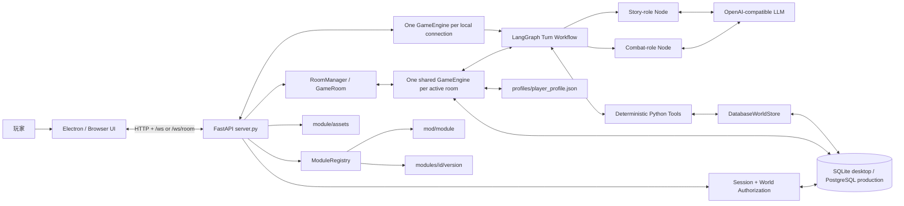
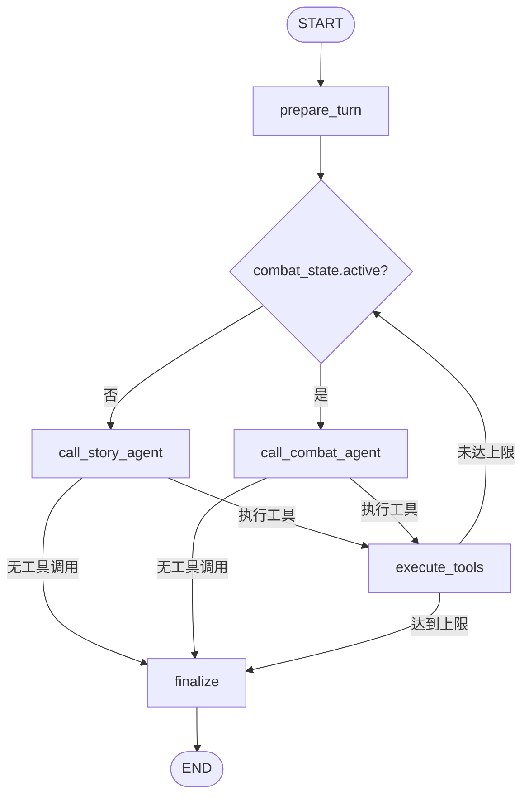
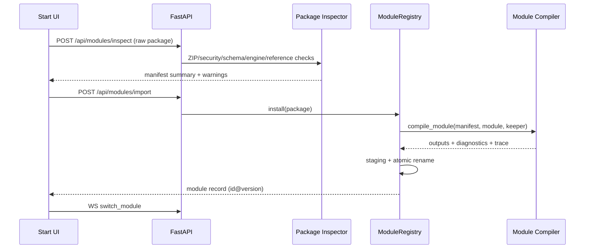

# 架构文档

本文描述当前仓库的实际运行结构。目标读者是准备修改引擎、前端、模组、存档或多人功能的开发者。

## 1. 系统定位

TRPG Master 同时支持本地桌面和账号化云端运行。Electron 提供桌面窗口，FastAPI 提供 HTTP/WebSocket 服务。单机 `/ws` 仍为每条连接创建 `GameEngine`；多人 `/ws/room` 由 `RoomManager` 按 `world_id` 只创建一个 `GameRoom`、一个共享 `GameEngine` 和一份 `ModelSession`。工作流在普通叙事节点与临时战斗职责节点间路由；这两个节点不是独立 Agent。Python 工具通过 `DatabaseWorldStore` 执行确定性规则与状态写入。

核心边界：

- 模型可以提出工具调用，但不能替代骰子、伤害、SAN、存档等确定性实现。
- `world_states.state` 的 JSONB 文档是一个运行世界的事实来源；生产环境使用 PostgreSQL。世界状态 v2 通过 `state_meta.domains` 声明每个聚合的唯一 JSON 路径，不复制可变状态；旧文件状态在导入数据库时经过 `world_migrations`。
- `snapshots.state` 的不可变 JSONB 文档是读档时恢复世界状态的事实来源。
- 前端不直接修改数据库世界状态，只通过 HTTP/WebSocket 请求服务端动作。
- `mod/<module>/` 只保存模组定义与初始模板，新游戏不会写回版本控制目录。
- 用户 `.trpgmod` 版本化安装到 `modules/<id>/<version>/`；运行世界固定绑定模组 key。
- 多人房间由服务端 Session、成员关系、调查员占用和当前行动者共同授权；不接受客户端自报身份。

运行时所有权划分：

- `WsSessionContext` 与 `WsMessageRouter` 拥有连接生命周期、回合租约和协议分发；
- `GameApplication` 提供开始、继续、行动、改写和存档用例，不依赖 FastAPI；
- `ModelSession` 拥有消息历史、活动流、取消和模型诊断；
- `ToolRuntime` 以唯一注册表执行工具并记录审计，模型 schema 与 handler 有覆盖契约；
- `action_resolution`、`encounters`、`discovery`、`consequences` 是不依赖 LLM 的确定性领域层；
- `DatabaseWorldStore` 提供数据库事务、行锁、revision、恢复和显式 schema 迁移；`WorldStore` 文件实现只保留给旧数据导入和兼容测试。

## 术语表

- **TIER（信息边界层级）**：CoC 风格的信息分级，定义于 `skills/core/no_spoiler.skill`：TIER_0 公开（进入场景即可感知的事实、`visible_tags`）、TIER_1 发现（交互或检定得到的表层事实）、TIER_2 推理（由已获线索支撑的结论）、TIER_3 秘密（NPC `secret`、幕后真相，绝不主动揭示）。引擎以滑动窗口向消息历史注入 TIER 提醒（`src/engine.py` 的 `TIER_REMINDER`），防止上下文稀释导致泄密；`link_clues` 工具生成的关联推理线索即 TIER_2 条目。
- **DSML**：部分 OpenAI 兼容供应商误把工具调用以 `<|DSML|tool_calls>` XML 块写进流式 `delta.content` 的私有协议。`src/tool_protocol.py` 把完整区块隔离并转换为内部工具调用；损坏、过长或未闭合的区块直接丢弃，其参数不进入叙事、消息历史或诊断日志。
- **spine / hybrid prompt**：system prompt 组装档位（`TRPG_PROMPT_PROFILE`，取值 `full`/`hybrid`/`opening`，默认 `hybrid`）。模组 skill 在前 300 字符内声明 `trpg-master:prompt-role=spine` 且脊柱内容合计不少于 1000 字符时，`hybrid` 用这些剧情脊柱（spine）替代完整 `module.md`；未声明或内容不足的第三方模组自动回退 `full`（完整 `module.md + skills`）。`opening` 仅供结构化开场使用。
- **narrative_model / judgement_model**：两类模型分工。普通叙事使用 `narrative_model`；战斗职责节点、复杂工具命中后的同回合续写、可选回合审计和上下文摘要兜底使用 `judgement_model`。默认值来自 `src/config.py`，可由设置页或 `TRPG_NARRATIVE_MODEL` / `TRPG_JUDGEMENT_MODEL` 环境变量分别指定。
- **回合记录（TurnRecord）**：一次 GM 回合的持久提交，由 `DatabaseTurnJournal` 写入 `turns` 表（父链、状态、消息与快照引用）与 `turn_events` 表（有序公开事件）；是断线恢复、重新叙述和时间线分支的事实来源。TurnRecord 是文档概念，代码中的共享记录类型与错误位于 `src/turn_journal.py`。

## 2. 系统上下文



## 3. 进程模型

### 3.1 Linux 源码桌面模式

`start_desktop.sh` 是进程所有者：

1. 优先激活 `venv`，回退 `.venv`，并自动补齐缺失的 Python 依赖。
2. 设置桌面 SQLite URL，执行 Alembic；首次运行以数据库审计标记保护的 `--once --replace` 导入旧 `worlds/`。
3. 检查前端依赖与构建产物。
4. 启动 `python3 -u server.py`，轮询 `/api/health`。
5. 启动 Electron，并以前台 `wait` 等待 Electron 主进程。
6. Electron 最后一个窗口关闭后，脚本终止 Uvicorn 并等待其正常退出。
7. Ctrl+C、SIGTERM 与异常退出统一进入清理函数。

终端模式继承 stdout/stderr；`--desktop` 模式重定向到 `/tmp/trpg-desktop.log`。后端日志同时写入 `/tmp/trpg-server.log`。

### 3.2 打包桌面模式

打包后的 Electron 由 `frontend/electron/main.cjs` 托管内置后端：

1. 定位 `resources/backend/trpg-server(.exe)`。
2. 设置只读 `TRPG_PROJECT_ROOT` 与用户数据下的 `TRPG_RUNTIME_ROOT` 后启动后端，Windows 使用 `windowsHide: true`。
3. 轮询 `/api/health`，成功后加载前端页面。
4. `window-all-closed` 或 `before-quit` 时终止内置后端。

设置 `TRPG_EXTERNAL_BACKEND=1` 可禁止打包壳启动内置后端，供调试或外部服务托管使用。

### 3.3 浏览器模式

`server.py` 在 `frontend/dist` 存在时将其挂载到 `/`；浏览器可直接访问 `http://127.0.0.1:8765`。浏览器标签页关闭无法可靠代表服务生命周期，因此自动关服只由 Electron/启动脚本保证。

## 4. 代码分层

| 层 | 主要文件 | 职责 |
|---|---|---|
| 桌面壳 | `frontend/electron/main.cjs`、`start_desktop.sh` | 窗口、首次配置、后端进程生命周期、退出确认 |
| 终端入口 | `src/game_loop.py` | 以 print/input 回调运行同一 `GameEngine` 的终端模式循环 |
| 前端 | `frontend/src/*.ts` | 开局、消息渲染、选项、骰子动画、面板、图片与 WS 状态 |
| 传输适配 | `server.py`、`src/multiplayer_http.py`、`src/ws_session.py`、`src/ws_router.py`、`src/game_application.py`、`src/asset_payload.py` | 应用装配、多人 HTTP 控制面、WebSocket 协议分发、连接生命周期与回合租约、传输无关的游戏用例、素材载荷构建、引擎回调转事件 |
| 鉴权 | `src/auth.py` | Argon2id 账号、可撤销 Session 与世界成员权限 |
| 游戏内核 | `src/engine.py`、`src/history_compactor.py`、`src/npc_conversations.py` | 会话消息、模型调用、存档、角色应用、历史压缩策略、NPC 对话有界记忆、回调接口 |
| 模型会话 | `src/model_session.py`、`src/model_streamer.py`、`src/tool_protocol.py`、`src/speaker_parser.py`、`src/llm.py` | 消息历史、活动流、取消与模型诊断；供应商流式边界、DSML 协议隔离与 NPC 发言归因；GLM 辅助摘要 |
| 回合编排 | `src/agent_graph.py`、`src/choices.py` | 单引擎叙事/战斗职责节点路由、工具循环、finalize 与结构化 choices 提取 |
| 战斗域 | `src/combat_agent.py`、`src/combat.py` | 临时战斗职责提示、权威回合状态、对抗与伤害结算 |
| 行动预检 | `src/action_checks.py` | 在叙述前保守识别明确调查动作并执行真实技能检定 |
| 行动阶段 | `src/action_resolution.py` | 将玩家输入裁定为抵达、普通交互或实际接触，统一限定本回合副作用边界 |
| 场景遭遇 | `src/encounters.py` | 按 Mod 声明的条件、幸运难度和持久化策略解析实际在场人物 |
| 回合对账 | `src/turn_reconciler.py` | 叙事正文裁剪、实体同步、结构化状态审计与受限提交 |
| 发现规则 | `src/discovery.py` | 匹配模组声明的行动意图与目标，在叙事前结算线索/SAN/NPC 效果 |
| 素材事件 | `src/handouts.py` | 声明式素材匹配、去重、旧线索图片修复与静态配置刷新 |
| 结局校验 | `src/endings.py` | 按模组结局定义和 `required_flags` 拒绝伪结局 |
| 性格归一化 | `src/personality.py` | 角色信念、背景/心理特质与暴力立场的兼容读取 |
| 道具域 | `src/inventory.py`、`tools/item.py` | 持有验证、一次性消耗、弹药/堆叠数量与使用日志 |
| 工具路由 | `src/tools.py`、`src/tool_runtime.py` | Function Calling schema、角色工具子集、进程内 handler 注册表与有界执行审计 |
| 确定性规则 | `tools/*.py`、`src/consequences.py` | 检定、骰子、战斗、状态、伤害、SAN、角色、模组导入的实现库；被 `src/tools.py` 进程内导入调用，同时保留独立 CLI 入口 |
| 回合性能 | `src/turn_performance.py`、`src/turn_mutations.py` | 阶段计时、首段可见、权威变更账本与审计跳过依据 |
| 持久化 | `src/persistence.py` | system prompt 组装、存档列表、快照迁移与恢复 |
| 数据库 | `src/database.py` | 数据库引擎、ORM 模型与事务边界（PostgreSQL 生产、SQLite 桌面/测试） |
| 角色服务 | `src/characters.py` | 候选角色、角色复制、案件结算与长期履历 |
| 模组格式 | `src/module_format.py`、`src/module_migrations.py` | v1 作者态模型、交叉引用校验、JSON Schema 与作者态格式迁移 |
| Lorebook | `src/lorebook.py` | Character Card V3 兼容模型、门槛校验、确定性检索与冷却记录 |
| 模组编译器 | `src/module_compiler.py` | 无副作用地生成世界模板、守秘人提示、诊断和字段来源追踪 |
| 模组诊断 | `src/module_diagnostics.py` | 统一模型错误、兼容性错误、警告与作者建议 |
| 模组注册表 | `src/module_registry.py` | 内置/用户模组发现、包安全检查、版本化原子安装 |
| 模组编辑器 | `src/editor_api.py`、`src/editor_projects.py` | Mod Editor 持久作者会话的 HTTP 适配与 revision 校验 |
| 运行时上下文 | `src/runtime.py` | `world_id`、模组定义路径、可写世界路径与旧单人数据迁移 |
| 世界存储 | `src/database_store.py`、`src/world_migrations.py`、`src/world_store.py` | 数据库行锁、revision、事务恢复与 schema 迁移；旧文件 Store 仅供导入/兼容 |
| 回合事件流 | `src/event_stream.py` | 跨线程 FIFO 发送、`turn_id`、单调 `seq` 与回合生命周期 |
| 回合日志 | `src/database_turn_journal.py`、`src/turn_journal.py` | 数据库回合父链、消息/快照、恢复事件、诊断与叙事变体；共享记录类型 |
| 时间线分支 | `src/world_branches.py` | 复制提交父链、创建独立世界与列出可切换时间线 |
| 玩家笔记 | `src/player_notes.py` | 按世界和账号存入数据库，独立 revision；不进入世界事实或模型 prompt |
| 配置 | `src/config.py`、`src/model_settings.py` | 默认数据根目录、模型角色、模型 ID 校验与 `.env.json` 原子持久化 |
| 日志 | `src/logger.py` | 游戏、工具、摘要、模型调用与错误日志 |

## 5. WebSocket 会话、房间与线程

每次连接单机 `/ws` 时，服务端打开一个 `RuntimeContext`，用它创建 `GameEngine` 并调用 `prepare_session()`。多人 `/ws/room?world_id=...` 则先校验 Session 与成员关系，再通过 `RoomManager.get_or_create()` 单飞加载共享引擎；后续连接附着到同一个 `RoomEventHub`，不会创建第二份模型历史。连接初始化后发送模组、角色、主题、模型设置、存档列表和可恢复的公开房间状态。

`GameEngine.handle_action()` 是同步阻塞函数。`server.py` 使用 `run_in_executor` 把它放入工作线程，避免阻塞 FastAPI 事件循环：

```mermaid
sequenceDiagram
    participant UI as Frontend
    participant Loop as FastAPI Event Loop
    participant Worker as Engine Worker Thread
    participant Engine as GameEngine
    participant Queue as Ordered Event Stream

    UI->>Loop: {type: action}
    Loop->>Loop: reserve connection + world turn
    Loop->>Queue: gm_turn_start(turn_id, seq=1)
    Loop->>Worker: run_in_executor(handle_action)
    Worker->>Engine: LangGraph turn
    Engine-->>Worker: synchronous callbacks
    Worker->>Queue: emit(payload)
    Queue-->>UI: one FIFO sender
```

`OrderedTurnEventStream` 是连接内唯一的 `send_json` 调用者。回合事件从 `gm_turn_start` 到 `done`
共享 `turn_id`，并携带从 1 递增的 `seq`；会话级列表、状态和心跳响应仍走同一个 FIFO，但不带
回合字段。前端拒绝旧回合或非递增事件，因此工具回调、素材和 `done` 不再依赖多个 asyncio
任务碰巧按创建顺序完成。

单机会话拥有连接级 `turn_lock`，每个 `world_id` 另有进程内共享的 `world_turn_lock`。多人入口还在
`GameRoom` 先执行当前行动者、数据库持久 `action_id` 和房间行动锁检查。它们都必须在
`begin_turn()` 前非阻塞占用；失败返回 `turn_rejected`，所以异常客户端无法先覆盖 active
`turn_id` 再排队 worker。世界锁也阻止断线后的旧 worker 与新连接同时推进同一世界。
`DatabaseWorldStore` 使用进程内锁配合回合工作单元：工具 mutation 先写入连接内缓冲状态，finalize
再以回合起始 revision 加数据库行锁校验，并与 Turn、Snapshot、自动存档和事件在同一事务提交。
异常或取消丢弃缓冲状态；多人连接共享同一个 `GameEngine.messages`，单机 `/ws` 的连接仍彼此独立。

每次 gameplay 回合在 worker 启动前由 `DatabaseTurnJournal.begin()` 在 `turns` 创建持久 `turn_id`。
finalize 在数据库事务中写入消息、不可变 `snapshots`、`turn_events` 与 completed 状态，事务成功后
才发送 `done`。模型/工具中途异常会留下 `failed/interrupted` 记录；进程重启会把旧 owner 的 active 记录
标成 `interrupted`。重连客户端可查询该 ID：完整记录直接重放已合并的公开事件，尚在同进程执行
则轮询，未提交记录才回退到最近自动存档。

模型设置更新也尝试获取同一个 `turn_lock`：正在生成时拒绝变更，空闲时校验两个模型 ID、原子更新 `.env.json`、更新当前引擎并作为后续连接的默认值。API Key 和请求地址不会被该操作覆盖。

检定确认和战斗决定是两类阻塞式握手：

1. 工作线程通过 `suggest_check` 或 `decision_request` 事件询问前端。
2. 工作线程最多等待 120 秒。
3. WebSocket 主循环仍可接收 `suggest_reply` 或带决定 ID 的 `decision_reply`。
4. `threading.Event` 被置位后，工作线程继续工具调用。

战斗决定超时时采用状态机给出的安全默认项，并发送 `decision_resolved` 关闭旧弹窗。

## 6. GM 单引擎回合工作流

`src/agent_graph.py` 构建以下 LangGraph。节点名中的 `agent` 是历史命名；它们共享同一个
`GameEngine`、`ModelSession`、消息列表和世界上下文，不代表多个独立 Agent：



### 6.1 `prepare_turn`

- 玩家输入存在时增加玩家回合计数。
- 根据上轮风险和轮数注入 TIER 提醒。
- `src.action_resolution` 在任何状态写入前生成单一 `ActionResolution`。跨场景动作停在 `arrival`；同一句中的查看、阅读等后续目的不升级为已完成事实。当前场景命中声明式发现规则时才进入 `contact`，其余为 `interaction`。
- `arrival` 先提交明确的场景移动，再发送场景描述；这一回合不执行通用技能预检，也不授权线索、SAN 和发现规则关联 flag。模型提出这些副作用时会被同一行动阶段门禁拒绝。
- 场景目录的 `npcs_present` 是模组初始驻点和按人物寻路的索引，不是永久出勤承诺。每次抵达时，引擎按 NPC 的运行时 `current_location` 重新生成 `current_scene.npcs_present`；只有实际在场人物才能触发头像。人物离开、被带走或死亡后无需改写静态场景目录。
- 场景声明 `encounters` 时，`src.encounters` 覆盖对应 NPC 的隐式驻点，统一处理 guaranteed、conditional、luck 和 unavailable。幸运结果使用真实 d100 工具；`repeat=once` 写入 `encounter_history`，避免通过反复进出刷结果。解析只公开在场/不在场及作者提供的可见文本，不把 NPC 的真实位置泄露给故事模型。
- `contact` 由 `src.discovery` 匹配当前场景中尚未发现的 `discovery_rules`，组合 `approach_text` 并在叙事前结算。无条件规则是本动作的权威契约，不再叠加通用语言推断出来的侦查；只有 `requires_success: true` 才执行作者指定技能。
- 前置叙事可见后，在第一次模型请求前原子提交线索、`flag_effects`、SAN、NPC 揭示和素材事件。
- 没有命中发现规则时，`src.action_checks` 仍对明确搜查、聆听、追踪等动作做一次权威检定。
- 将玩家动作、紧凑世界状态、时代约束、真实检定和已结算发现一并追加为 user 消息。
- 根据内容关键词按需加载战斗、魔法、心理等 Skill。
- 每轮先恢复为 `narrative_model`。默认配置下叙述与判定均为 Pro，也可由设置页或环境变量分别指定。

### 6.2 模型职责节点路由

- `combat_state.active` 为假时进入 `call_story_agent`（普通叙事职责节点），负责探索、社交、线索与战斗交接。
- 战斗激活时进入 `call_combat_agent`（战斗职责节点），使用 `judgement_model` 并在同一次正常模型调用上叠加临时战斗提示。
- 两个节点共享同一消息历史、权威世界状态和模型调用器，没有独立长期记忆、独立规划循环或节点间通信。
- 战斗职责节点可选择 NPC 战术，但只能用 `combat_*` 工具改变战斗事实。

### 6.3 模型调用

- 使用 OpenAI Chat Completions 流式接口。
- 开头首句经过内部控制语过滤；流式协议防火墙会短暂保留可能构成工具协议起始符的尾部，确认是普通文本后再通过 `on_narrative` 发送，因此仍保留细粒度流式输出。
- 结构化工具调用按 index 累积并在流结束后交给路由节点。兼容供应商误放进 `delta.content` 的 DSML 工具协议：完整区块被隔离并转换为内部工具调用，损坏、过长或未闭合区块直接丢弃，参数不会进入叙事、消息历史或诊断日志。
- 玩家展示不以原始模型正文为权威：服务端把正文定稿为 `chat_events`，补齐守秘人/NPC 身份并只下发公开 schema 字段。显式 NPC 标签用于低延迟流式归因；漏标签时仅允许当前世界已知公开姓名的 `姓名：台词` 行恢复为人物发言。
- 浏览器用独立展示队列消费安全的叙事增量，网络接收速度不直接决定逐字播放速度；标点和人物切换带节奏停顿，长积压自动追赶。`done` 与玩家可交互的 presentation complete 分离，骰点、素材和选项不会越过尚未展示的相关叙事。
- 普通叙事使用 `narrative_model`；战斗、复杂工具命中后的同回合续写、可选回合审计和上下文摘要兜底使用 `judgement_model`。
- 故事模型只看到需要其判断的 `MODEL_TOOLS`。项目文件读取、状态快照读取、素材展示、场景缓存和私有摘要写入仍保留兼容实现，但不再制造同步工具循环。
- 发送请求前会修复旧存档中被控制消息打断的工具响应批次，避免 OpenAI 兼容接口拒绝历史。
- 不会因普通检定重跑已经流式输出的内容；只有确实调用复杂工具时，工具后的下一次请求才切到判定模型。
- 默认 `hybrid` system prompt 只对声明 `trpg-master:prompt-role=spine` 且内容充足的模组启用；未声明的第三方模组自动保留完整 `module.md + skills`。

### 6.4 战斗状态机

`combat_start` 在 `world_state.combat_state` 创建权威状态，包含 encounter ID、轮次、参战者、先攻、当前行动者、防御次数、待确认决定和有界日志。玩家消息已经声明开场攻击或武力威胁时，调用方通过 `initial_action` 一次提交，状态机直接进入确认/结算，不再依赖模型节点开战后补交第二次工具调用。`combat_action` 校验行动者并执行 d100 对抗、伤害、重伤与回合推进；PC 枪械攻击通过 `src.inventory` 的共享资源服务扣弹，即使射击落空也会消耗一发，0 发时拒绝动作且不推进回合。`combat_end` 负责非击倒类结束条件。

战斗外道具动作调用 `use_item`：`use` 仅验证持有，`consume` 更新堆叠数量或移除一次性物品，`firearm_discharge` 处理鸣枪、试射、打锁等非攻击开枪。后者与战斗枪击共用形如 `左轮手枪（6发）` 的解析和扣减逻辑，但同一发子弹只能走一条调用路径。成功动作追加到有界 `item_use_log`，并随世界状态快照保存。

状态机在两类升级动作前插入阻塞式玩家决定；决定的载荷字段、选项 ID 与超时语义见 `docs/API.md` 的 `decision_request`：

- `irreversible_violence`：PC 首次攻击未主动敌对的 NPC 时，在任何掷骰、伤害或弹药消耗前返回。默认项为取消，取消不消耗动作或资源；确认后目标写入 `hostile_to_pc`，事件追加到 `violence_log`，并在模组存在 `case_clocks.human_pressure` 时推进压力。
- `coercive_threat`：PC 用武器胁迫未主动敌对的 NPC 时返回。取消开场威胁会结束刚创建的战斗且不消耗行动、弹药或物品；确认后目标写入 `threatened_by_pc` 并转为 `guarded`，事件追加到 `threat_log`。后续真正攻击仍需独立经过 `irreversible_violence`。
- NPC 攻击 PC 时状态机先返回 `decision_required`，由 `GameEngine` 完成前端确认后内部调用 `combat_decide`。

为避免流式文本抢在确认之前叙述“已经拔枪”，`GameEngine.handle_action()` 会先调用无副作用的 `preview_player_escalation()`（`src/combat.py`）。它以保守关键词识别明确攻击/武力威胁，并从当前世界的 NPC 名称解析目标；假设句、否定句和已敌对目标不会拦截。取消时不进入 LangGraph、不发送 tension 或 narrative 事件，只记录“行动未发生”；确认后生成仅本回合有效的一次性授权，后续 `combat_start` / `combat_action` 返回同类型、同目标的状态机决定时，授权静默选择确认项，避免第二次弹窗。授权不匹配或未被消费会在回合结束时清除。

`src.personality` 统一读取 `backstory.beliefs`、背景特质和游戏中获得的心理特质。角色可通过 `backstory.violence_stance` 声明 `avoidant`、`conditional` 或 `unrestrained`；旧角色缺少字段时使用 `conditional`。立场只改变确认措辞和返回给模型职责节点的 `roleplay_context`，不能替玩家否决行动，也不能免除战斗、资源、法律、声望、案件与 SAN 后果。

模组缺少 NPC 的 DEX 或战斗技能时，状态机使用保守默认值并写入 `assumed_fields`，便于后续补全模组数据。战斗状态属于世界快照，因此可随普通存档恢复。

### 6.5 `execute_tools`

- 解析模型提供的 JSON 参数。
- 调用 `GameEngine._execute_tool()`，最终落到 `src.tools.execute_function()`。
- 将工具结果作为 tool 消息写回会话。
- 技能、普通骰、战斗和 SAN 结果转换成 `dice_result`，供前端可视化。
- 单个工具抛出的异常会变成模型可读的错误结果，不会中断整条 WebSocket 回合；按需 Skill 只在整批 tool 消息写完后注入。
- NPC 首次揭示、场景切换和图片线索加入会产生权威事件；`src.handouts` 按编译后的
  `reveal_on.entity_id` 解析素材并按素材 ID 去重。目录线索必须先归档，图片才可展示；展示层不反向写入线索或旗标，模型调用 `show_handout` 只是受同一状态门禁约束的兼容入口。
- 可选 GLM 对复杂工具结果生成简短反馈。

所有工具 handler 都在引擎进程内执行：`execute_function()` 落到 `ToolRuntime` 唯一注册表，handler
接收 `RuntimeContext` 并直接操作同一个 `DatabaseWorldStore`，每次执行记录有界审计
（`ToolExecutionRecord`）。`tools/*.py` 仍保留 CLI 入口，经 `RuntimeContext.from_env()` 读取
`TRPG_PROJECT_ROOT`、`TRPG_RUNTIME_ROOT`、`TRPG_MODULE` 与 `TRPG_WORLD_ID` 打开同一数据库，
不会仅凭模组名猜测唯一状态；但 CLI 不是模型工具的调用路径。

### 6.6 `finalize`

- 合并工具轮与最终叙事，并裁掉尚未发生的选项菜单。
- 保守同步明确进入的场景和当前场景首次出现的 NPC；仅提到地点不会移动玩家。
- 默认使用确定性预检和保守叙事同步，不再为普通回合追加一次模型审计。诊断时可设置 `TRPG_ENABLE_TURN_AUDIT=1`，用结构化 `commit_turn` 检查缺失的场景、线索、物品、NPC、旗标、SAN 或结局候选。
- 将最终叙事追加到消息历史；素材仅由结构化线索、SAN、场景和 NPC 事件触发。
- 更新自动存档 `slot_000`。
- 从明确的 `你可以——` 菜单提取结构化 `choices` 事件；正文中的其他编号列表不会进入协议。
- 标记本轮是否为高风险回合。
- 发送 `done`，前端恢复输入与行动选项。
- 在需要时于 `done` 之后静默压缩历史。

## 7. 上下文与 Skill

### 7.1 常驻上下文

`src.persistence.load_system_prompt()` 按以下顺序组装：

1. `src.config.SKILL_LOAD_ORDER` 中的核心 Skill。
2. 当前模组的 `module.md`，其中模板 PC 会被替换为运行时调查员约束。
3. 当前模组 `skills/*.skill`。

### 7.2 回合 Lorebook

模组可在独立 `lorebook.json` 中提供 Character Card V3 Lorebook。`GameEngine.prepare_session()` 只加载并校验一次；`src.lorebook.select_lore()` 在模型请求前按最近可见消息、当前场景、在场 NPC、已知线索和 flags 做本地确定性筛选。结果有条目数/token 双上限，并追加在本轮 `[引擎权威状态]` 之后，因此不会破坏稳定 system prompt 的前缀缓存。

检索不调用模型、embedding 服务或数据库。条目分组使用模组 ID、组名和持久化回合序号产生可复现选择；`world_state.narrative_memory` 保存 `turn_sequence` 与最多 512 个条目的最近使用记录，支持跨读档冷却。注入过的权威状态和 Lorebook 内容不会再次参与关键词扫描，`gated` 条目必须先通过服务端线索/flag 门槛。

每次选择还生成不含条目正文的 trace：记录条目 ID、命中键、token 估算以及 `scene_gate`、
`cooldown`、`token_budget` 等筛除原因。trace 随回合记录保存并在“上一回合诊断”中展开，
用于调试模组触发，而不是把守秘信息暴露给玩家界面。

### 7.3 按需 Skill

战斗、魔法、心理学、调查方法与角色创建等较大 Skill 不全部常驻。引擎根据工具名或玩家消息关键词注入加载提示，并用 `_loaded_optional_skills` 避免同一会话重复提示；故事模型不直接读取项目文件。

### 7.4 历史压缩

- 触发单位：玩家回合，而不是内部工具消息数。
- 周期：每 50 个玩家回合。
- 保留：最近 24 条消息，并尽量从 user 边界切分。
- 顺序：GLM -> Pro 模型 -> 简单截断兜底。
- 时机：`done` 之后静默运行，成功后更新自动存档。
- 压缩结果作为一条结构化 user 摘要插入 system prompt 之后。

TIER 提醒在高风险回合后最多间隔 5 轮注入；即使没有高风险回合，也会每 10 轮至少注入一次。前 3 轮不重复注入。

## 8. 数据所有权

| 数据 | 路径 | 写入者 | 生命周期 |
|---|---|---|---|
| 模组定义 | `mod/<name>/module.md` | 模组作者 | 版本控制 |
| 初始世界 | `mod/<name>/world_state_initial.json` | 模组作者/导入器 | 新游戏模板 |
| 叙事知识库 | `mod/<name>/lorebook.json` 或用户模组同名文件 | 模组作者 | 模组版本 |
| 用户模组源文件 | `modules/<id>/<version>/manifest.json`、`module.json`、`keeper.md` | `.trpgmod` 导入器 | 指定模组版本 |
| 用户模组编译产物 | `modules/<id>/<version>/module.md`、`world_state_initial.json` | `module_compiler` | 指定模组版本 |
| 世界元数据 | `worlds.metadata_json` | `RuntimeContext` / 世界服务 | 世界生命周期 |
| 当前世界 | `world_states.state` JSONB | `DatabaseWorldStore` | 当前案件 |
| 主题 | `mod/<name>/theme.json` | 模组作者 | 版本控制 |
| 模组素材 | `mod/<name>/assets/*` | 模组作者 | 版本控制 |
| 自动/手动存档 | `save_slots` + `snapshots` | `src.persistence` | 事务化存档与不可变快照 |
| 回合提交日志 | `turns` + `turn_events` | `DatabaseTurnJournal` | 当前时间线的可恢复提交历史 |
| 玩家笔记 | `player_notes` | `PlayerNotesStore` | 按用户隔离，不进入 prompt |
| 默认调查员 | `characters/default/*.json` | 开发者 | 版本控制 |
| 自定义调查员 | `characters/custom/*.json` | 玩家/工具 | 本地运行数据 |
| 长期履历 | `profiles/player_profile.json` | `src.characters` | 跨模组本地数据 |
| 模型配置 | `.env.json` | 配置向导/`start.py` | 本地机密 |
| 运行日志 | `logs/`、`/tmp/trpg-*.log` | 后端/启动脚本 | 诊断数据 |

### 8.1 运行时上下文

`RuntimeContext` 是世界与模组绑定的运行时入口，包含 `world_id`、`module_name`、数据库 URL、
只读 `module_dir`、兼容导入目录和对应 `DatabaseWorldStore`。`GameEngine`、持久化、角色服务和
工具执行器都显式接收该对象。桌面启动器在后端启动前用 `--once --replace` 将旧 `worlds/`
导入数据库；成功标记写入 `audit_events`，后续运行不再把兼容 JSON 当成事实来源。

世界状态含 `schema_version` 与单调递增的 `revision`。`DatabaseWorldStore.update()` 在数据库
事务和行锁内读取最新状态、执行 mutator 并检查可选 `expected_revision`。过期版本抛出
`StaleRevisionError`，提交失败则由数据库整体回滚。

### 8.2 存档

`save_slots` 保存槽位、消息与 UI 摘要，`snapshots` 保存不可变 JSONB 状态并由外键关联。

- `slot_000` 是自动槽。
- `save_slots.messages` 保存 system/user/assistant/tool 消息及工具调用关联。
- 读取旧槽位时会规范化工具消息顺序，并为历史中缺失的工具返回补入明确错误，避免存档无法继续。
- `snapshots.state` 保存完整世界状态，读档时通过 `DatabaseWorldStore.restore()` 生成新的 revision。
- 读档记录开始时的 revision；读取槽位期间若世界已被其他动作更新，恢复会以 `StaleRevisionError` 明确拒绝，避免覆盖新行动。
- `save_slots.metadata_json` 保存列表 UI 所需摘要、schema/revision 与可选 `label`。
- 旧快照通过 `src.world_migrations` 补充 schema、私有记忆、NPC 揭示与 PC 心理档案。
- 进行中的 `combat_state` 位于完整世界状态内，读档后 LangGraph 会路由到战斗职责节点。

### 8.3 回合记录、重新叙述与时间线

`turns` 保存父链、状态、消息和快照引用，`turn_events` 保存有序公开事件；桌面兼容导出可生成旧 `record.json`，但它不是事实来源。公开恢复数据不包含 system prompt、Lorebook 正文或工具私有输出。

“重新叙述”仅允许当前世界最后一个完成回合，要求当前 world revision 与记录一致。它使用独立的
短 prompt、禁用全部 tools，并只替换匹配的 assistant 正文；固定 choices、工具结果和世界快照不变。
每个变体及模型诊断写回回合记录，失败则恢复原消息和自动存档。

每个回合记录同时保存本回合 `player_input`、结果叙事以及 `parent_turn_id`。结果消息上的“创建分支”
不是复制结果后的状态，而是以 `parent_turn_id` 恢复到本次玩家行动前的决策点；首个没有父回合的
开场记录才以自身作为分支源。服务端从该完成回合复制父链、消息和快照到唯一 `world_id`，保留
分叉 revision，并在 `worlds.metadata_json.branch` 记录 parent world 与 source turn。原世界不回滚；新世界后续
状态、存档、回合日志和笔记均独立。存档面板按模组列出这些时间线，前端把当前 world/module
记入本地连接偏好。

### 8.4 调查员与长期履历

新游戏从 `profile/default/module/custom` 四类来源解析角色引用，把角色复制到当前 `world_state.pc`。游戏内变化只作用于案件状态；案件结算后，`settle_case()` 才把结局、HP/SAN 变化、声望、人脉与最后角色状态写入 `profiles/player_profile.json`。

### 8.5 模组包与注册表

`ModuleRegistry` 合并两类来源：

```text
内置 legacy key       mod/<directory>/
用户版本 key          modules/<package-id>/<version>/  -> id@version
```

`RuntimeContext` 在构造时解析并固定 `ModuleRecord`，之后主题、角色、素材、Skill、初始模板和
守秘人提示都从同一 `module_dir` 读取，不允许各服务再次自行拼接 `PROJECT_ROOT/mod`。

`.trpgmod` 导入分为预检与安装：



作者态 `module.json` 保存全部内容定义，运行时编译器只把初始已知线索写入 `clues_found`，并将
完整定义保存到私有 `clue_catalog`/`scene_catalog`。模组版本和世界状态 schema 分别迁移，不能
共用一个版本号。完整契约见 `docs/MODULE_FORMAT.md`。

素材触发同样在编译边界内：实体上的 `asset_id` 会生成精确的 `npc_revealed`、`scene_entered` 或
`clue_discovered` 规则，`reveal_on` 也只有稳定 `entity_id` 能授权展示。旧包里的文本条件可以
解析但运行时忽略并产生编译警告。旧存档恢复时只刷新模组的静态素材元数据，并按目录线索 ID
修复已发现但没有图片关联的线索，不会用线索正文猜图，也不覆盖 HP、场景或其他游戏进度。

线索素材遵循单向副作用边界：`discovery_rules -> state_add_clue(clue_id) -> handout`。图片展示层
不能反向创建目录线索或应用 `flag_effects`；未进入 `clues_found` 的线索图片即使被显式请求也会
被状态门禁拒绝。模型仍可记录即兴文字线索，但只有结构化目录 ID 能进入作者定义的证据流程。

线索的 `discovery_rules` 也在该边界内。规则只允许预定义行动意图、目标别名、可选
`approach_text`、技能门槛、SAN 严重度和 NPC 揭示，不执行作者代码或任意正则。命中后先展示
不含判定结果的前置叙事，再由引擎提交效果，最后把 `resolved_discoveries` 交给模型续写，因此
关键线索与图片不依赖 Function Calling 的自觉性，骰子也不会早于“看见了什么”出现。

编译边界分为四层：`module_format` 定义语言，`module_diagnostics` 产生稳定且可定位的反馈，
`module_compiler` 负责纯转换，`module_registry` 负责 ZIP 安全、落盘和原子安装。
`POST /api/modules/compile` 与 `tools/module_packager.py compile` 都直接消费同一个编译入口；预览
不会创建世界、安装模组或修改作者工程。旧的 `module_format.compile_world_state` 与
`render_keeper_prompt` 仅作为兼容转发保留。

## 9. 前端结构

| 模块 | 职责 |
|---|---|
| `react-main.tsx` / `react/App.tsx` | 创建 React 根节点并启动 WebSocket 生命周期 |
| `react/GameShell.tsx` | 组合主界面、开始菜单与所有覆盖层 |
| `react/components/` | 聊天、控制区、存档、设置、笔记、模组导入等声明式视图 |
| `state/` | Zustand 客户端状态；服务写入、组件订阅 |
| `ws.ts` | 连接、有界退避、断线恢复入口、发送队列、回合序号校验与事件分发 |
| `start.ts` | 模组/调查员选择、新游戏与继续游戏入口 |
| `react/components/ModuleImporter.tsx` | `.trpgmod` 文件选择、HTTP 预检、确认安装与自动切换 |
| `renderer.ts` | 将叙事流、骰子和历史记录转换为消息状态 |
| `options.ts` | 行动选项、自由输入、检定确认 |
| `panels.ts` | 角色、线索、结局、存档与快速存档命令适配 |
| `settings.ts` | 模型路由、回合耗时/context 分区与 Lorebook trace 诊断 |
| `utility.ts` | 不注入模型的玩家笔记，以及仅发送普通 action 的快捷行动 |
| `style.css` | 主题变量、素材化控件和响应式布局 |

前端在 Electron 中通过 `file://` 加载生产资源，因此主题和动态状态主要经 WebSocket 下发。图片 handout 同时携带 `asset_data_uri` 与 HTTP `asset_url`：Electron 优先使用 data URI，浏览器可回退到 HTTP 资产路由。回合中若 handout 先于任何可见叙事到达，前端只缓存到第一段叙事；已有可见叙事时立即展示，不再统一等待 `done`。等待状态由 `turn_phase` 驱动，超过 8 秒后在同一状态条显示耗时；最终按钮优先使用结构化 `choices`。

断线时前端结束当前 loading、关闭失效决定并保留“本轮未确认完成”标记。重连使用有上限的指数
退避，只维护一个连接提示，并按原 `turn_id` 请求持久状态：completed 记录重建完整 UI，active 记录
短轮询，failed/interrupted 才提供自动存档回退。单机补发粒度是完成回合。多人连接另用单调
`room_event_id`、逐连接 ack 和有界缓冲区增量补发；缓冲缺口或进程重启时发送只含公开回合父链、
公开调查员状态与房间控制状态的 `room_full_state`。服务端还会按当前登录用户单独附加
`private_state`，用于恢复其角色详情、可见线索和私人笔记；这一部分不进入公共事件缓冲，也不会
广播给房间内其他连接。

## 10. 错误与可观测性

- 引擎初始化失败：WebSocket 发送 `error` 后关闭连接。
- 模型调用失败：`EngineCallbacks.on_error` 转为 `error` 事件。
- 工具失败：进程内 handler 抛出的异常转为模型可读的错误结果，单个工具失败不中断回合。
- 未捕获的回合异常：WebSocket 发送 `error` 后仍发送 `done`，前端不会永久锁住输入。
- 活动回合重复提交：在创建生命周期前返回 `turn_rejected`，不会排队或覆盖事件归属。
- 工具轮超限：LangGraph 进入 finalize，避免无限工具循环。
- Electron 页面加载失败：主进程显示错误窗口。
- 桌面后端启动失败：启动脚本输出/记录后端末尾日志。

`src/logger.py` 负责游戏、工具、摘要、模型调用和错误日志。每次模型调用记录职责节点、模型名、首 token 延迟、总耗时、结束原因与工具数量；桌面壳日志带 `[main]` 前缀。

隔离 WebSocket 对照显示，声明式预结算把“检查遗体”这类命中发现规则的动作从约 6 次模型请求
降为 1 次，回合耗时约减半；模型请求前 1 秒内即可完成检定、SAN、图片与线索状态提交，模型
首 token 延迟仍是等待的主要来源。Lorebook 本地确定性检索在格式上限规模下仍是毫秒级，无需
向量数据库或额外 Agent。上述结论的历史基准数据见 `docs/archive/benchmarks_2026-07.md`。

### 10.1 设计依据

各决策的外部参考与推导笔记已移至 `docs/DESIGN_RATIONALE.md`。

## 11. 并发边界

- `/ws` 是单机兼容入口；同一世界的多个 `/ws` 连接不构成多人房间。
- `/ws/room` 是权威多人入口。一个应用进程内，同一 `world_id` 只存在一个共享引擎；行动按当前
  行动者和房间锁串行化，`room_actions` 的唯一约束保证进程重启后的 `action_id` 幂等。
- `RoomEventHub` 在发送前过滤 `public`、`player:<user_id>`、`owner` 与 `server_only`，私人决定和
  玩家笔记不会先广播再靠前端隐藏；完整 `character_state` 同样按当前调查员控制者定向投递。
- 第一版只允许一个 Uvicorn worker。多 worker 或多 VM 尚未实现跨进程房间租约、粘性路由和事件
  总线，直接横向扩容会破坏“一世界一引擎”约束。
- 不同世界由数据库外键、世界行锁、独立 `GameRoom` 和独立事件缓冲共同隔离。

## 12. 扩展方式

### 新增工具

1. 在 `src/tools.py` 添加 Function Calling schema。
2. 用 `@TOOL_RUNTIME.handler(...)` 注册进程内 handler；`execute_function()` 经注册表分发。
3. 如需即时反馈，将名称加入 `COMPLEX_FUNCTIONS`；该集合不触发模型切换。
4. 如有前端副作用，在 `agent_graph._handle_tool_side_effects()` 或 EngineCallbacks 中发事件。
5. 更新 `docs/API.md`（如果协议变化）及相关 Skill。

### 新增服务端事件

1. 在 `EngineCallbacks` 增加回调或从 `server.py` 直接发送。
2. 在 `frontend/src/ws.ts` 增加事件分发。
3. 把 payload 字段和事件顺序写入 `docs/API.md`。

### 新增模组

1. 从 `examples/module-template/` 复制作者工程。
2. 编辑 `manifest.json`、`module.json`、`keeper.md` 与可选素材目录。
3. 运行 `tools/module_packager.py compile` 查看诊断，再运行 `pack`；不能手写编译产物。
4. 从开始界面导入，验证玩家预览、开场、读档隔离和图片发放。
5. 已发布实体 ID 保持稳定；不兼容内容变更提升模组主版本。

### 模组编译器契约

`src/module_compiler.py` 是游戏安装器、HTTP 预览和 CLI 共同使用的唯一权威编译入口。输入为
`manifest.json + module.json + keeper.md`（`lorebook.json` 为可选校验输入），输出
`CompilationResult`：世界模板 `world_state`、守秘人提示 `keeper_prompt`、`diagnostics[]` 和
`trace[]`。`diagnostics` 分 `error`/`warning`/`advice` 三级，带稳定 `code`、`phase`、作者态字段
`path` 和 `message`，只有 `error` 阻止安装；`trace` 记录 `source_path -> output_path` 的转换来源，
供编辑器解释运行时值的出处。编译器本身不读写文件、不安装模组、不创建世界：包路径、素材
存在性、checksum 和 ZIP 安全由 `module_registry` 在编译前检查，落盘只发生在注册表安装或 CLI
显式指定 `--output` 时。作者侧的诊断与校验规则见 `docs/MODULE_FORMAT.md` 的「校验与诊断」一章。

## 13. 安全边界

- 服务端已提供 Argon2id 账号、可撤销 Session 和世界成员权限。桌面模式默认允许匿名游戏；公网部署必须设置 `TRPG_REQUIRE_AUTH=1`、通过 TLS 反向代理访问，并关闭或按需开放注册。
- `.env.json` 含 API Key，禁止打包和提交。
- 资产路由与 `read_file` 有路径边界检查；新增文件接口时必须保持相同约束。
- `.trpgmod` 必须经过跨平台路径、符号链接、文件类型、体积、Schema、引擎版本、引用和 checksum 检查后才能安装。
- 第三方 `custom_skills` 会改变模型行为，导入预览必须显示信任警告。
- 不要把模组 secret 直接发送到前端。人物线索只使用公开 name、visible tags 与已发放素材。
- 模型输出属于不可信输入。所有玩家可见文本必须先经过流式协议防火墙；不得在 WebSocket、错误消息或日志中回显被隔离的工具协议及参数。
