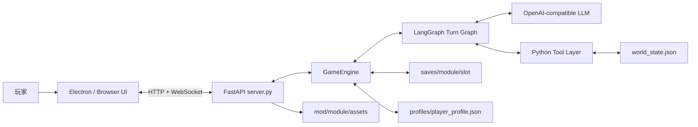

# 架构文档

本文描述当前仓库的实际运行结构。目标读者是准备修改引擎、前端、模组、存档或未来多人功能的开发者。

## 1. 系统定位

TRPG Master 当前是一个本地单机应用：Electron 提供桌面窗口，FastAPI 提供本地 HTTP/WebSocket 服务，`GameEngine` 管理一条玩家会话，LangGraph 按世界状态在叙事 Agent 与战斗 Agent 间路由，OpenAI 兼容模型负责叙事和行动意图，Python 工具负责确定性规则与状态写入。

核心边界：

- 模型可以提出工具调用，但不能替代骰子、伤害、SAN、存档等确定性实现。
- `world_state.json` 是当前案件状态的事实来源。
- `snapshot.json` 是读档时恢复世界状态的事实来源。
- 前端不直接修改世界文件，只通过 WebSocket 请求服务端动作。
- 当前架构不是多人房间服务器，进程内存在全局活动模组与共享状态路径。

## 2. 系统上下文



## 3. 进程模型

### 3.1 Linux 源码桌面模式

`start_desktop.sh` 是进程所有者：

1. 激活 `venv`，检查前端依赖与构建产物。
2. 启动 `python3 -u server.py`，轮询 `/api/health`。
3. 启动 Electron，并以前台 `wait` 等待 Electron 主进程。
4. Electron 最后一个窗口关闭后，脚本终止 Uvicorn 并等待其正常退出。
5. Ctrl+C、SIGTERM 与异常退出统一进入清理函数。

终端模式继承 stdout/stderr；`--desktop` 模式重定向到 `/tmp/trpg-desktop.log`。后端日志同时写入 `/tmp/trpg-server.log`。

### 3.2 打包桌面模式

打包后的 Electron 由 `frontend/electron/main.cjs` 托管内置后端：

1. 定位 `resources/backend/trpg-server(.exe)`。
2. 设置 `TRPG_PROJECT_ROOT` 后启动后端，Windows 使用 `windowsHide: true`。
3. 轮询 `/api/health`，成功后加载前端页面。
4. `window-all-closed` 或 `before-quit` 时终止内置后端。

设置 `TRPG_EXTERNAL_BACKEND=1` 可禁止打包壳启动内置后端，供调试或外部服务托管使用。

### 3.3 浏览器模式

`server.py` 在 `frontend/dist` 存在时将其挂载到 `/`；浏览器可直接访问 `http://127.0.0.1:8765`。浏览器标签页关闭无法可靠代表服务生命周期，因此自动关服只由 Electron/启动脚本保证。

## 4. 代码分层

| 层 | 主要文件 | 职责 |
|---|---|---|
| 桌面壳 | `frontend/electron/main.cjs`、`start_desktop.sh` | 窗口、首次配置、后端进程生命周期、退出确认 |
| 前端 | `frontend/src/*.ts` | 开局、消息渲染、选项、骰子动画、面板、图片与 WS 状态 |
| 传输适配 | `server.py` | HTTP 路由、WebSocket 协议、线程切换、引擎回调转事件 |
| 游戏内核 | `src/engine.py` | 会话消息、模型调用、存档、角色应用、记忆压缩、回调接口 |
| 回合编排 | `src/agent_graph.py` | 叙事/战斗 Agent 路由、工具循环、finalize |
| 战斗域 | `src/combat_agent.py`、`src/combat.py` | 战斗角色提示、权威回合状态、对抗与伤害结算 |
| 性格归一化 | `src/personality.py` | 角色信念、背景/心理特质与暴力立场的兼容读取 |
| 道具域 | `src/inventory.py`、`tools/item.py` | 持有验证、一次性消耗、弹药/堆叠数量与使用日志 |
| 工具路由 | `src/tools.py` | Function Calling schema、工具分类、CLI 子进程执行 |
| 确定性规则 | `tools/*.py` | 检定、骰子、战斗、状态、伤害、SAN、角色、模组导入 |
| 持久化 | `src/persistence.py` | system prompt 组装、存档列表、快照迁移与恢复 |
| 角色服务 | `src/characters.py` | 候选角色、角色复制、案件结算与长期履历 |
| 配置 | `src/config.py` | 数据根目录、模型、活动模组、路径与 Skill 加载顺序 |

## 5. WebSocket 会话与线程

每次连接 `/ws` 时，服务端创建一个新的 `GameEngine` 并调用 `prepare_session()`。连接初始化后依次发送模组、角色、主题和存档列表。

`GameEngine.handle_action()` 是同步阻塞函数。`server.py` 使用 `run_in_executor` 把它放入工作线程，避免阻塞 FastAPI 事件循环：

```mermaid
sequenceDiagram
    participant UI as Frontend
    participant Loop as FastAPI Event Loop
    participant Worker as Engine Worker Thread
    participant Engine as GameEngine

    UI->>Loop: {type: action}
    Loop->>Worker: run_in_executor(handle_action)
    Worker->>Engine: LangGraph turn
    Engine-->>Worker: synchronous callbacks
    Worker-->>Loop: run_coroutine_threadsafe(send_json)
    Loop-->>UI: narrative_chunk / dice_result / done
```

每条连接拥有一个 `turn_lock`，保证同一连接内的多个玩家动作串行执行。这个锁不覆盖其他 WebSocket 连接，也不保护全局 `cfg` 或共享 `world_state.json`。

检定确认和战斗决定是两类阻塞式握手：

1. 工作线程通过 `suggest_check` 或 `decision_request` 事件询问前端。
2. 工作线程最多等待 120 秒。
3. WebSocket 主循环仍可接收 `suggest_reply` 或带决定 ID 的 `decision_reply`。
4. `threading.Event` 被置位后，工作线程继续工具调用。

战斗决定超时时采用状态机给出的安全默认项，并发送 `decision_resolved` 关闭旧弹窗。

## 6. GM 回合状态机

`src/agent_graph.py` 构建以下 LangGraph：


### 6.1 `prepare_turn`

- 玩家输入存在时增加玩家回合计数。
- 根据上轮风险和轮数注入 TIER 提醒。
- 将玩家动作追加为 user 消息。
- 根据内容关键词按需加载战斗、魔法、心理等 Skill。
- 默认把本轮模型设为 Flash；`TRPG_FORCE_PRO` 可让两个角色全程使用 Pro。

### 6.2 Agent 路由

- `combat_state.active` 为假时进入 `call_story_agent`，负责探索、社交、线索与战斗交接。
- 战斗激活时进入 `call_combat_agent`，在同一次正常模型调用上叠加临时战斗职责提示。
- 两个角色共享消息历史与权威世界状态，战斗角色没有独立长期记忆，也不会额外串行调用一次模型。
- 战斗角色可自由选择 NPC 战术，但只能用 `combat_*` 工具改变战斗事实。

### 6.3 模型调用

- 使用 OpenAI Chat Completions 流式接口。
- 文本增量立即通过 `on_narrative` 发送给前端。
- 工具调用按 index 累积并在流结束后交给路由节点。
- 不再因普通检定在同一回合中途从 Flash 重跑 Pro；这避免已流式输出内容与第二次判断互相冲突。
- Pro 仍用于 `TRPG_FORCE_PRO` 和静默上下文摘要兜底。

### 6.4 战斗状态机

`combat_start` 在 `world_state.combat_state` 创建权威状态，包含 encounter ID、轮次、参战者、先攻、当前行动者、防御次数、待确认决定和有界日志。玩家消息已经声明开场攻击或武力威胁时，调用方通过 `initial_action` 一次提交，状态机直接进入确认/结算，不再依赖 Agent 开战后补交第二次工具调用。`combat_action` 校验行动者并执行 d100 对抗、伤害、重伤与回合推进；PC 枪械攻击通过 `src.inventory` 的共享资源服务扣弹，即使射击落空也会消耗一发，0 发时拒绝动作且不推进回合。NPC 攻击 PC 时先返回 `decision_required`，由 `GameEngine` 完成前端确认后内部调用 `combat_decide`。`combat_end` 负责非击倒类结束条件。

战斗外道具动作调用 `use_item`：`use` 仅验证持有，`consume` 更新堆叠数量或移除一次性物品，`firearm_discharge` 处理鸣枪、试射、打锁等非攻击开枪。后者与战斗枪击共用形如 `左轮手枪（6发）` 的解析和扣减逻辑，但同一发子弹只能走一条调用路径。成功动作追加到有界 `item_use_log`，并随世界状态快照保存。

PC 首次攻击未主动敌对的 NPC 时，状态机在任何掷骰、伤害或弹药消耗前返回 `irreversible_violence` 决定。默认项为取消，取消不消耗动作或资源；确认后目标写入 `hostile_to_pc`，事件追加到 `violence_log`，并在模组存在 `case_clocks.human_pressure` 时推进压力。

PC 用武器胁迫未主动敌对的 NPC 时返回 `coercive_threat` 决定。取消开场威胁会结束刚创建的战斗且不消耗行动、弹药或物品；确认后目标写入 `threatened_by_pc` 并转为 `guarded`，事件追加到 `threat_log`，但不会把威胁误算成开枪。后续真正攻击仍需独立经过 `irreversible_violence`。

为避免流式文本抢在确认之前叙述“已经拔枪”，`GameEngine.handle_action()` 会先调用无副作用的 `preview_player_escalation()`。它以保守关键词识别明确攻击/武力威胁，并从当前世界的 NPC 名称解析目标；假设句、否定句和已敌对目标不会拦截。取消时不进入 LangGraph、不发送 tension 或 narrative 事件，只记录“行动未发生”；确认后生成仅本回合有效的一次性授权。后续 `combat_start` / `combat_action` 返回同类型、同目标的状态机决定时，授权静默选择确认项，避免第二次弹窗。授权不匹配或未被消费会在回合结束时清除。

`src.personality` 统一读取 `backstory.beliefs`、背景特质和游戏中获得的心理特质。角色可通过 `backstory.violence_stance` 声明 `avoidant`、`conditional` 或 `unrestrained`；旧角色缺少字段时使用 `conditional`。立场只改变确认措辞和返回给 Agent 的 `roleplay_context`，不能替玩家否决行动，也不能免除战斗、资源、法律、声望、案件与 SAN 后果。

模组缺少 NPC 的 DEX 或战斗技能时，状态机使用保守默认值并写入 `assumed_fields`，便于后续补全模组数据。战斗状态属于世界快照，因此可随普通存档恢复。

### 6.5 `execute_tools`

- 解析模型提供的 JSON 参数。
- 调用 `GameEngine._execute_tool()`，最终落到 `src.tools.execute_function()`。
- 将工具结果作为 tool 消息写回会话。
- 骰子结果转换成 `dice_result`，供前端可视化。
- NPC 首次揭示、场景切换和图片线索加入会触发自动 handout。
- 可选 GLM 对复杂工具结果生成简短反馈。

工具 CLI 通过 argv 列表和 `shell=False` 启动，并继承当前 `TRPG_MODULE`。这保证中文/空格路径可用，也保证运行时切换模组后子进程读写正确的状态文件。

### 6.6 `finalize`

- 将最终叙事追加到消息历史。
- 更新自动存档 `slot_000`。
- 标记本轮是否为高风险回合。
- 发送 `done`，前端恢复输入与行动选项。
- 在需要时于 `done` 之后静默压缩历史。

## 7. 上下文与 Skill

### 7.1 常驻上下文

`src.persistence.load_system_prompt()` 按以下顺序组装：

1. `src.config.SKILL_LOAD_ORDER` 中的核心 Skill。
2. 当前模组的 `module.md`，其中模板 PC 会被替换为运行时调查员约束。
3. 当前模组 `skills/*.skill`。

### 7.2 按需 Skill

战斗、魔法、心理学、调查方法与角色创建等较大 Skill 不全部常驻。模型可调用 `read_file`，引擎也会根据工具名或玩家消息关键词注入加载提示，并用 `_loaded_optional_skills` 避免同一会话重复提示。

### 7.3 历史压缩

- 触发单位：玩家回合，而不是内部工具消息数。
- 周期：每 50 个玩家回合。
- 保留：最近 24 条消息，并尽量从 user 边界切分。
- 顺序：GLM -> Pro 模型 -> 简单截断兜底。
- 时机：`done` 之后静默运行，成功后更新自动存档。
- 压缩结果作为一条结构化 user 摘要插入 system prompt 之后。

TIER 提醒在高风险回合后最多间隔 5 轮注入；即使没有高风险回合，也会每 10 轮至少注入一次。前 3 轮不重复注入。

## 8. 数据所有权

| 数据 | 路径 | 写入者 | 生命周期 |
|---|---|---|---|
| 模组定义 | `mod/<name>/module.md` | 模组作者 | 版本控制 |
| 初始世界 | `mod/<name>/world_state_initial.json` | 模组作者/导入器 | 新游戏模板 |
| 当前世界 | `mod/<name>/world_state.json` | 状态工具、角色服务、读档 | 当前案件 |
| 主题 | `mod/<name>/theme.json` | 模组作者 | 版本控制 |
| 模组素材 | `mod/<name>/assets/*` | 模组作者 | 版本控制 |
| 自动/手动存档 | `saves/<name>/slot_*` | `src.persistence` | 本地运行数据 |
| 默认调查员 | `characters/default/*.json` | 开发者 | 版本控制 |
| 自定义调查员 | `characters/custom/*.json` | 玩家/工具 | 本地运行数据 |
| 长期履历 | `profiles/player_profile.json` | `src.characters` | 跨模组本地数据 |
| 模型配置 | `.env.json` | 配置向导/`start.py` | 本地机密 |
| 运行日志 | `logs/`、`/tmp/trpg-*.log` | 后端/启动脚本 | 诊断数据 |

### 8.1 活动模组

`src.config.set_active_module(name)` 会同时更新：

- `MODULE_NAME`
- `MODULE_DIR`
- `STATE_FILE`
- `INITIAL_STATE_FILE`
- `SAVES_DIR`
- `THEME_FILE`
- `ASSETS_DIR`
- 环境变量 `TRPG_MODULE`

这些变量是进程级全局值。一个连接切换模组会影响同一进程中的其他连接和后续工具子进程。

### 8.2 存档

```text
saves/<module>/slot_NNN/
├── messages.json
├── snapshot.json
└── meta.json
```

- `slot_000` 是自动槽。
- `messages.json` 保存 system/user/assistant/tool 消息及工具调用关联。
- `snapshot.json` 保存完整世界状态，读档时覆盖当前 `world_state.json`。
- `meta.json` 保存列表 UI 所需摘要与可选 `label`。
- 旧快照在读档时补充 `private_memory`、NPC `revealed` 和 PC `psychological_profile`。
- 进行中的 `combat_state` 位于完整世界状态内，读档后 LangGraph 会直接路由到战斗 Agent。

### 8.3 调查员与长期履历

新游戏从 `profile/default/module/custom` 四类来源解析角色引用，把角色复制到当前 `world_state.pc`。游戏内变化只作用于案件状态；案件结算后，`settle_case()` 才把结局、HP/SAN 变化、声望、人脉与最后角色状态写入 `profiles/player_profile.json`。

## 9. 前端结构

| 模块 | 职责 |
|---|---|
| `main.ts` | 启动 WebSocket、应用主题 |
| `ws.ts` | 连接、重连、发送队列、服务端事件分发 |
| `start.ts` | 模组/调查员选择、新游戏与继续游戏入口 |
| `renderer.ts` | Markdown 消息、流式追加、滚动策略、骰子与 handout 容器 |
| `options.ts` | 行动选项、自由输入、检定确认 |
| `panels.ts` | 角色、线索、结局、存档与快速存档 |
| `dom.ts` | DOM 引用与连接状态 |
| `style.css` | 主题变量、素材化控件和响应式布局 |

前端在 Electron 中通过 `file://` 加载生产资源，因此主题和动态状态主要经 WebSocket 下发。图片 handout 同时携带 `asset_data_uri` 与 HTTP `asset_url`：Electron 优先使用 data URI，浏览器可回退到 HTTP 资产路由。

## 10. 错误与可观测性

- 引擎初始化失败：WebSocket 发送 `error` 后关闭连接。
- 模型调用失败：`EngineCallbacks.on_error` 转为 `error` 事件。
- 工具超时：CLI 默认 30 秒，结果以错误字符串返回给模型。
- 工具轮超限：LangGraph 进入 finalize，避免无限工具循环。
- Electron 页面加载失败：主进程显示错误窗口。
- 桌面后端启动失败：启动脚本输出/记录后端末尾日志。

`src/logger.py` 负责游戏、工具、摘要、模型调用和错误日志。每次模型调用记录 Agent 角色、模型名、首 token 延迟、总耗时、结束原因与工具数量；桌面壳日志带 `[main]` 前缀。

## 11. 当前并发边界

虽然 `/ws` 可以建立多条连接，但当前实现不能提供隔离的多人世界：

- 活动模组路径保存在全局 `src.config`。
- 同一模组只有一个 `world_state.json`。
- 存档命名空间只有模组，没有房间或世界实例 ID。
- `turn_lock` 仅属于单条连接。
- 不同连接的 `GameEngine.messages` 独立，但会读写同一个世界文件。
- HTTP 与 WebSocket 均无鉴权和玩家身份。

多人化建议按以下顺序改造：

1. 引入 `world_id`/`room_id`，把活动模组从全局变量移到会话上下文。
2. 将状态路径改为 `worlds/<world_id>/world_state.json` 或数据库中的世界快照。
3. 建立服务端权威的 Room/World 对象与跨连接回合锁。
4. 为玩家连接增加身份、角色占用和权限。
5. 把事件广播与私人事件分开，明确可见性。
6. 再评估 SQLite/PostgreSQL，用于账户、房间、成员与索引；大体积会话快照仍可保留文件或对象存储。

## 12. 扩展方式

### 新增工具

1. 在 `src/tools.py` 添加 Function Calling schema。
2. 在 `execute_function()` 分发到 Python 函数或 `tools/*.py`。
3. 如需即时反馈，将名称加入 `COMPLEX_FUNCTIONS`；该集合不触发模型切换。
4. 如有前端副作用，在 `agent_graph._handle_tool_side_effects()` 或 EngineCallbacks 中发事件。
5. 更新 `docs/API.md`（如果协议变化）及相关 Skill。

### 新增服务端事件

1. 在 `EngineCallbacks` 增加回调或从 `server.py` 直接发送。
2. 在 `frontend/src/ws.ts` 增加事件分发。
3. 把 payload 字段和事件顺序写入 `docs/API.md`。

### 新增模组

1. 创建 `mod/<name>/module.md` 和两个 world state 文件。
2. 可选添加 `theme.json`、`skills/`、`characters/` 与 `assets/`。
3. 保持 ID 稳定：NPC、场景、线索和 `asset_map` 通过 ID 关联。
4. 使用开始界面切换模组，验证新游戏重置、读档隔离和图片发放。

## 13. 安全边界

- 服务端默认监听 `0.0.0.0:8765`，但没有鉴权；只应在可信本地网络或本机使用。
- `.env.json` 含 API Key，禁止打包和提交。
- 资产路由与 `read_file` 有路径边界检查；新增文件接口时必须保持相同约束。
- 不要把模组 secret 直接发送到前端。人物线索只使用公开 name、visible tags 与已发放素材。
