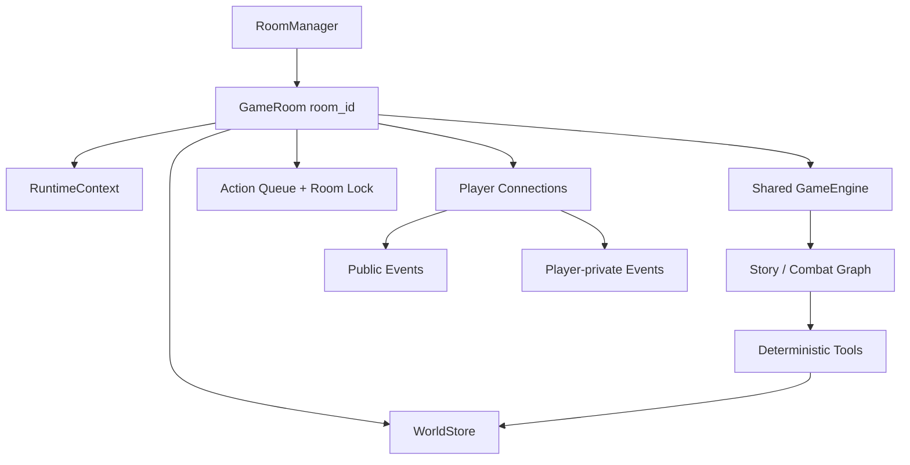

# TRPG Master 开发路线图

本文将项目从当前的本地单人版本推进到稳定的双人/小队联机版本，并明确多 Agent、数据库和远程部署的进入条件。

- 更新日期：2026-07-16
- 当前基线：`af9afb5`
- 当前形态：本地单玩家、React 桌面前端、叙事/战斗双 Agent、按 `world_id` 隔离且支持决策点分支的世界、可导入的版本化 `.trpgmod`
- 第一目标：完成可稳定游玩的 2 人局域网合作版本
- 非近期目标：大型公网服务、玩家匹配、商业化账户体系、每个 NPC 独立 Agent

## 1. 总体判断

### 1.1 多人游戏

可以开始，但“开始多人”首先意味着改造状态所有权，而不是直接制作房间大厅。

M0 已经移除全局状态路径：每个 `GameEngine` 持有 `RuntimeContext`，世界状态与存档按
`world_id` 隔离。尚未完成的多人阻塞是：同一房间还没有共享 `GameEngine`、行动队列、
连接身份与广播机制；直接让多个 WebSocket 操作同一个 `world_id` 仍会产生彼此独立的 GM
消息历史。

因此，多人开发顺序必须是：

1. 世界实例隔离。
2. 房间级权威运行时和行动队列。
3. 玩家身份与角色所有权。
4. 双人前端体验。
5. 私人信息、权限和远程安全。

### 1.2 多 Agent

当前叙事 Agent 与战斗 Agent 已经构成第一版多 Agent。近期不增加第三个常驻 Agent，原因如下：

- 当前主要风险来自状态一致性、工具时序和多人隔离，而不是叙事角色数量不足。
- 日志中的单次模型调用已经可能达到十几秒，串行增加 Agent 会直接增加等待与费用。
- 多个长期记忆不同的 Agent 容易对 NPC 状态、线索边界和玩家行动产生不同解释。
- 多人化本身会显著增加状态与消息路由复杂度，不应同时进行大规模 Agent 拆分。

未来最值得评估的是“场景导演 Agent”：只在进入新场景或案件阶段变化时调用一次，生成结构化私有计划，不参与每个玩家回合。

## 2. 目标架构

一个房间必须只拥有：

- 一个权威世界状态。
- 一条共享 GM 消息历史。
- 一个串行行动队列。
- 一个房间级锁和状态版本号。
- 一组带身份的玩家连接。
- 一份可恢复的房间存档。

推荐新增模块：

| 模块 | 职责 |
|---|---|
| `src/runtime.py` | `RuntimeContext`，保存 `world_id`、`module_name` 与路径；`room_id` 在 M1 由 `GameRoom` 持有 |
| `src/world_store.py` | `WorldStore`、原子更新、版本检查、快照与恢复 |
| `src/world_migrations.py` | 世界状态 schema 版本与显式迁移注册表 |
| `src/rooms.py` | `RoomManager`、`GameRoom`、连接注册、行动队列和广播 |
| `src/identity.py` | 玩家身份、加入令牌、角色所有权和权限 |
| `src/events.py` | 公共/私人事件封装、序号和可见性 |

## 3. 里程碑

### M0：单机运行时收口

状态：已完成（2026-07-11）。

目标：移除多人化的结构性阻塞，同时不改变现有单人玩法。

#### 工作项

- [x] 新增 `RuntimeContext`，不再从业务逻辑直接读取全局 `cfg.MODULE_NAME`、`STATE_FILE` 和 `SAVES_DIR`。
- [x] 新增 `WorldStore`，提供 `load`、`update`、`snapshot`、`restore` 和 `revision`。
- [x] 世界更新采用房间锁、状态版本检查和原子文件替换，避免半写入与覆盖更新。
- [x] 为世界状态加入 `schema_version`，建立显式迁移入口。
- [x] 将运行中的世界实例移到 `worlds/<world_id>/`，`mod/<module>/` 只保留定义和初始模板。
- [x] 将 `GameEngine`、持久化层和角色服务改为接收 `RuntimeContext`。
- [x] 让状态相关工具接收上下文或状态对象，停止依赖 `TRPG_MODULE` 选择唯一状态文件。
- [x] 保留单人兼容入口：桌面启动时自动创建或恢复默认本地世界。
- [x] 增加两个世界实例同时运行的隔离测试。
- [x] 增加存档恢复、待确认动作恢复和异常写入恢复的集成测试。

#### 验收标准

- 同一模组可以创建两个 `world_id`，角色、HP、线索、物品和战斗状态完全隔离。
- 两个引擎交替执行至少 20 个动作，不出现跨世界写入。
- 单个世界的并发更新不会丢失，过期 `revision` 会被明确拒绝或重试。
- 新游戏不再修改版本控制中的 `mod/*/world_state.json`。
- 现有单人存档可以自动迁移并继续游玩。

验证证据：`tests/test_world_store.py` 覆盖线程/进程并发、revision、原子失败、备份恢复、
双世界与旧单人迁移；`tests/test_runtime_integration.py` 覆盖两个引擎交替 20 次工具动作、
存档恢复、schema 迁移和待确认战斗动作恢复。

### M0.5：模组生态基础

状态：已完成（2026-07-12）。

目标：建立可导入、可验证、可版本化且能被未来编辑器无损读写的模组契约。

#### 工作项

- [x] 定义 `.trpgmod` v1：ZIP 容器、`manifest.json`、`module.json` 与 Markdown 正文。
- [x] 使用 Pydantic 2 定义作者态领域模型并生成 Draft 2020-12 JSON Schema。
- [x] 分离全部线索目录与开局已知线索，编译当前引擎使用的世界模板和守秘人提示。
- [x] 把编译器抽成无副作用服务，统一安装器、HTTP/CLI 预览、结构化诊断与字段来源追踪。
- [x] 实现路径、符号链接、文件类型、体积、压缩比、checksum 与交叉引用校验。
- [x] 实现 `ModuleRegistry`，统一发现内置模组和版本化用户模组。
- [x] 让 `RuntimeContext`、角色、主题、素材和 Skill 都从固定 `ModuleRecord.path` 读取。
- [x] 实现 HTTP 预检/导入、游戏开始页预览、能力警告、安装和自动切换。
- [x] 实现 pack/validate/schema CLI 与完整示例工程。
- [x] 禁止模型工具自行导入文件或覆盖当前世界，模组安装只由用户入口触发。
- [x] 完成格式规范和模组编辑器需求/技术规划。

#### 验收标准

- 同一个包重复导入幂等；同版本不同内容拒绝覆盖；多个版本可以并存。
- 导入后的模组能创建世界、选择调查员、加载主题/素材并生成开场提示。
- 路径穿越、符号链接、脚本、损坏 JSON、悬空引用和缺失素材均在写入前拒绝。
- 玩家开局状态只包含 `initially_known` 线索，完整目录不提前进入 `clues_found`。
- 编辑器前后端可消费同一份 Schema，导出的包继续经过服务端权威校验。

验证证据：`tests/test_module_packages.py` 覆盖编译结果、字段诊断、来源追踪、无副作用 HTTP 预览、
引用、Schema、打包、幂等安装、版本并存、冲突、引擎兼容、跨平台路径、路径穿越、符号链接、
脚本、缺失素材与 HTTP 导入。

### M1：多人房间内核

预计工作量：5–8 个开发日。

目标：允许多个连接安全地加入同一个房间，共享同一位守秘人和同一世界。

#### 工作项

- [ ] 实现 `RoomManager`，按 `room_id` 创建、获取、休眠和销毁 `GameRoom`。
- [ ] 每个 `GameRoom` 只创建一个共享 `GameEngine`，不再为每个 WebSocket 创建独立 GM 历史。
- [ ] 建立房间级 `action_queue` 和 `room_lock`，所有改变世界的动作串行执行。
- [ ] 在现有单机 `TurnJournal + turn_id/seq` 基础上增加房间级 `event_id`、逐玩家 ack 与增量补发。
- [ ] WebSocket 握手加入 `protocol_version`、`room_id`、`player_id` 和 `join_token`。
- [ ] 为请求增加 `request_id`，错误使用稳定的结构化 `error_code`。
- [ ] 实现房间广播以及 `public`、`player:<id>`、`keeper` 三类可见性。
- [ ] 支持房主创建房间、玩家加入、离开和重新连接。
- [ ] v1 探索阶段采用“当前提交者”模式，一次只允许一个玩家动作进入 GM 队列。
- [ ] 增加双连接广播、并发提交、断线重连和房间销毁测试。

#### 验收标准

- 两个浏览器可以加入同一房间并看到完全相同的公共叙事、骰子和 handout。
- 同一玩家重连后不会创建第二条 GM 历史，并可从最后 `event_id` 补齐事件。
- 两名玩家同时提交动作时，服务端只按队列顺序执行，不会并发调用 GM 或覆盖状态。
- 不同房间之间的模组、状态、消息和存档完全隔离。

### M2：双人可玩版本

预计工作量：1–2 周。

目标：两名玩家各自控制一名调查员，完成一个短模组。

#### 数据模型

- [ ] 将单数 `world_state.pc` 迁移为调查员集合，例如 `investigators` 与 `party`。
- [ ] 为每名调查员保存 `investigator_id`、`owner_player_id` 和在线状态。
- [ ] 保留单人兼容读取层，旧工具访问 `pc` 时映射到当前行动调查员。
- [ ] 检定、伤害、SAN、物品与战斗工具显式接收 `actor_id` 或 `target_id`。
- [ ] 共享线索与私人线索分开存储。

#### 服务端与规则

- [ ] 探索阶段允许房主切换当前提交者，或由玩家主动申请发言权。
- [ ] 战斗阶段由 `combat_state.current_actor` 决定唯一可提交玩家。
- [ ] 防御、孤注一掷、不可逆暴力等决定只发给角色所有者。
- [ ] 玩家掉线时支持等待、房主托管或安全默认项。
- [ ] GM prompt 注入队伍摘要，明确每名调查员姓名、性格、位置和所有者。
- [ ] 自动存档保存房间消息、全部调查员和玩家成员关系。

#### 前端

- [ ] 新增创建/加入房间界面和短加入码。
- [ ] 新增玩家列表、角色占用、准备状态和连接状态。
- [ ] 区分公共聊天、提交给 GM 的行动和系统消息。
- [ ] 明确显示当前提交者与战斗当前行动者。
- [ ] 私人决定和私人线索只在目标玩家界面出现。
- [ ] 支持刷新页面后重连并恢复房间 UI。

#### 验收标准

- 两名玩家可分别选择调查员并完成一次探索、检定、线索获取和战斗。
- 任何玩家都不能替另一名玩家确认私人决定或操作其角色。
- 中途断开一个客户端不会停止房间；重连后状态和消息一致。
- 保存、退出服务、重新启动并恢复房间后可以继续游戏。

### M3：多人体验完善

预计工作量：1–2 周。

- [ ] 房主权限、移交房主、踢出玩家和旁观者模式。
- [ ] 私聊、秘密 handout、单人 SAN 体验和分离场景。
- [ ] 行动提案与投票模式，供队伍共同决定关键选择。
- [ ] 房间暂停、空房休眠、超时清理和崩溃恢复。
- [ ] 多人存档列表、房间重命名、复制世界和归档案件。
- [ ] 延迟、队列长度、模型调用费用和工具错误的房间级日志。
- [ ] 完成 2–4 人长时间压力测试。

### M4：远程部署与安全

此阶段只在局域网双人版本稳定后开始。

- [ ] 服务端不再默认无鉴权暴露到公网。
- [ ] 加入正式账户或一次性会话凭据、TLS、速率限制和审计日志。
- [ ] 明确 API Key 由房主提供还是由服务端统一托管。
- [ ] 防止玩家读取模组私密内容、其他房间状态和服务端文件。
- [ ] 迁移到支持多进程协调的持久化与消息系统。
- [ ] 增加备份、数据导出、删除和隐私策略。

## 4. 数据库策略

### 本地与局域网阶段

采用 SQLite 保存结构化元数据：

- 房间与世界索引。
- 玩家成员关系与角色占用。
- 加入令牌和权限。
- 事件序号与操作审计。
- 存档元数据和 schema 版本。

以下内容继续使用文件：

- `module.md`、规则和 Skill。
- 模组图片、主题与 handout。
- 可移植的完整世界快照。
- 可导出的聊天记录。

建议通过 Repository 接口隔离数据库，不让 Agent、工具和前端直接依赖 SQL。

### 公网与多进程阶段

满足以下任一条件后再考虑 PostgreSQL：

- 同时运行多个后端进程。
- 需要跨设备长期账户。
- 需要服务端托管大量活跃房间。
- SQLite 单写入者成为可测量瓶颈。

不要在当前阶段把模组正文、图片或所有世界字段拆成关系表。

## 5. 多 Agent 进入条件

新增 Agent 前先建立固定场景评测集，至少覆盖：

- 开场身份与模组边界。
- 调查、线索和无剧透约束。
- 社交与 NPC 一致性。
- 战斗、物品、SAN 和不可逆行动。
- 存档恢复和上下文压缩后续写。
- 两名玩家提出冲突意图。

每次评测记录：

| 指标 | 说明 |
|---|---|
| 工具正确率 | 是否调用正确工具、参数与顺序 |
| 状态一致性 | 叙事是否与权威状态相符 |
| 信息边界 | 是否泄露秘密或未发现线索 |
| 角色一致性 | NPC 和调查员行为是否连续 |
| 首 token 延迟 | 玩家等待多久开始获得反馈 |
| 完整回合耗时 | 从提交到重新可操作的时间 |
| Token 与费用 | 增加 Agent 后的实际成本 |

只有当现有双 Agent 在某一类任务上持续失败，并且不能通过确定性工具、Skill 或结构化状态解决时，才新增 Agent。

### 候选：场景导演 Agent

- 触发时机：进入新场景、案件阶段变化或上下文压缩完成后。
- 输入：已揭示事实、私有记忆、场景状态和模组约束。
- 输出：结构化目标、NPC 动机、潜在升级和禁止泄露项。
- 可见性：只进入守秘人私有上下文，不直接向玩家输出。
- 限制：不掷骰、不改状态、不参与每个普通回合。

### 暂不采用

- 每个 NPC 一个独立 Agent。
- 战斗中串行调用战术 Agent、规则 Agent、叙事 Agent。
- 让不同 Agent 各自保存一份世界记忆。
- 使用 Agent 代替确定性状态机或权限检查。

## 6. 并行质量工作

以下工作不阻塞 M0，但应持续推进：

- [ ] 建立 10–20 个脚本化冒险回归场景和结果报告。
- [ ] 为 WebSocket 完整回合、读档和重连增加集成测试。
  已覆盖连接内重复 action 拒绝、事件流 active turn 不可覆盖和自动存档恢复入口；仍缺浏览器断网、服务重启与持久事件补发的端到端测试。
- [x] 为模组格式增加 schema 校验和清晰的导入错误。
- [ ] 给世界状态、存档和协议建立版本号及迁移测试。
- [ ] 记录 P50/P95 首 token 延迟、完整回合耗时和模型错误率。
- [ ] 完善设置页中的模型选择、连接测试和日志导出。
- [ ] 建立发布前检查清单：单机、Electron、浏览器、Windows 包和旧存档。

## 7. 风险与控制

| 风险 | 控制措施 |
|---|---|
| 多连接覆盖状态 | 房间唯一 `WorldStore`、锁、revision 和原子更新 |
| 多个 GM 同时续写 | 每房间一个共享 `GameEngine` 和行动队列 |
| 玩家冒用其他角色 | 服务端身份与角色所有权校验，不信任前端 actor_id |
| 私密线索泄露 | 服务端事件可见性，不向公共广播携带秘密字段 |
| 断线导致决定卡死 | 决定归属、超时策略、重连恢复和房主托管 |
| Agent 数量导致变慢 | 事件触发式 Agent、评测门槛和延迟预算 |
| 数据库锁定架构 | Repository 接口，世界快照保持可导出 JSON |
| 旧存档失效 | schema_version、幂等迁移和固定迁移样本 |

## 8. 下一开发周期

M0 与 M0.5 已完成。下一周期进入 M1；模组编辑器按 `docs/MODULE_EDITOR.md` 独立推进，仍不同时开发第三个 Agent。

M0 实际完成顺序：

1. 为现有状态和存档建立隔离测试基线。
2. 定义 `RuntimeContext` 与 `WorldStore` 接口。
3. 实现原子文件版 `FileWorldStore`。
4. 把 `GameEngine` 与 persistence 迁移到上下文。
5. 把 combat、inventory 等已内聚领域改为直接接收状态对象。
6. 为旧 CLI 工具提供上下文参数兼容层。
7. 将运行世界迁移到 `worlds/<world_id>/`。
8. 增加 schema 版本和旧存档迁移。
9. 完成双世界并行与故障恢复测试。
10. 更新架构/API 文档并提交 M0。

下一步可以开始 `RoomManager`。房间层应复用现有 `RuntimeContext`、`ModuleRegistry` 与
`WorldStore`，并把同一
房间的连接收口到一个共享 `GameEngine` 和一条串行行动队列，不能重新引入进程级活动世界。
