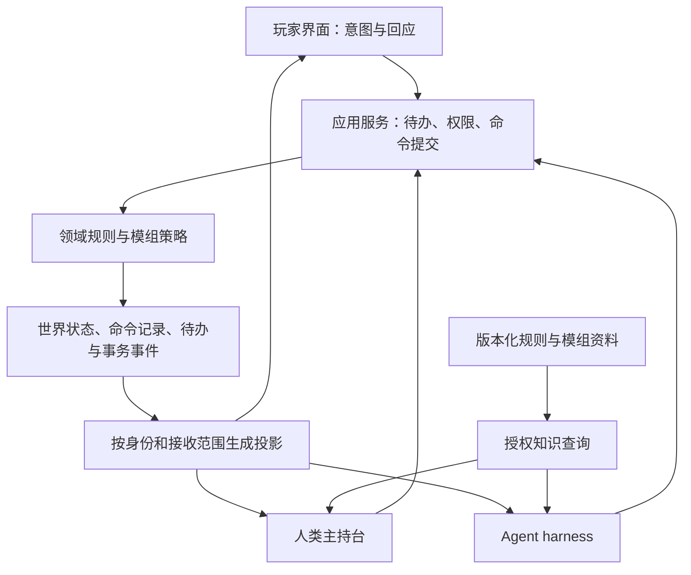

# 从 AI 跑团游戏到支持人类与 Agent 主持的跑团平台

> 历史归档（2026-09-16 整理）：正文保留当时的结论与适用版本，不作为当前完成状态或执行授权。现行入口见 [README](../../../../README.md)，未完成事项见 [STATUS](../../../STATUS.md)。正文中的仓库路径按仓库根目录理解，`/tmp` 产物不保证仍存在。

日期：2026-09-13。状态：实验分支设计提案，尚未实现。

## 1. 决策与检查范围

产品定位：提供一张人类守秘人可以独立使用的数字主持桌；Agent 通过同一套游戏操作接口主持，harness 负责其上下文、工具授权、执行预算、恢复和接管。

第一验收问题：**完全不配置模型、禁止模型网络请求时，一位人类守秘人与两位玩家能否通过界面完成一次调查场景并保存续团？**

本次检查基于 HEAD `f116862` 加当前工作区的未提交 advisory 修复。阅读了应用用例、房间角色与消息入口、工具目录与执行器、领域函数、素材出口、玩家面板提交和架构说明。未运行新测试、未修改业务代码、未访问生产。下文“缺口”指已检查路径缺少完整闭环，不是对所有未检查代码作绝对不存在的断言。

这份文档独立于当前 Kimi 修复，不要求撤销或混入其工作。建议在修复基线确认后创建 `experiment/keeper-platform` 分支。新旧运行模式并行验证，不在第一阶段重写整个 GameEngine。

## 2. 现状检查：能力存在，但主持流程尚未独立

| 主持能力 | 仓库证据 | 判断与改进方向 |
|---|---|---|
| 领域规则与状态 | `src/gameplay/` 的 inventory、discovery、handouts、world_time、战斗与 SAN 模块 | 大量可复用能力；保留计算与不变量，整理为明确命令 |
| 开场、续团、行动 | `src/app/game_application.py`：开局返回 opening intent；续团追加模型控制指令 | 当前应用用例仍围绕模型回合组织，需增加无模型主持生命周期 |
| 模型配置门禁 | `src/multiplayer/messages.py` 的 start/continue/action/rewrite 路径调用 `_room_model_readiness` | 纯人类房间需要独立通过；不能全局关闭 BYOK 门禁 |
| 房间身份 | `src/multiplayer/service.py`：owner/player/viewer | owner 是房间管理者，不能直接等同知晓全部秘密的 keeper |
| 同步与定向发送 | `src/multiplayer/room_runtime.py`：房间锁、行动 ID、可见性过滤和恢复 | 可复用，但 owner 可见不等于 keeper 可见；历史与恢复也须按新权限投影 |
| 工具执行 | `src/ai/tools/registry.py`、`tool_runtime.py` | schema、handler 和部分业务操作放在 AI 包，返回 JSON 字符串；不宜直接作为人类后台任意工具 RPC |
| Agent 可用能力 | `src/ai/model/model_tool_catalog.py`：show_handout、秘密读取等列为 engine-only | 当前 AI 获得的是受裁剪叙事职责；需要重新定义主持权限下的窄读取和发布操作，不能直接解禁旧工具 |
| 玩家出示/使用 | `frontend/src/investigator-actions.ts`：`sendAction(buildPanelActionText(draft))` | 界面知道对象，提交时却退化为文字；应保留对象 ID 与目标，交主持人裁定 |
| 发言 | `src/gameplay/speaker_parser.py`、`src/web/asset_payload.py` | 已有段与身份验证，但缺标签时仍推断角色；新流程使用显式发言信封 |
| 线索与图片 | handouts/discovery、frontend_payload | 有自动发放与显示能力；需要主持人主动分发、个人知情、展示与持有分离 |
| 图片保密 | `src/web/module_http.py`：hosted 禁止直读模组素材；事件携带授权后的图片载荷 | 保留现有防护；主持素材浏览必须使用独立鉴权出口，不能重新开放全目录 |
| 存档与事件 | `src/storage/database.py`：world_states、snapshots、turns、turn_events 等 | 有持久化基础；需支持不依附一次 LLM 回复的主持操作和待办恢复 |
| 备团知识 | 模组编译器、keeper 文本、`src/ai/context/` 的 lorebook 与摘要 | 可复用资料，需提供可检索的人类主持视图；知识阅读与向玩家发布必须分开 |
| 世界定制 | `src/gameplay/handouts.py:refresh_static_handout_config` 整体替换 scene_catalog 等 | 人类即兴创作不能存进会被模板刷新覆盖的区域，需模板与世界覆盖层分离 |

结论：现状是具备平台基础的 AI 主持游戏，尚不能把“已有 Python 工具”视为“人类可完整主持”。第一阶段的重点是补齐角色、应用命令和主持台，不是增加更多自然语言规则。

## 3. 目标结构与边界

三个层次分别负责：

1. 平台：身份、权限、存储、事件、资料、素材、场景与主持工具。
2. 规则：骰点、伤害、状态合法性、战斗、时间等计算；模组自动化属于可配置策略。
3. 主持：理解意图、判断是否检定、决定公开什么、扮演人物、控制节奏。由人类或 Agent 执行。

“共用接口”不表示“权限完全相同”。Agent 只能使用被委派的主持能力；人类可以拥有明确、留痕的规则修正权限。平台不开放通用 SQL、文件读取、任意 JSON 路径写入。

LangGraph 可以继续作为一个 harness 实现；平台生命周期与命令执行不能必须启动它。无需为此引入微服务、Kubernetes、新数据库或外部协议标准。

## 4. 房间、身份与主持模式

不要把一个 role 枚举同时用于账单、管理、玩法和隐私。建议分开：

- 房间管理：所有者、成员、访客等，保持现有邀请/移交能力。
- 玩法授权：谁控制哪些调查员，谁具有 keeper 能力，谁只能旁观。
- 主持控制权：当前是哪个人类会话或哪个 Agent 运行实例主持，带 controller_epoch。
- 计费授权：谁提供模型 Key、允许哪个 Agent 使用，与 keeper 身份分别校验。

房主可以是普通玩家；移交房主不能自动让对方读到主持秘密。已授权的秘密无法让人“忘记”，撤销只停止后续访问。第一版只支持一位活动主持，不做多人同时主持。

模式建议：

| 模式 | 行为 | 模型要求 |
|---|---|---|
| human | 玩家行动进入主持待办，由人类回应与结算 | 不初始化模型，不要求 Key，不自动调用摘要 |
| assisted | 人类主持，显式请求 AI 起草、检索或建议 | 仅使用辅助功能时需要；草稿默认仅主持可见 |
| agent | Agent 接受委派主持，使用公共命令集 | 开始 Agent 执行前验证 BYOK、能力和预算 |

模式服务端持久化，前端切换不能冒充授权。第一阶段只新增 human，保持旧 AI 模式不变；assisted/agent 接管以后实现。

本地与云端使用同一主持前端和命令协议。纯本地单窗口可用开发阶段双视图，但完整验收必须包含两个独立玩家客户端。若要开放局域网真人房间，必须提供成员凭证与素材隔离；不能直接把当前匿名本地服务绑定到公网或局域网作为多人方案。

## 5. 操作接口：明确对象，保留解释自由

以下命名是拟议 API，不代表已实现。第一阶段只实现最小集合。

| 操作 | 关键参数 | 语义 |
|---|---|---|
| `publish_message` | speaker、audience、内容、关联命令 | 旁白/NPC/本人发言；不能代替玩家提交已选择的行动 |
| `request_check` | 调查员、技能、目标 ID、难度、奖惩骰、可见性 | 创建持久待办，不等于已掷骰 |
| `resolve_check` | check_request_id | 服务端掷骰并保存结果，一次请求只能结算一次 |
| `grant_clue` | clue_id、接收者、依据 | 增加指定角色的知情记录，不自动取得实物 |
| `present_handout` | asset_id、接收者、展示说明 | 展示经授权素材，不自动发线索或道具 |
| `move_party` | 分组、目的地、过渡耗时 | 校验场景与规则，并一次结算明确的旅程 |
| `set_npc_presence` | NPC、场景、进入/离开 | 变更在场关系；不能仅靠小说段落暗示 |
| `transfer_item` / `use_item` | 稳定物品 ID、数量、来源/去向、操作 | 平台检验所有权、数量与合法操作 |
| `adjust_stat` | 角色、字段枚举、变化值、原因 | 调用规则层，不开放任意字段写入 |
| `advance_time` | 分钟、原因、相关行动 | 推进世界时间并处理时钟，不再从正文反推 |
| `record_fact` | 文本、来源、知情范围 | 即兴事实或笔记；不是自动可执行的规则 flag |
| `resolve_player_intent` | intent_id、处理结果、剩余步骤 | 明确结束或挂起玩家请求，避免无限等待 |

关键分离：看过图片、知道线索、持有原件、向 NPC 出示原件是四件事。NPC 的知情和玩家的知情也是不同记录。出示按钮提交对象与目标，而不是只拼成一句话；是否赢得信任或得到线索仍由主持裁定。

检定结果与任务结果分别记录：“骰点成功”不自动等于“所有调查目标完成”；“命令成功保存”也不等于“游戏行动成功”。避免 success=true / not_executed 在不同层混用。

命令信封至少包含：command_id、world_id、expected_revision、controller_epoch、kind、payload、cause_id。principal 从服务端会话/Agent 委派解析，不能相信客户端自报 actor。命令返回 accepted/rejected/conflict、revision、result、event_ids；领域结果放 result 内。

幂等范围为世界与 command_id，绑定调用者和载荷摘要：相同请求重试返回已保存结果；同 ID 不同载荷必须拒绝。每次提交重新检查权限与控制权，不能只在 WebSocket 建连时校验。

## 6. 事务、事件与自由聊天

自由聊天、玩家意图、主持命令、规则结果、公开叙事是不同消息类型。聊天不必取得全局行动者锁；会改变状态的命令仍串行处理。首版保留一个共享场景，不为了自由聊天同时承诺完整分队模拟。

检定流程：玩家提交意图 → 主持请求检定 → 玩家点击掷骰 → 平台落账 → 主持解释并决定后续操作。请求、响应、取消、超时与已解决状态都要持久化；刷新、断线和接管后不能丢失待掷骰请求。

复用现有数据库事务、世界 revision 和事件日志，不强制改成全量事件溯源。新命令日志与状态更新、待办变更、待发布事件必须在同一事务提交。推送发生在提交之后；推送失败可按事件游标重放，不能再次掷骰或发物品。

一次“线索发放+对应图片展示”可以由应用层提供固定组合命令，整体验证和提交。不要一开始开放任意脚本事务或复杂 DAG。

发言可以流式，但先确定发言者、audience 和 message_id，再发送该消息正文片段。模型工具参数先完整解析、校验，再执行；不能将半截工具调用当成公共消息。状态结果先提交，结果叙述引用 command/result ID。草稿、被取消生成和私有推理不得进入公开流。

主持纠错分两种：未公开草稿可编辑；已提交状态采用明确补偿命令，历史追加更正。恢复较早时间线使用已有分支机制，并重新校验当前成员权限。已展示的秘密和真实玩家记忆无法通过回滚撤销。

## 7. 人类主持台最小设计

采用现有 React、主题与游戏画面，新增主持工作区；这不是管理公告、账号和发布的运营后台。

- 左侧：当前地点、NPC、模组资料、线索与图片库，可检索与预览。
- 中部：玩家可见聊天与主持草稿，明确选择旁白/NPC 和接收范围；提供“以玩家甲视角预览”。
- 右侧：待处理行动、待检定、角色状态、时间与事件；关键对象点击后出现窄操作表单。
- 私人笔记与未公开资料有持续清晰的身份标记；发布前看到确切接收人。

首版不做地图绘制、语音视频、复杂战棋、完整模组可视化编辑器或手机主持布局。玩家端继续使用既有画面；云端大厅和本地入口都应明确暴露“人类主持”选项，模型设置不阻碍此模式开局。

一位主持可不占用调查员名额、不需要准备角色卡；两位玩家分别控制角色。启动条件改为该模式需要的成员就绪状态，不复用“房主必须选择调查员”的假设。

### 7.1 游戏内“当前所在场景”（纳入 P1）

用户追加需求：游戏中持续显示当前所在场景，优先放在左上角模组标题下方，例如：

> 猩红文档  
> 当前场景 · 医学院地下停尸房

这是所有主持模式共用的玩家界面信息，本地与云端均需提供。保持紧凑、不遮挡正文，不挤压顶部操作按钮；窄屏允许该行独占一行，长名称换行或省略并提供完整名称查看方式。首版使用普通文字信息，不必增加可点击按钮或地图入口。

数据契约：

- 复用服务端已有 `current_scene` 的权威场景 ID，新增或规范化玩家视图中的场景投影；不要再创建一份独立可写的“当前位置”状态。
- 建议玩家投影为 `current_scene: { id, display_name } | null`，随世界标识和 revision 同步。`display_name` 是玩家允许知道的地点名称，不能直接泄露模组中的秘密地点标题或幕后描述；未知名称可显示“陌生的地下室”。
- 切换场景只有在服务端移动提交成功后更新；点击“前往”、提到某个地点、模型叙事描写其他场景，都不能直接改标题。移动被拒绝或取消时保留原场景。
- 初始化、断线重连、读档、时间线分支和切换世界均从对应权威投影恢复；切换期间清除旧世界地点，可显示“正在同步位置…”。旧存档缺字段时由服务端从当前状态派生，确实未知时显示“位置未知”，不从历史小说文本猜测。
- 标题表示当前已结算位置。流式正文仍在播放出发描写时，标题可以已显示抵达位置；若未来需要演出同步，应携带明确场景事件序号，不以关键词或任意延时猜测。
- P1 共享场景模式使用队伍位置；未来分队后，玩家标题应显示自己控制的调查员所在场景。主持查看其他分组时须区分“正在查看的场景”和“队伍实际位置”。

验收：初次开局正确显示；移动成功后更新；拒行/取消不更新；刷新和读档恢复正确；旧世界迟到事件不污染新世界；未公开地名不泄露；本地/云端及长地名、窄屏布局均验证。新接口可缺省以兼容旧客户端，不能因此阻止旧存档打开。

## 8. 隐私、资料与世界创作

定义 keeper、全桌公开、指定玩家/调查员等 audience。存储明确的接收关系；“当前场景”在发布时解析成接收人集合，不按未来位置扩大历史可见性。后来加入者默认只获取公开历史和其被授权继承的角色资料；继承规则需显式定义。

相同过滤用于实时流、重连、聊天历史、存档预览、导出、素材下载和模型上下文。不能只在前端隐藏。玩家离开房间或调查员更换控制者后，重新检查历史/角色知识访问。

现有 hosted 禁止直接访问模组素材的措施保持。新增主持素材接口按世界和 keeper 权限查询；玩家通过已有授权载荷或受控资源访问。复制已收到的图片无法撤回，产品不承诺“撤回后彻底保密”。

模组秘密对主持是工作资料，对玩家是隐藏信息。新增 `query_module`、`query_rules`、`read_entity` 等范围明确的查询，返回资源 ID、版本、片段位置与可见性。先做目录/关键字检索，不预设必须引入向量数据库。Agent 获得主持资料的权利和向玩家发布的权利独立检查。

知识库文本是资料，不能自行改变工具权限。公开发言不得附带私有检索全文、秘密标题或内部来源摘要。日志也按用途区分主持私有与玩家可见。

世界作者数据建议分为：固定模组版本、世界内 overrides、运行状态、历史事实。人类添加的 NPC、线索、笔记和更改不能被模板刷新覆盖。升级模板应展示差异并合并冲突；旧世界先保留兼容读取，禁止在开局时无提示替换自定义目录。supersedes 修复是局部兼容机制，不能代替这项设计。

## 9. 规则自动化与主持裁定

保留三种明确策略，而不是每个规则单独藏一个开关：

- manual：主持主动调用规则；普通叙事不触发关键词自动发放。
- assisted：模组自动化提出候选操作，主持确认后落账。
- automatic：满足作者条件时平台执行并输出可追踪事件，用于现有 AI 游戏体验。

策略按世界固定，切换应记录；第一阶段 human 使用 manual，旧模式使用原策略。同一线索或检定只能有一个执行所有者，不能“主持调用一次，自动规则又触发一次”。

主持覆写只能通过专用命令，明确目标、原因、原值与新值。不能绕过身份、跨世界隔离、幂等、事务或素材访问授权。普通重试限制可以由人类判定做法变化或批准孤注一掷；绝不能修改已经记录的骰点来伪装成功。

开放主持不意味着先做通用规则系统：保留 CoC 现有领域能力，待人类闭环成立后再考虑其他规则包。

## 10. Agent harness 的位置

harness 使用平台接口获取主持视图、待办、规则资料和当前能力目录，提出命令并读取执行结果。它拥有以下职责，而不是世界状态的最终写权限：

- 将玩家意图分解成主持操作；选择询问、请求检定、处理结果或结束回应。
- 按场景、角色和预算检索资料；管理上下文窗口、历史摘要和缓存。
- 绑定本次运行的权限、模型配置、费用预算、工具次数、超时和取消信号。
- 记录失败原因与可恢复游标，提供人类查看、修改草稿和接管入口。
- 对模糊行为澄清；无进展时停止重复尝试，并将阻塞理由暴露给主持。

语义解析仍有价值，但归于 Agent/输入辅助适配器。平台接受显式目标命令；规则层不以中文动词正则作为唯一可移动入口。保留 speaker_parser 和旧输入匹配用于历史/旧模式，不让新命令再绕回文字解析。

接管流程：停止新模型请求 → 在事务边界完成/拒绝在途命令 → 增加 controller_epoch → 使旧 Agent 后续命令失效 → 展示最新状态与待办 → 人类继续。取消模型网络请求本身不足以保证停止写入。

assisted 模式中 AI 草稿提交前须重新检查 revision；不能批准基于旧场景生成的发放。预算耗尽或供应商不可用时，human 模式仍可运行，agent 模式暂停并提供接管，不静默换用平台 Key。

## 11. 实施顺序与验收门槛

### P0：建立独立实验基线

- 先确认 Kimi 当前修复文件和测试结果，由维护者选择稳定提交作为实验起点。
- 本文独立提交可由用户后续决定；当前不创建分支或提交他人的未完成改动。
- 增加独立测试世界与模式标志，旧世界默认维持原 AI 行为。
- 列出能力 → 领域函数 → 服务命令 → 权限 → UI → 验收测试映射。

### P1：人类主持的最小完整场景（首个可交付里程碑）

实现 keeper 授权、human 开局/续团、命令提交、持久事件和最小主持台。操作范围只覆盖：旁白/NPC 发言、个人图片/线索发放、请求与结算检定、HP/SAN 调整、整队移动与时间、处理玩家意图、存档恢复。

按一个能力一条纵向流程交付，不先把所有目录移动一遍。将所需 handler 中的领域操作提取到应用服务；旧 registry handler 委托相同服务，保持旧 catalog 的请求级安全校验。GameEngine 暂留兼容外壳，新 human session 不创建 ModelSession。

验收：一位主持+两位玩家完成法伦委托、前往停尸房、与医生交谈、查看遗体；玩家甲获得私有线索，乙不可见；一次检定、一次 SAN 处理；断线重连并保存续团。没有 Key，没有模型请求，没有手改文件/数据库，没有依赖特殊自然语言触发。两位玩家均必须实际接收并回应。

### P2：主持日常能力与创作保护

补齐物品转移/使用、NPC 出入、资料检索、操作更正、世界 overrides、战斗与时钟面板。玩家出示/使用提交结构化请求，保留叙事补充字段。定义私聊与资料继承规则。分队移动在此阶段单独设计，不把全局 current_scene 悄悄当作每个玩家的位置。

验收：错误发放可追加更正、道具不重复扣减、模组升级不覆盖世界创作、私有资料不通过历史/素材出口泄露、战斗和时间能由人类完成。

### P3：Agent 接入相同命令并支持接管

新增命令目录适配器和主持知识投影，逐项迁移现有 Agent 工具。实现 run_id、控制权 epoch、预算、暂停/接管；先 assisted 再 agent。不得把人类测试通过解释为 AI 叙事已可靠。

验收：同一组确定命令在人类与 Agent 适配器下产生等价状态；同一 command_id 重试不重复生效；Agent 中途掉线/耗尽预算后人类继续；迟到工具调用被拒；私有草稿不公开。

### P4：迁移与发布评估

评估旧解析器哪些只需留在兼容层，哪些可删除。按真实使用频率决定是否继续自动化。实验分支发布前走本地验收与项目 staging/正式发布流程；本文不授权部署。

## 12. 必须覆盖的验证与指标

| 场景 | 成功标准 |
|---|---|
| 模型不可用的人类房间 | 开始、操作、检定、保存、恢复全部可用；网络探针确认无模型调用 |
| 非 keeper 伪造命令 | 服务端拒绝；不改变状态、不发布事件 |
| 房主但不是 keeper | 不获得模组秘密；可以执行其房间管理权限 |
| 指定甲的线索与图片 | 乙在实时、重连、历史、导出、资源访问均不可获取 |
| 命令重试与冲突 | 同 ID 返回原结果；不同载荷拒绝；过期 revision 不静默覆写 |
| 提交后推送失败 | 恢复时重放已提交事件，不重复结算 |
| 等待掷骰时重启 | 待办恢复，只接受一次合法结果 |
| 接管期间迟到调用 | epoch 校验拒绝旧控制者写入 |
| 世界模板变化 | 即兴 NPC/线索/场景覆盖层保留，冲突可见 |
| 旧 AI 模式 | 现有核心回归与猩红文档专项仍通过 |

人工试玩记录：完成场景必须离开界面操作文件的次数（目标 0）、因平台缺少操作被迫改剧情的次数、重复发放/扣减次数（目标 0）、资料泄露次数（目标 0）、主持处理一个行动的步骤与等待时间。对 Agent 再记录命令拒绝原因、无进展回合、澄清次数和接管完成率。

“叙事永远一致”不是平台保证。明确命令能消除归属和落账的猜测，但人类或 Agent 仍可能说错话；平台提供可追踪事实和更正机制。

## 13. 可交给实现者的第一阶段任务

> 在独立实验分支实现 P1，不扩展到全量 harness 重写。先阅读本文与当前 AGENTS.md，核对现有未提交工作。
>
> 先提交一张实际代码能力映射，再按“keeper 身份 → 无模型开局 → 明确发言 → 定向线索/图片 → 检定与状态 → 移动时间 → 保存恢复”的顺序完成纵向闭环。每条路径同时有服务端授权、持久化、前端入口与实际多客户端验证。
>
> 复用领域逻辑、数据库与既有玩家 UI；旧 AI 流程保留。禁止将主持台操作转换成自然语言后再交给 Agent 或正则解析；禁止通过假 Key、模型桩或跳过测试冒充无模型可用。人类主持不需要调查员卡，房主不自动拥有主持秘密。
>
> 新增命令契约集中定义，旧 AI 工具逐项委托公共服务，不公开通用 execute_function/state_set。模式、授权、接收范围和操作日志必须落在服务端。
>
> 使用独立世界和至少三客户端演示 P1 剧情，输出操作录像或截图、命令/事件证据、验证结果和未覆盖范围。不得修改事故存档或生产环境，不自动发布。
